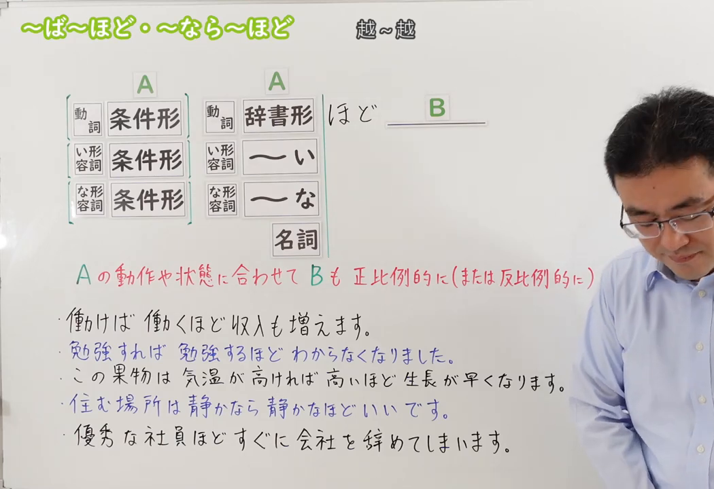

---
{
  "id": "N3-G-0069",
  "kind": "grammar",
  "level": "N3",
  "title": "～ば～ほど／～なら～ほど：越……越……",
  "status": "confirmed",
  "card_revision": 1,
  "source": {
    "lesson": "N3 第69个语法",
    "material": "出口日語原视频板书、日语字幕与独立日文教学正文",
    "video": "https://www.youtube.com/watch?v=DxgBlUlC3m0",
    "screenshot": "assets/grammar/n3/N3-G-0069-0001.png",
    "screenshot_seconds": 1,
    "screenshot_crop": {
      "x": 0,
      "y": 0,
      "width": 1050,
      "height": 720
    }
  },
  "tags": [
    "相关变化",
    "程度递增",
    "N3"
  ],
  "confusions": [
    "～につれて",
    "～にしたがって",
    "～ほど（程度）",
    "～ばかり"
  ],
  "created_at": "2026-09-13",
  "updated_at": "2026-09-13",
  "next_review": "2026-09-20"
}
---

# N3 第69课｜～ば～ほど・～なら～ほど

# 视频学习资料整理

已核对播放列表第69项：标题「【Ｎ３文法】～ば～ほど・～なら～ほど」、视频ID `DxgBlUlC3m0`、时长08:52。学习者未提供个人原始输出或例句，不虚构理解判断；学习者于2026-09-13确认入库，本卡从确认日开始七天复习周期。

接续图取原视频00:01，原始帧1280×720，固定左上角裁为(0,0,1050,720)，保留标题、四类词接续、A/B关系及板书例句，尽量裁去右侧多余人物区域。

例句图取原视频07:30（450秒），原始帧1280×720，固定左上角裁为(0,0,1050,720)，显示课程例句及中文说明。

# 核心与接续

## **A【条件形】＋A【辞书形／原形】＋ほど，B／A【名词】＋ほど，B。**

表示前项程度越高，后项也按比例越明显（“越A越B”）。动词、い形容词、な形容词的完整接续会把同一词重复两次：前项用条件形，后项用该词的辞书形／原形，再加「ほど」和后项B。名词没有「ば形」；名词直接接「ほど」（如「優秀な社員ほど」）。教材有时把动词等重复部分省略写成“动词ば形＋ほど”等简写，但实际造句仍应理解为「VばVるほど」等完整结构。な形容词的条件形是词干＋ならば，现代日语通常直接用「なら」，「ならば」较正式。

| 类型 | 接续规则 | 示例 |
|---|---|---|
| 动词 | 动词条件形（ば形）＋同一动词辞书形＋ほど | 読めば読むほど、面白くなる。 |
| い形容词 | い形容词条件形（～ければ）＋同一い形容词原形＋ほど | 安ければ安いほど、よく売れる。 |
| な形容词 | な形容词词干＋なら（ば）＋同一な形容词词干＋な＋ほど | 静かなら静かなほど、集中できる。 |
| 名词 | 名词＋ほど（名词直接接ほど，不使用条件形） | 優秀な社員ほど、すぐに会社を辞めてしまいます。 |

# 语义边界与适用条件

- 「ば～ほど」前后通常使用同一词的不同形式，强调相关程度，不是单纯“非常”。
- 动词完整形式是「VばVるほど」；い形容词是「～ければ～いほど」；な形容词为「词干＋なら（ば）＋词干＋な＋ほど」。名词没有条件形，在本课板书中直接用「名词＋ほど」（如「優秀な社員ほど」）。首项或重复项在上下文明确时可省略（如「書くほど」），但这是简写，不应替代前三类的完整接续规则。
- 后项可为性质、评价、变化或必要性；不表示必然因果。

# 课程例句与自然例句

- 革製品は使えば使うほど、風合いが出てきます。——皮革制品越用越有质感。
- 日本語は勉強すればするほど面白くなる。——日语越学习越有趣。
- 一般的に、駅から近ければ近いほど家賃は高くなります。——一般来说，离车站越近房租越高。
- 便利な社員ほど、すぐに会社を辞めてしまいます。——越能干的员工，越容易马上辞职。

# 易混项及 JLPT 考点

- 「につれて／にしたがって」表示随时间或变化发展；「ば～ほど」要求前后程度的比例关系。
- 「ほど」单独表示程度时不构成“越A越B”。
- JLPT常考条件形变化（読めば、安ければ）及「なら（ば）」接な形容词；名词则直接接「ほど」，没有名词「ば形」。前三类注意后项要重复同一词再加「ほど」，不要写成「読んだほど」。

# 来源与复核记录

核对日期：2026-09-13（本次接续复核）。原视频00:01板书明确显示：动词／い形容词／な形容词左栏为条件形，右栏分别为辞书形、「～い」、「～な」；名词只出现在右栏，直接接「ほど」，没有名词条件形。独立资料：[たのすけ「～ば…ほど」](https://tanosuke.com/ba-hodo/)明确写出前三类的重复接续；[日本語NET「〜ば〜ほど」](https://nihongokyoshi-net.com/2018/06/07/jlptn3-grammar-hodo/)同样列出动词、い形容词、な形容词的重复接续；[MLC「～ば～ほど・～なら～ほど・～ほど」](https://www.mlcjapanese.co.jp/n3_011.html)明确列出「名詞＋ほど」并以「駅から近いマンションほど」示例；[日本語教師のN1et](https://jn1et.com/hodo/)说明相关「ほど」接续包含「V普通形・Aい・Naな・N＋ほど」。因此名词没有「ば形」，本课名词应直接接「ほど」。截图均来自原视频独立帧，未使用封面或重绘。学习者已确认入库，确认日为2026-09-13，下次复习为2026-09-20。

