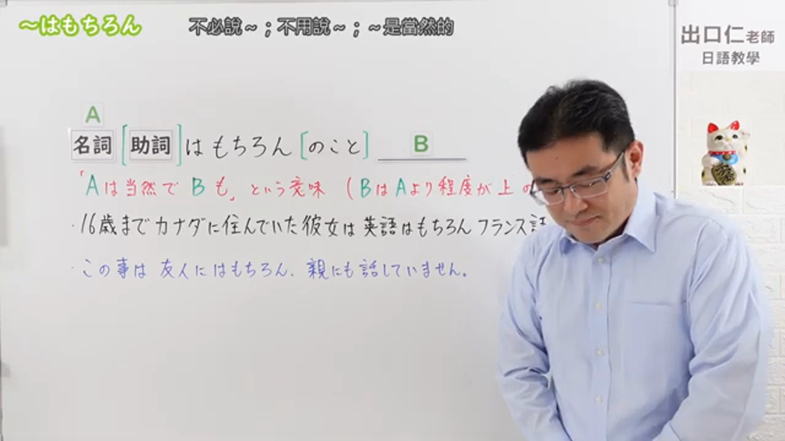
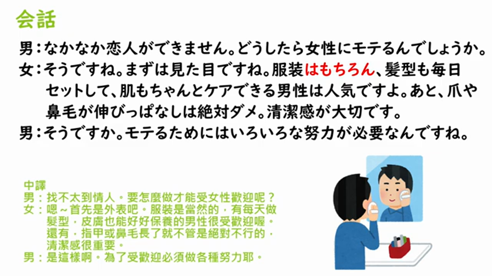

---
{
  "id":"N3-G-0071","kind":"grammar","level":"N3","title":"～はもちろん（のこと）：当然……，B也……","status":"confirmed","card_revision":1,
  "source":{"lesson":"N3 第71个语法","material":"出口日語原视频板书、日语字幕与独立日文教学正文","video":"https://www.youtube.com/watch?v=CPeQ49uGQUU","screenshot":"assets/grammar/n3/N3-G-0071-0001.png","screenshot_seconds":1,"screenshot_crop":{"x":0,"y":0,"width":1050,"height":591}},
  "tags":["追加","当然","N3"],"confusions":["～はともかく","～はもとより","～だけでなく"],"created_at":"2026-09-13","updated_at":"2026-09-13","next_review":"2026-09-20"
}
---

# N3 第71课｜～はもちろん（のこと）

# 视频学习资料整理

已核对播放列表第71项：标题「【JLPT N3 Grammar】～はもちろん」、视频ID `CPeQ49uGQUU`，时长约04:41。学习者于2026-09-13确认入库，本卡从确认日开始七天复习周期。

接续图取原视频00:01，原始帧640×360，固定左上角缩放为1050×591，保留标题、板书「名詞＋（助詞）はもちろん（のこと），B」及含义说明。

例句图取原视频04:00（240秒），原始帧640×360，保留课程会话例句。

# 核心与接续

## **A【名词（＋助词）】はもちろん（のこと），B。**

表示A是理所当然的，B也同样成立；常译为“当然A，B也……”。「のこと」可有可无，意义基本不变；B常用「も」呼应。

| 类型 | 接续规则 | 示例 |
|---|---|---|
| 名词 | 名词（必要时保留格助词）＋はもちろん（のこと） | 英語はもちろん、フランス語も上手だ。 |
| 名词（话题／对象） | 名词＋助词＋はもちろん（のこと） | 友人にはもちろん、親にも話していません。 |

# 语义边界与适用条件

- A通常是代表性、理所当然的项目，B是进一步追加且说话人也要强调的项目；不是“暂不讨论A”。
- 「もちろんのこと」比单独「もちろん」稍完整、偏正式；课程说明指出有无「のこと」意义不变。
- 后项多用「も」，但也可根据句法使用其他助词。

# 课程例句与自然例句

- 16歳までカナダに住んでいた彼女は英語はもちろん、フランス語も上手だ。——在加拿大住到16岁的她，英语自不必说，法语也很好。
- このことは友人にはもちろん、親にも話していません。——这件事当然没告诉朋友，也没告诉父母。
- この店は味はもちろん、店員の対応もすばらしい。——这家店味道自不必说，店员的服务也很棒。

# 易混项及 JLPT 考点

- 「はともかく」是暂且不论A；「はもちろん」则明确承认A并追加B，方向相反。
- 「だけでなく」单纯表示“不仅A还B”；「はもちろん」带有“A理所当然”的语气。
- JLPT常考名词直接接续、A后「は」及B后「も」，以及「のこと」可省略。

# 来源与复核记录

核对日期：2026-09-13。原视频00:01板书及字幕说明「はもちろん」前为名词，偶尔带助词；「のこと」可添加且意义不变；A为当然事项、B为程度更高或追加事项。课程00:02例句与00:04会话页用于核对实际用法。独立资料：[日本語教師たのすけ「～はもちろん」](https://tanosuke.com/wamochiron/)与[日本語904「～はもちろん～も」](https://note.com/yy46/n/nd46e9144a37f)均支持「N1＋はもちろん＋N2＋も」、当然＋追加含义及「はもとより」等辨析。图片均为原视频帧，未使用封面或重绘。学习者已于2026-09-13确认入库，下次复习为2026-09-20。
