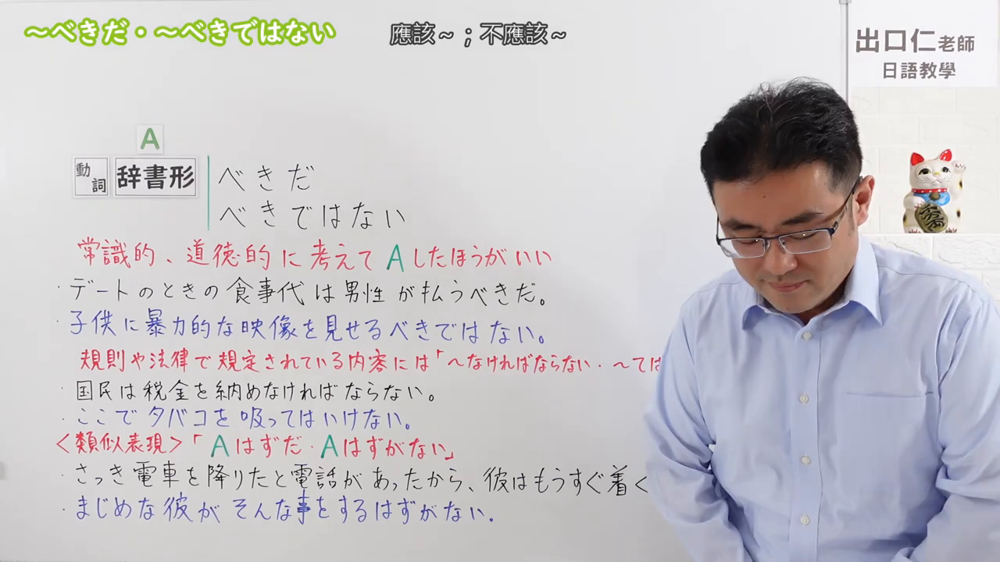
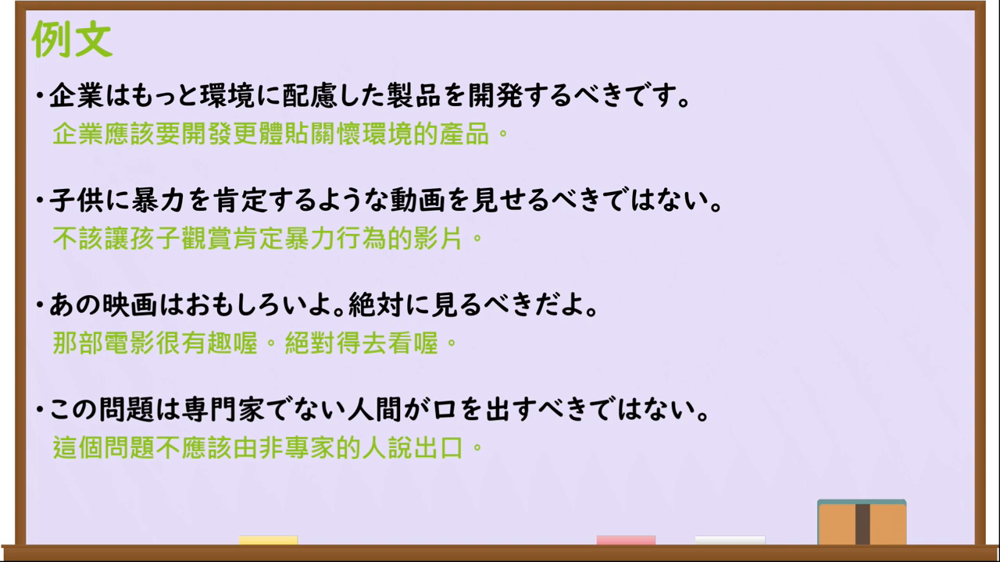

---
{
  "id":"N3-G-0074","kind":"grammar","level":"N3","title":"～べきだ／～べきではない：应该……／不应该……","status":"confirmed","card_revision":1,
  "source":{"lesson":"N3 第74个语法","material":"出口日語原视频板书、日语字幕与独立日文教学正文","video":"https://www.youtube.com/watch?v=vUO6aYil7bU","screenshot":"assets/grammar/n3/N3-G-0074-0001.png","screenshot_seconds":1,"screenshot_crop":{"x":0,"y":0,"width":1280,"height":720}},
  "tags":["义务","劝告","道德判断","N3"],"confusions":["～なければならない","～てはいけない","～はずだ／～はずがない"],"created_at":"2026-09-13","updated_at":"2026-09-13","next_review":"2026-09-20"
}
---

# N3 第74课｜～べきだ／～べきではない

# 视频学习资料整理

已核对播放列表第74项：标题「【N3文法】～べきだ・～べきではない」，视频ID `vUO6aYil7bU`，时长约05:56。学习者于2026-09-13确认入库，本卡从确认日开始七天复习周期。

接续图取原视频00:01，原始帧1280×720，保留标题、动词辞书形接续、常识／道德判断说明，以及与规则表达和「はず」的比较板书。画面右侧人物未影响核心接续。

例句图取原视频04:45（285秒），原始帧1280×720，完整保留课程四条例句及中文说明。

# 核心与接续

## **A【动词辞书形】＋べきだ／べきではない。**

「べきだ」表示按照说话人的常识、道德或社会观念，做A才妥当；「べきではない」表示不做A才妥当。分别常译为“应该A”“不应该A”。

| 类型 | 接续规则 | 示例 |
|---|---|---|
| 动词 | 动词辞书形＋べきだ | 約束は守るべきだ。 |
| 动词 | 动词辞书形＋べきではない | 人を見た目だけで判断するべきではない。 |
| 动词「する」 | する＋べきだ／べきではない，或「す」＋べきだ／べきではない | もっと勉強するべきだ。／もっと勉強すべきだ。 |

# 语义边界与适用条件

- 表达说话人基于常识、道德、社会责任等作出的强判断，也可用于较强的建议或忠告；对具体听话人使用时可能显得强硬。
- 客观规则、法律或制度规定通常用「～なければならない／～てはいけない」，课程明确提醒不宜把这类规定机械改成「べきだ／べきではない」。
- 「べきではない」接在动词辞书形之后：見せるべきではない；不要误写成「見せないべきだ」。
- 推测某事理应发生时使用「はずだ」；认为某事不可能发生时使用「はずがない」，不是本课的道德判断。

# 课程例句与自然例句

- 企業はもっと環境に配慮した製品を開発するべきです。——企业应该开发更加顾及环境的产品。
- 子供に暴力を肯定するような動画を見せるべきではない。——不应该让孩子观看肯定暴力行为的视频。
- あの映画はおもしろいよ。絶対に見るべきだよ。——那部电影很有趣，绝对应该去看。
- この問題は専門家でない人間が口を出すべきではない。——这个问题不应该由非专业人士插嘴干预。

# 易混项及 JLPT 考点

- 「べきだ」是价值判断或强建议；「なければならない」主要表示义务、规定或不可避免的必要性。
- 「べきではない」是“不应该”；「はずがない」是“按道理不可能”，两者不能互换。
- JLPT常考「するべき／すべき」两种形式，以及否定位置：动词辞书形＋べきではない。

# 来源与复核记录

核对日期：2026-09-13。原视频00:01板书和字幕明确动词辞书形接「べきだ／べきではない」，「するべきだ／すべきだ」均可；课程将其限定为基于常识、道德的应否判断，并区分规则用「なければならない／てはいけない」和推测用「はずだ／はずがない」。独立资料：[たのすけ「～べきだ／～べきではない」](https://tanosuke.com/bekida/)支持辞书形接续、「する／すべき」、社会通念与忠告用法，以及与义务表达的区别；[日本語教師のN1et「べきだ／ではない」](https://jn1et.com/beki/)支持辞书形接续及强烈忠告、助言和主张的语气。两张图片均为原视频独立帧，未使用封面或重绘。学习者已于2026-09-13确认入库，下次复习为2026-09-20。
