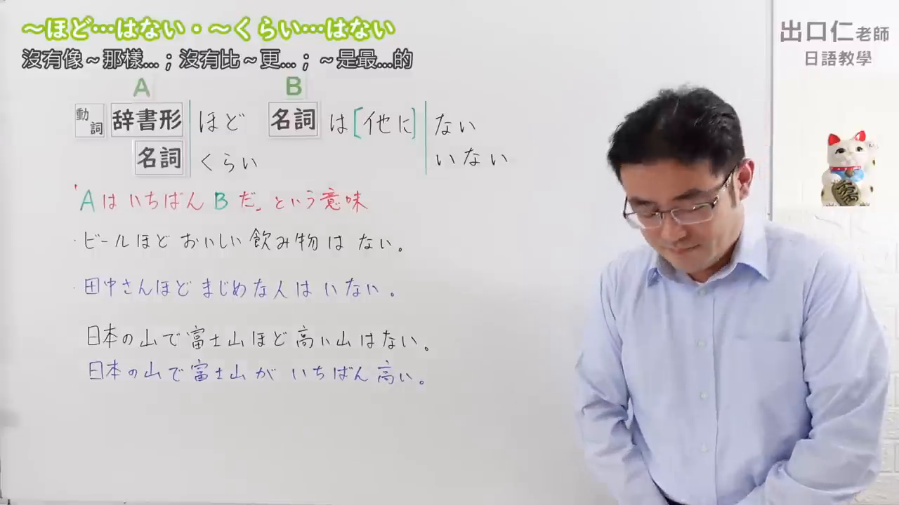
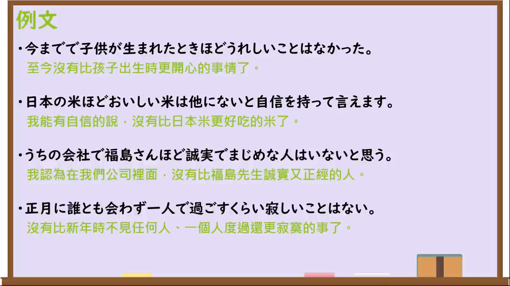

---
{
  "id":"N3-G-0077","kind":"grammar","level":"N3","title":"～ほど……はない／～くらい……はない：没有比……更……的；……最……","status":"confirmed","card_revision":1,
  "source":{"lesson":"N3 第77个语法","material":"出口日語原视频板书、日语字幕与独立日文教学正文","video":"https://www.youtube.com/watch?v=4duXe89L8ZQ","screenshot":"assets/grammar/n3/N3-G-0077-0001.png","screenshot_seconds":1,"screenshot_crop":{"x":0,"y":0,"width":1280,"height":720}},
  "tags":["最高程度","主观评价","N3"],"confusions":["～ほど（程度）","～ば～ほど","～が一番"],"created_at":"2026-09-13","updated_at":"2026-09-13","next_review":"2026-09-20"
}
---

# N3 第77课｜～ほど……はない／～くらい……はない

# 视频学习资料整理

已核对播放列表第77项：标题「【N3文法】～ほど…はない・～くらい…はない」，视频ID `4duXe89L8ZQ`，时长约06:19。学习者于2026-09-13确认入库，本卡从确认日开始七天复习周期。

接续图取原视频00:01，原始帧1280×720，保留标题、A项动词辞书形／名词接续、B项名词＋「は（他に）ない／いない」、含义和课程例句。

例句图取原视频05:00（300秒），原始帧1280×720，完整保留课程四条例句及中文说明。

# 核心与接续

## **A【动词辞书形／名词】＋ほど／くらい，B【名词】＋は（他に）ない／いない。**

表示在说话人的经验或评价范围内，没有其他B能达到A所示的程度，即“A是最……的”；常译为“没有比A更……的B”“A最……”。「ほど」与「くらい」在本课结构中意义基本相同。

| 类型 | 接续规则 | 示例 |
|---|---|---|
| 动词 | 动词辞书形＋ほど／くらい＋名词＋は（他に）ない | 子供が生まれた時ほど嬉しいことはなかった。 |
| 名词 | 名词＋ほど／くらい＋名词＋は（他に）ない | 日本の米ほどおいしい米は他にない。 |
| 名词（人／动物的存在） | 名词＋ほど／くらい＋名词＋はいない | 田中さんほど真面目な人はいない。 |

# 语义边界与适用条件

- 本结构通常表达说话人的主观最高评价，相当于「Aが一番……だ」。课程提醒，一般不用于人人都知道的客观最高事实；客观事实直接用「一番」更自然。
- B是人或动物的“存在”时使用「いない」；B是物、事或人／动物的动作等时使用「ない」。
- 「他に」可出现也可省略，不改变核心意思。
- 「ほど」与「くらい」基本可互换；「くらい」偏口语，「ほど」稍正式。

# 课程例句与自然例句

- 今までで子供が生まれた時ほど嬉しいことはなかった。——至今没有比孩子出生时更开心的事了。
- 日本の米ほどおいしい米は他にないと自信を持って言えます。——我可以自信地说，没有比日本米更好吃的米。
- うちの会社で福島さんほど誠実で真面目な人はいないと思う。——我认为我们公司里没有比福岛先生更诚实认真的人。
- 正月に誰とも会わず一人で過ごすくらい寂しいことはない。——没有比新年不见任何人、独自度过更寂寞的事了。

# 易混项及 JLPT 考点

- 第76课「～ほど」用A说明B的程度；本课必须与否定式「……はない／いない」呼应，表达最高程度。
- 「～ば～ほど」表示“越……越……”，不是最高评价。
- JLPT常考A项的动词辞书形／名词、B项「ない／いない」的选择，以及「他に」可省略。

# 来源与复核记录

核对日期：2026-09-13。原视频00:01板书明确A项为动词辞书形或名词，后接「ほど／くらい」；B项为名词＋「は（他に）ない／いない」。字幕说明人或动物的存在用「いない」，其余用「ない」，并强调该结构相当于主观判断“A最……”。课程约04:55进入例句页。独立资料：[日本語NET「〜ほど〜はない」](https://nihongokyoshi-net.com/2019/04/17/jlptn3-grammar-hodo-wanai/)支持V辞书形＋こと／名词＋ほど……はない、主观最高评价和不宜用于客观事实；[日本語教師のN1et「くらい／ぐらい～はない・ほど～はない」](https://jn1et.com/kurai-hodo-nai/)复核“最……”含义、两种形式及各词类用例。本卡总接续严格采用原视频本课列出的动词辞书形与名词两类，不把外部资料的扩展接续混入主表。两张图片均为原视频独立帧，未使用封面或重绘。学习者已于2026-09-13确认入库，下次复习为2026-09-20。
