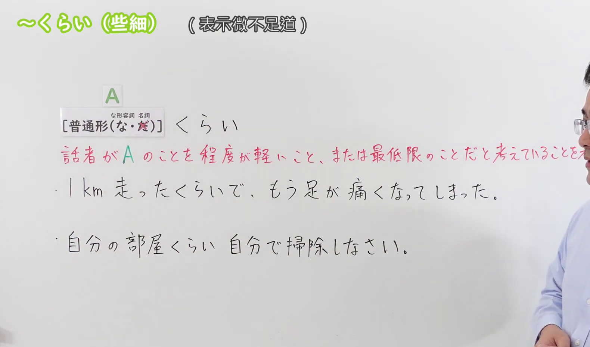
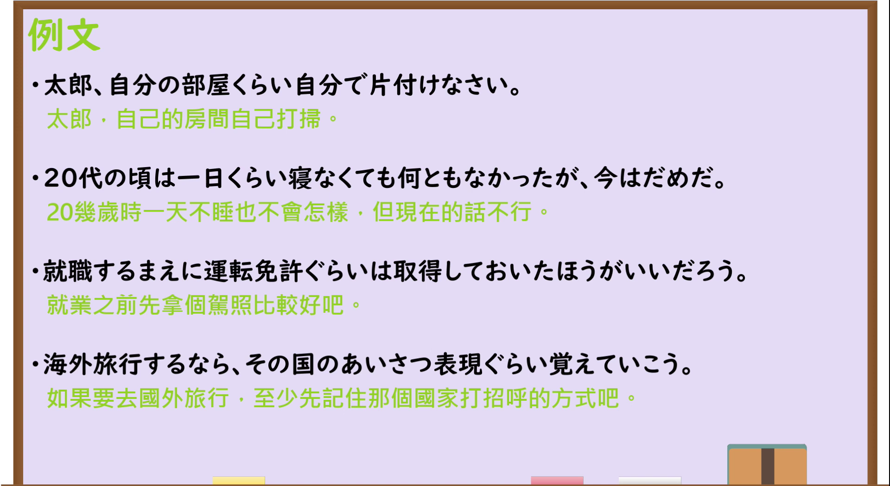

---
{
  "id": "N3-G-0078",
  "kind": "grammar",
  "level": "N3",
  "title": "～くらい／～ぐらい：些细；最低限",
  "status": "confirmed",
  "card_revision": 1,
  "schema_version": 1,
  "source": {
    "lesson": "N3 第78个语法",
    "material": "出口日語原视频板书、日语字幕与独立日文教学正文",
    "video": "https://www.youtube.com/watch?v=KweyB6rYqqw",
    "screenshot": "assets/grammar/n3/N3-G-0078-0210.png",
    "screenshot_seconds": 130,
    "screenshot_crop": {
      "x": 0,
      "y": 0,
      "width": 1580,
      "height": 930
    }
  },
  "tags": [
    "些细",
    "最低限",
    "轻视",
    "说话者评价",
    "N3"
  ],
  "confusions": [
    "～くらい（约数）",
    "～くらい（程度）",
    "～ほど…はない",
    "～なんか／～なんて",
    "～だけ"
  ],
  "created_at": "2026-09-13",
  "updated_at": "2026-09-13",
  "next_review": "2026-09-20"
}
---

# N3 第78课｜～くらい・～ぐらい（些细／最低限）

# 视频学习资料整理

按指定范围整理；学习者未提供个人原始输出或例句，不虚构理解判断。已逐项核对播放列表第78项：标题「【Ｎ３文法】～くらい（些細）」、视频ID `KweyB6rYqqw`、时长03:56。学习者于2026-09-13确认入库，本卡从确认日开始七天复习周期。

先检查[原视频00:01](https://www.youtube.com/watch?v=KweyB6rYqqw&t=1s)，再比较00:20、00:40、01:00、01:20、01:40、02:00、02:05、02:10和02:15。接续图取自[原视频02:10](https://www.youtube.com/watch?v=KweyB6rYqqw&t=130s)：原帧1920×1080，固定左上角裁为(0,0,1580,930)，保留标题、普通形接续、な形容词与名词的特殊标记、些细／最低限说明及两句板书例句。裁去右侧大部分人物和底部空白；人物仍遮住红字说明的末尾，但日语讲解清晰说明“说话者把 A 看成程度轻或最低限的事”，且两份独立资料一致支持。未抹除、重绘或拼接。

例句图取自[原视频02:30](https://www.youtube.com/watch?v=KweyB6rYqqw&t=150s)，位于视频后半部分的例句页，完整显示四句课程例句及中文说明。原帧1920×1080，固定左上角裁为(0,0,1920,1050)，仅裁去底部少量边框，未重绘或拼接。

# 核心与接续

## **A【普通形（な・去だ）】＋くらい，B**

括号内两项依次对应**な形容词、名词的现在肯定形**：「な」表示な形容词的「だ」改为「な」，「去だ」表示名词去掉现在肯定形的「だ」后接「くらい」。动词和い形容词按普通形接续。原视频总接续只写「くらい」，常用语音变体「ぐらい」在其例句页和独立资料中均有出现。

| 类型 | 接续规则 | 示例 |
|---|---|---|
| 动词 | 普通形＋くらい／ぐらい | 1km走ったくらいで／一日くらい寝なくても |
| い形容词 | 普通形＋くらい／ぐらい | 少し体調が悪いくらいでは |
| な形容词 | 现在肯定形的だ改为な＋くらい／ぐらい；否定、过去等按普通形 | 簡単なくらいでは／簡単ではないくらい |
| 名词 | 现在肯定形去だ＋くらい／ぐらい；否定、过去等按普通形 | 自分の部屋くらい／子供ではないくらい |

「は」「で」「なら」「ても」等可按句子结构接在「くらい／ぐらい」之后，如「免許ぐらいは」「走ったくらいで」「一日くらい寝なくても」。

# 语义边界与适用条件

1. **些细、轻视。** 说话者把 A 看作不严重、不难、不值得大惊小怪的“小事”，如「1km走ったくらいで」含有“才跑一公里就……”的语气。
2. **最低限。** 说话者认为 A 是至少应该做到或具备的最低要求，如「自分の部屋くらい自分で片付けなさい」「運転免許ぐらいは取得しておいたほうがいい」。
3. **常带说话者态度。** 它不只是客观说明范围；对他人的困难、疾病或重视之物使用时，可能显得轻视、责备或失礼，应注意语境。
4. **不能一看到数量就译成“大约”。** 「一日くらい寝なくても何ともなかった」在本课语境中是把“一天不睡”当作程度轻的小事，不是单纯估计“一天左右”。
5. **「くらい」与「ぐらい」基本同义。** 两者在现代日语中通常可替换；本课视频标题和总接续用「くらい」，例句也出现「ぐらい」。

# 例句

## 原视频例句

1. 太郎、自分の部屋くらい自分で片付けなさい。
   太郎，至少把自己的房间自己收拾好。

2. 20代の頃は一日くらい寝なくても何ともなかったが、今はだめだ。
   二十多岁时，即使一天不睡也没什么，但现在不行了。

3. 就職するまえに運転免許ぐらいは取得しておいたほうがいいだろう。
   就业前，至少先取得驾驶执照比较好吧。

4. 海外旅行するなら、その国のあいさつ表現ぐらい覚えていこう。
   如果要去国外旅行，至少先记住那个国家的问候表达再去吧。

## 补充自然例句

- 遅れるなら、連絡ぐらいしてください。
  如果要迟到，至少请联系一下。

- 少し失敗したくらいで、全部あきらめる必要はない。
  不过是稍微失败了一次，没必要全部放弃。

# 易混项与 JLPT 考点

- **约数的～くらい**：「一時間くらい待った」通常是“等了大约一小时”；本课则要从责备、最低要求、「～ても」「～で」等上下文判断“这点程度”的态度。
- **程度的～くらい**：「声が出ないくらい驚いた」表示惊讶达到说不出话的程度，不含“这点小事”的轻视。
- **第77课的～くらい…はない**：「家族といるくらい幸せなことはない」表示“没有比……更幸福的”，后项结构和意义都不同。
- **～なんか／～なんて**：同样可表达轻视，且口语色彩强，但主要接名词；本课「くらい」可以接动词、い形容词、な形容词和名词。
- **～だけ**：「自分の部屋だけ」只限定“只有自己的房间”；「自分の部屋くらい」还传达说话者认为这是最低限的小事。
- **接续题**：な形容词现在肯定的「だ」改为「な」，写成「静かなくらい」；名词现在肯定去「だ」，写成「部屋くらい」。不要写成「静かだくらい／部屋だくらい」。

# 来源与复核记录

核对日期：2026-09-13。

- [出口日語原视频](https://www.youtube.com/watch?v=KweyB6rYqqw)：支持普通形接续、な形容词现在肯定的「な」、名词直接接续、说话者把 A 看作程度轻或最低限、两句板书例句及四句课程例句；例句页同时出现「くらい／ぐらい」。
- [日本語NET「〜くらい（軽視）」](https://nihongokyoshi-net.com/2019/01/23/jlptn3-grammar-kurai/)：复核动词／い形容词普通形、な形容词＋な、名词直接接续，以及“简单的小事／不成问题”的轻视意义。
- [日本語教師のN1et「くらい」](https://jn1et.com/kurai/)：复核普通形的逐词类接续、轻视与不重要的说话者态度、四类词均可接续，以及与「なんか／なんて」「など」「にすぎない」等的语体和接续差异。

字幕校对：自动字幕中的「普通系」「名刺」「程度が軽いこと」等结合板书与语境校正为「普通形」「名詞」及完整说明；课程例句文字以清晰例句页为准。早先 Firecrawl 检索因账户返回402未能取得结果；本次改用 Crawl4AI 0.9.3 重新读取日本語NET与日本語教師のN1et两站正文，成功复核接续、轻视意义、词类范围及易混项，未把搜索摘要当作验证依据。

复核结论：原视频与两份独立日文教学资料对核心接续和“些细／最低限”意义的说明一致。成稿已重新检查普通形例外、语义边界、例句、译文及两张图片的课程归属与实际时间；学习者已于2026-09-13确认入库，下次复习为2026-09-20。
