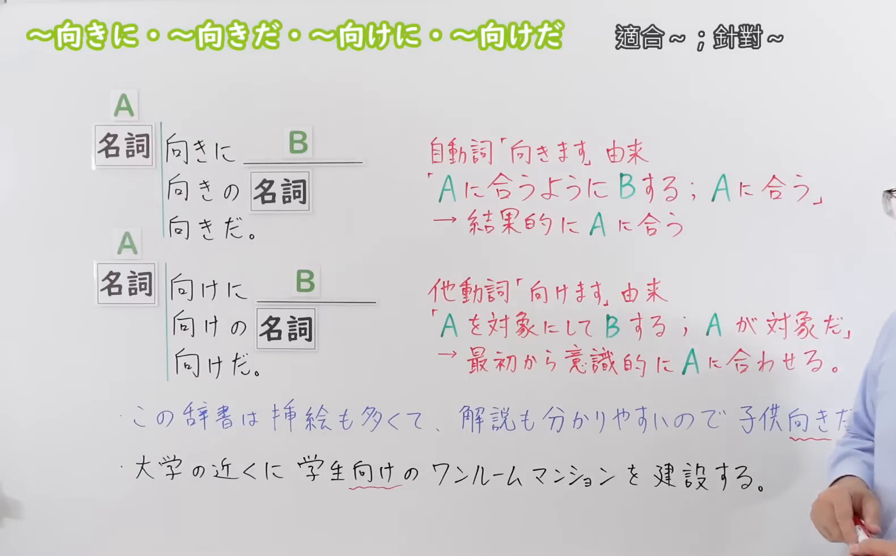
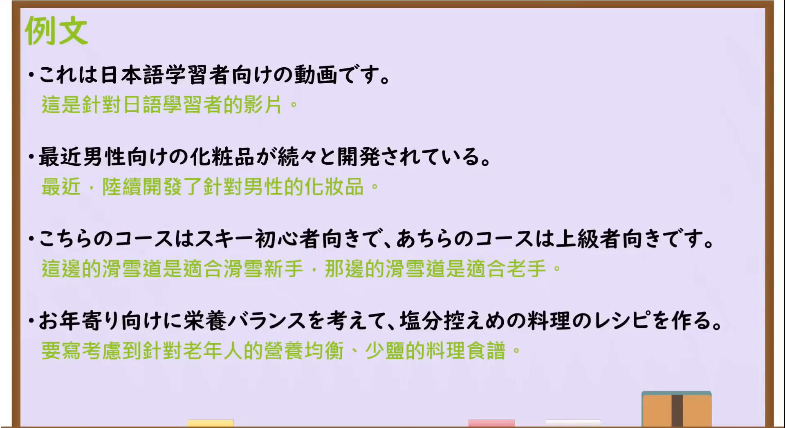

---
{
  "id": "N3-G-0079",
  "kind": "grammar",
  "level": "N3",
  "title": "～むき（向き）に／～むき（向き）だ／～むけ（向け）に／～むけ（向け）だ：适合；面向",
  "status": "confirmed",
  "card_revision": 1,
  "schema_version": 1,
  "source": {
    "lesson": "N3 第79个语法",
    "material": "出口日語原视频板书、日语字幕与独立日文教学正文",
    "video": "https://www.youtube.com/watch?v=8Jl1tXDaGOo",
    "screenshot": "assets/grammar/n3/N3-G-0079-0230.png",
    "screenshot_seconds": 230,
    "screenshot_crop": {
      "x": 0,
      "y": 0,
      "width": 1580,
      "height": 980
    }
  },
  "tags": [
    "适合",
    "目标对象",
    "说话者判断",
    "制作者意图",
    "N3"
  ],
  "confusions": [
    "～むき（向き）",
    "～むけ（向け）",
    "～にむけて（に向けて）"
  ],
  "created_at": "2026-09-13",
  "updated_at": "2026-09-13",
  "next_review": "2026-09-20"
}
---

# N3 第79课｜～むき（向き）に・～むき（向き）だ・～むけ（向け）に・～むけ（向け）だ

# 视频学习资料整理

按指定范围整理；学习者未提供个人原始输出或例句，不虚构理解判断。已逐项核对播放列表第79项：标题「【N3文法】～向きに・～向きだ・～向けに・～向けだ」、视频ID `8Jl1tXDaGOo`、时长05:42。学习者于2026-09-13确认入库，本卡从确认日开始七天复习周期。

先检查[原视频00:01](https://www.youtube.com/watch?v=8Jl1tXDaGOo&t=1s)，再比较00:50、01:50、02:50、03:30、03:40和03:50的同一板书。接续图取自[原视频03:50](https://www.youtube.com/watch?v=8Jl1tXDaGOo&t=230s)：原帧1920×1080，固定左上角裁为(0,0,1580,980)，完整保留标题、两组名词接续、「适合／针对」提示、自他动词来源、核心区别及两句板书例句。该时点教师位于最右侧，裁去大部分人物及底部空白，右缘仍保留极少部分人物，但没有遮挡关键接续或说明；未抹除、重绘或拼接。

例句图取自[原视频04:10](https://www.youtube.com/watch?v=8Jl1tXDaGOo&t=250s)，位于视频后半部分的例句页，完整显示四句课程例句及中文说明。原帧1920×1080，固定左上角裁为(0,0,1920,1050)，仅裁去底部少量边框，未重绘或拼接。

# 核心与接续

## **A【名词】＋向きに＋B／A【名词】＋向きの＋名词／A【名词】＋向きだ。**

## **A【名词】＋向けに＋B／A【名词】＋向けの＋名词／A【名词】＋向けだ。**

以上两行严格按原视频的两个板书接续块展开。A是适合的人、事物或用途，或被设定为目标的对象；B是动作或状态。「に」后接谓语B，「の」用于修饰后面的名词，「だ」用于句末判断，礼貌体分别为「向きです」「向けです」。

| 类型 | 接续规则 | 示例 |
|---|---|---|
| 名词 | 名词＋向きに＋谓语 | 初心者向きにできているコース |
| 名词 | 名词＋向きの＋名词 | 家族向きの物件 |
| 名词 | 名词＋向きだ／向きです | この仕事は彼向きだ。 |
| 名词 | 名词＋向けに＋谓语 | 高齢者向けに開発する |
| 名词 | 名词＋向けの＋名词 | 学習者向けの動画 |
| 名词 | 名词＋向けだ／向けです | この雑誌は若者向けだ。 |

# 语义边界与适用条件

1. **～むき（向き）：结果上适合。** 源自动词「むきます（向きます）」。说话者根据内容、性质、能力或实际效果判断某物“适合A、正合A使用”；未必是制作者一开始就把A设为目标。
2. **～むけ（向け）：一开始就面向某对象。** 源自他动词「むけます（向けます）」。表示制作者、提供者或计划者有意识地把A当作目标对象，进行开发、制作、说明、销售或服务。
3. **目标与适合可能不一致。** 「子供向けに作られたが、子供向きではない」可以成立：作品原本以儿童为目标，但说话者认为内容实际上不适合儿童。
4. **「向き」常含判断，「向け」强调设定。** 「初心者向きだ」是“从实际性质看适合初学者”；「初心者向けだ」是“以初学者为对象”。不少场景两者都能出现，但观察角度不同，不能只按中文“适合／面向”机械替换。
5. **本课不讲实际方向。** 「南向きの部屋」「横向きに寝る」中的「向き」表示朝向；形式相同，但不是本课“适合”的语法意义。

# 例句

## 原视频例句

1. これは日本語学習者向けの動画です。——这是面向日语学习者的视频。

2. 最近、男性向けの化粧品が続々と開発されている。——最近，面向男性的化妆品不断被开发出来。

3. こちらのコースはスキー初心者向きで、あちらのコースは上級者向きです。——这边的雪道适合滑雪初学者，那边的雪道适合高级滑雪者。

4. お年寄り向けに栄養バランスを考えて、塩分控えめの料理のレシピを作る。——面向老年人，考虑营养平衡，制作低盐菜肴的食谱。

## 补充自然例句

- この本は漢字が少なく、初級者向きだ。——这本书汉字很少，适合初学者。

- 外国人観光客向けに、多言語の案内板を設置した。——面向外国游客，设置了多语种指示牌。

- 子供向けに作られた映画だが、暴力的な場面が多く、子供向きだとは思わない。——这部电影原本面向儿童制作，但暴力场面很多，我不认为它适合儿童。

# 易混项与 JLPT 考点

- **～むき（向き）与～むけ（向け）**：前者考察“实际适合、说话者判断”，后者考察“预先设定的对象、制作者意图”。题干出现「開発する」「作る」「書く」「サービス」等有意识的行为时，常与「向け」呼应；出现性质、能力或评价时，常与「向き」呼应，但仍须结合整句判断。
- **～にむけて（～に向けて）**：「試験に向けて勉強する」表示朝着考试这一目标做准备，接续和意义不同；本课是「名词＋向けに／向けの／向けだ」，表示目标对象。
- **实际方向的「向き」**：「南向きの部屋」是朝南的房间，不是“适合南方的房间”。
- **形式选择**：后接动作写「学生向けに作る」，后接名词写「学生向けの教材」，句末判断写「学生向けだ／です」；「向き」也按同样三种结构变化。
- **辨析题**：「子供向け」只说明制作者以儿童为目标，并不自动保证内容客观上或在说话者看来「子供向き」。

# 来源与复核记录

核对日期：2026-09-13。

- [出口日語原视频](https://www.youtube.com/watch?v=8Jl1tXDaGOo)：支持两组名词接续；「向き」源自动词「向きます」，表示结果上适合A；「向け」源自他动词「向けます」，表示最初就有意识地把A当作对象；并提供两句板书例句及四句课程例句。
- [日本語NET「〜むきに」](https://nihongokyoshi-net.com/2019/05/14/jlptn3-grammar-muki/)及[日本語NET「〜むけに」](https://nihongokyoshi-net.com/2018/11/21/jlptn3-grammar-mukeni/)：复核「名词＋向きに／向けに」及「向けの＋名词」；正文明确区分「向け」是针对特定对象有意制作或书写，「向き」是正合适、相匹配。
- [ARC东京日本语学校「『子ども向け』と『子ども向き』は同じですか」](https://arc.ac.jp/Tokyo/mimi-bunpou071/)：复核「向け」取决于制作者为哪类人制作，「向き」是说话者判断与谁相配或正合适。
- [コトハジメ「『向き』と『向け』の使い分け」](https://cotohajime.net/muki-vs-muke/)：补充复核目标对象与适合性区别、自他动词来源，以及「南向き」「横向き」属于实际方向而非本课适合义。

网页获取记录：Crawl4AI 0.9.3 成功读取以上三个独立日文教学站点的正文。Google仅用于发现候选网址，DuckDuckGo页面触发人机验证；两者的搜索摘要均未作为教学依据。

字幕校对：自动字幕中的「名刺」「向きに向きのキーだ」「6型」等同音误识，结合清晰板书、日语讲解和例句页校正为「名詞」「向きに・向きの・向きだ」「向けに・向けの・向けだ」。课程例句文字以清晰例句页为准。

复核结论：原视频与三站独立日文教学正文对名词接续及“结果上适合／有意识地面向目标对象”的核心区别一致。成稿已重新检查总接续、粒度展开、语义边界、例句、译文及两张图片的课程归属与实际时间；学习者已于2026-09-13确认入库，下次复习为2026-09-20。
