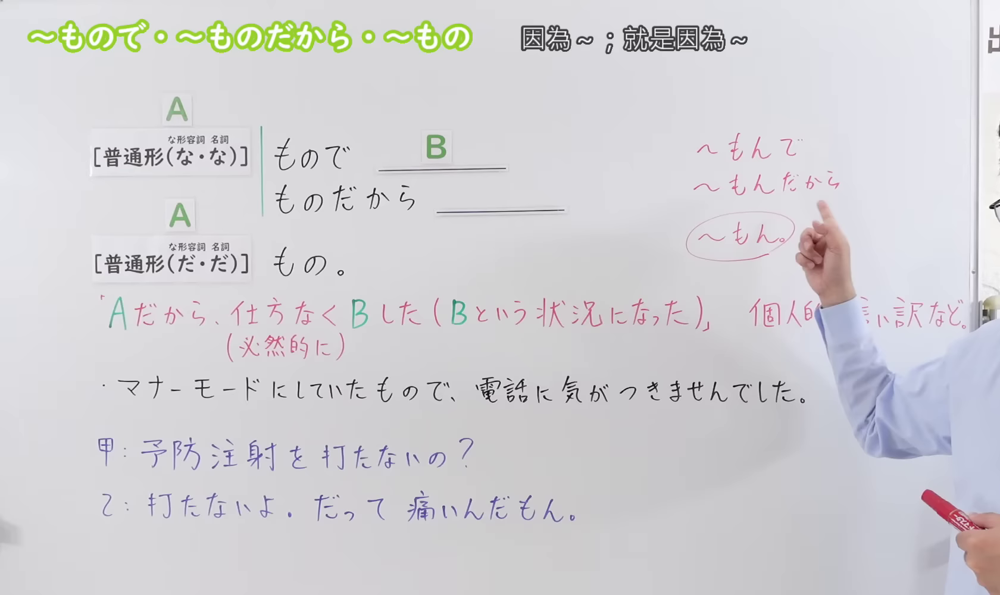
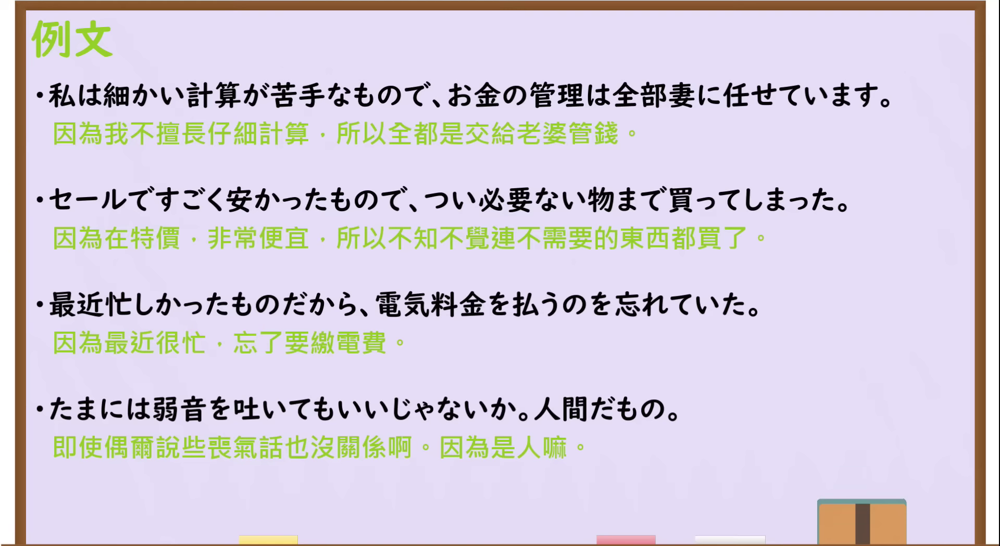

---
{
  "id": "N3-G-0081",
  "kind": "grammar",
  "level": "N3",
  "title": "～もので／～ものだから／～もの：个人理由、说明或辩解",
  "status": "confirmed",
  "card_revision": 2,
  "schema_version": 1,
  "source": {
    "lesson": "N3 第81个语法",
    "material": "出口日語原视频板书、日语字幕与独立日文教学正文",
    "video": "https://www.youtube.com/watch?v=kYs8iMN-ILk",
    "screenshot": "assets/grammar/n3/N3-G-0081-0220.png",
    "screenshot_seconds": 140,
    "screenshot_crop": {
      "x": 0,
      "y": 0,
      "width": 1680,
      "height": 1000
    }
  },
  "tags": [
    "原因理由",
    "个人说明",
    "辩解",
    "不可控结果",
    "口语缩约",
    "N3"
  ],
  "confusions": [
    "～から／～ので",
    "～もの（句末理由）",
    "～ものだ（常理／感叹）",
    "～もんで／～もんだから／～もん"
  ],
  "created_at": "2026-09-14",
  "updated_at": "2026-09-19",
  "next_review": "2026-09-21"
}
---

# N3 第81课｜～もので・～ものだから・～もの

# 视频学习资料整理

按指定范围整理；学习者未提供个人原始输出或例句，不虚构理解判断。已逐项核对播放列表第81项：标题「【Ｎ３文法】～もので・～ものだから・～もの」、视频ID `kYs8iMN-ILk`、时长04:38。学习者于2026-09-14确认入库，本卡从确认日开始七天复习周期。

先检查[原视频00:01](https://www.youtube.com/watch?v=kYs8iMN-ILk&t=1s)，再比较01:00、02:00、02:20、02:40、02:50和03:00的同一板书。接续图取自[原视频02:20](https://www.youtube.com/watch?v=kYs8iMN-ILk&t=140s)：原帧1920×1080，固定左上角裁为(0,0,1680,1000)，保留标题、两组普通形接续、A／B结构、无奈或必然结果、个人说明／辩解、课程例句、会话例及三种口语缩约。裁去右侧大部分人物与底部空白；右缘仍保留手臂和少量人物区域，以免裁断「個人的な言い訳など」及缩约板书，关键内容未被遮挡。未抹除、重绘或拼接。

例句图取自[原视频03:20](https://www.youtube.com/watch?v=kYs8iMN-ILk&t=200s)，位于视频后半部分的例句页，完整显示四句课程例句及中文说明。原帧1920×1080，固定左上角裁为(0,0,1920,1050)，仅裁去底部少量边框，未重绘或拼接。

# 核心与接续

## **A【普通形（な・な）】＋もので、B／A【普通形（な・な）】＋ものだから、B**

## **A【普通形（だ・だ）】＋もの。**

以上两行严格依照原视频的两组板书接续。第一行括号内两个「な」依次对应な形容词和名词的现在肯定形；第二行两个「だ」依次对应な形容词和名词的现在肯定形。动词和い形容词按普通形接续。A是说话者提出的个人理由，B是已经发生、自然形成或说话者认为无可奈何的结果；句末「もの」则把理由留在句末，让听者结合语境理解结果。

| 类型 | 接续规则 | 示例 |
|---|---|---|
| 动词 | 普通形＋もので／ものだから，B | マナーモードにしていたもので、電話に気がつきませんでした。 |
| い形容词 | 普通形＋もので／ものだから，B | すごく安かったもので、買ってしまった。 |
| な形容词 | 现在肯定形的だ改为な＋もので／ものだから；否定、过去等按普通形 | 計算が苦手なもので、妻に任せています。 |
| 名词 | 现在肯定形的だ改为な＋もので／ものだから；否定、过去等按普通形 | まだ学生なもので、よく分かりません。 |
| 动词 | 普通形＋もの。 | 知らなかったもの。 |
| い形容词 | 普通形＋もの。 | だって、痛いもの。 |
| な形容词 | 现在肯定形＋だ＋もの；否定、过去等按普通形 | 苦手だもの。 |
| 名词 | 现在肯定形＋だ＋もの；否定、过去等按普通形 | 人間だもの。 |

原视频还把口语缩约写为「～もんで」「～もんだから」「～もん」。前两种成年人也可使用；句末「～もん」语气更幼稚、撒娇或感情化。外部资料还列出「ものですから」等礼貌形式，但原视频总接续写普通形，因此不把礼貌体补进大号总接续。

## 场景①：温和说明自身处境，希望获得体谅

**说话人的意图：** 告诉对方自己不熟悉当前的事情，希望对方理解自己的困惑。用「ものですから」说明个人情况，语气较委婉，并不等于推卸责任。

**场景演示（自拟场景）：** 客户第一次在银行办理海外汇款，拿到表格后不清楚应该怎么填写，于是向柜员说明情况。

客户：すみません。海外への送金は初めてなものですから、手続きがよく分からなくて。 
（不好意思，因为是第一次往海外汇款，我不太清楚办理手续的方法。）

柜员：では、一緒に確認しましょう。まず、こちらにお名前を書いてください。 
（那我们一起确认一下吧。首先，请在这里写上您的姓名。）

客户：ありがとうございます。助かります。 
（谢谢您，帮大忙了。）

「初めてなものですから」用「な」，不是「初めてのものですから」。客户的解释以「よく分からなくて」含蓄收尾，由语境传达希望获得帮助的意思；柜员另起一句提出填写要求，不是把命令接在客户的「ものですから」后面。

## 场景②：解释已经发生的疏忽或非预期结果

**说话人的意图：** 对已经发生的疏忽交代原因，传达“我不是故意这样做的”，希望对方谅解。「もので／ものだから」都可以承担这种说明或辩解的作用，不必硬分成两个意思。

**场景演示（自拟场景）：** 朋友昨晚打来电话，却一直没等到回复。第二天见面时，接电话的一方解释自己没有注意到来电。

朋友：昨日、電話したんだけど、気づかなかった？ 
（我昨天给你打了电话，你没注意到吗？）

自己：携帯をマナーモードにしていたものだから、電話に気づかなかったんだ。ごめんね。 
（因为手机设成了静音模式，我没注意到有电话。不好意思啊。）

朋友：そうだったんだ。じゃあ、今、少し話せる？ 
（原来如此。那现在能聊一会儿吗？）

「していたものだから」说明当时的情况，后面的「気づかなかった」是已经发生的结果。本结构后项通常不直接接命令、请求、邀请或接下来的意志；朋友随后另起一句询问能否聊天，不受这一连接限制。

## 场景③：用句末「もの／もん」感情化地申辩

**说话人的意图：** 强调自己的感受，希望对方接受“因为这样，所以我才不愿意”的理由。在这个场景中，「もん」带有孩子气、撒娇或不服气的语气。

**场景演示（自拟场景）：** 晚饭时，妈妈发现孩子把青椒挑到盘子边上，便询问原因。

妈妈：どうしてピーマンを食べないの？ 
（你为什么不吃青椒呢？）

孩子：だって、苦いんだもん。 
（可是，它很苦嘛。）

妈妈：そっか。でも、一口だけ食べてみない？ 
（这样啊。不过，要不要只尝一口？）

「苦いんだもん」可对应「苦いのだもの」：这里的「んだ」带说明语气，「もん」是「もの」的口语缩约。这类说法常见于亲近关系，但不限于儿童；是否显得撒娇或失礼，要结合人物关系和语气判断，正式道歉时不宜照搬。

## 场景④：用句末「もの」给出安慰的理由

**说话人的意图：** 为“别过于责怪自己”提供一个对方容易接受的理由，表达理解和宽慰。这里是在体谅别人，并非为自己的行为辩解。

**场景演示（自拟场景）：** 两位关系亲近的同事在会议后交谈。一人刚才发错了资料，已经准备更正，却仍为自己的疏忽自责。

同事甲：資料を間違えて配っちゃった。どうして確認しなかったんだろう。 
（我把资料发错了。当时怎么就没检查一下呢。）

同事乙：誰だって失敗することはあるよ。人間だもの。 
（谁都会有犯错的时候呀。毕竟都是人嘛。）

同事甲：ありがとう。少し気が楽になった。すぐに正しい資料を送り直すね。 
（谢谢，我心里轻松一点了。我马上把正确的资料重新发过去。）

「人間だもの」是在句末给出安慰的理由，名词后保留「だ」。它与「人は失敗するものだ」中表示一般常理的「ものだ」结构不同；常理句也可以用于安慰，不能仅凭“是不是安慰别人”判断是哪一种语法。

以上四组是本课语法在不同交际场景中的作用，不是四个互不相关的词典义。「もので／ものだから」都可用于会话，不能简单归成书面语与口语的一一对应。

# 语义边界、适用条件与后项限制

1. **提出个人理由。** 「～もので／～ものだから」说明为什么出现B，常带“因为A，所以也没办法”的语气；理由往往与说话者的个人情况、疏忽或难处有关。
2. **常用于说明、辩解或歉意语境，但不能机械等同于撒谎。** 原视频明确以「個人的な言い訳など」讲解；たのすけ也强调言い訳语气。N1et则认为它并非每次都必须是辩解。因此本卡把“辩解”作为高频语用，不写成所有句子的必要条件。
3. **B通常不是命令、请求、邀请或说话者接下来的意志。** 本结构把B作为A带来的既成、自然或无奈结果；要说“因为热，请开窗”或“因为累，休息吧”，通常用「ので／から」更自然。
4. **B可以省略。** 在对话中只说「初めてなものですから……」，也能以含蓄方式留下解释或歉意。
5. **句末「もの」带感情。** 「人間だもの」「痛いんだもの」是在句末强调理由，常有申辩、撒娇或希望对方体谅的语气，不是「人は間違えるものだ」中表示常理的「～ものだ」。
6. **「もので」中的「で」承担连接作用。** 句子后面还有B；句末形式则用「もの」，不能把「人間だもの」写成「人間なもの」。

# 例句

## 原视频例句

1. 私は細かい計算が苦手なもので、お金の管理は全部妻に任せています。  
   因为我不擅长细致的计算，所以钱全部交给妻子管理。

2. セールですごく安かったもので、つい必要ない物まで買ってしまった。  
   因为打折时特别便宜，一不留神连不需要的东西也买了。

3. 最近忙しかったものだから、電気料金を払うのを忘れていた。  
   因为最近很忙，忘记交电费了。

4. たまには弱音を吐いてもいいじゃないか。人間だもの。  
   偶尔说点丧气话也没关系吧，毕竟是人嘛。

## 补充自然例句

- 電車が遅れたものですから、約束の時間に間に合いませんでした。  
  因为电车晚点了，所以没能赶上约定的时间。

- A：どうして連絡しなかったの？ B：携帯の電池が切れていたもんで。  
  A：为什么没联系？B：因为手机没电了。

# 易混项与 JLPT 考点

- **～から／～ので**：都能表示原因。「から」可自然接意志、命令、请求；「ので」较客观、柔和；本课形式更突出个人处境、解释和希望对方体谅的语气，后项通常不是命令或意志。
- **句末理由的～もの与常理／感叹的～ものだ**：「人間だもの」是在为前文提供理由；「人は失敗するものだ」表示一般常理；「よく一人でできたものだ」表示感叹。意义与接续环境不同。
- **な形容词、名词接续要分两组记**：接「もので／ものだから」时为「苦手なもので／学生なものだから」；句末「もの」为「苦手だもの／学生だもの」。
- **缩约形式**：「もの→もん」是口语音变；「もんで／もんだから」可以由成年人使用，但句末「～もん」往往更孩子气或感情化。
- **后项选择题**：若后项是已经迟到、忘记付款、买多了等既成或无奈结果，本课形式自然；若后项是「～ましょう」「～てください」，通常不选本课形式。

# 来源与复核记录

核对日期：2026-09-14。

补充记录（2026-09-19）：按学习者要求，通过`qoderclicn`调用`Qwen3.8-Flash`、`reasoning-effort=xhigh`生成“说话人的意图”及自拟场景，经修订并由Codex校对接续、译文、人物语气与限制表述后加入“核心与接续”。新增场景依据本卡已有规则，不冒充视频或外部来源原句；本次未重新联网复核。原确认日2026-09-14、下次复习2026-09-21及确认事件不变，不重启复习周期。

- [出口日語原视频](https://www.youtube.com/watch?v=kYs8iMN-ILk)：支持两组普通形接续；「Aだから、仕方なく／必然的にBした（Bという状況になった）」及个人说明、辩解的语气；并说明「もんで／もんだから」可用于成年人、句末「もん」较孩子气。四句课程例句以清晰例句页为准。
- [日本語教師たのすけ「～ものだから／～もので／～もの」](https://tanosuke.com/monodakara-2)：复核「もので／ものだから」前的普通形、な形容词和名词现在肯定形用「な」、句末「もの」、B可省略、口语缩约，以及后项不接命令或意向的限制。
- [日本語教師のN1et「もの族」](https://jn1et.com/mono/)：复核「ものだから」的普通形接续、个人理由、后项通常不使用意志表达，以及句末「もの／もん」的理由、辩解用法。该页对“是否必然是言い訳”比课程与たのすけ更宽，本卡据此将其写成常见语用而非绝对条件。

网页获取记录：Crawl4AI 0.9.3 成功读取以上两份独立日文教学正文；Yahoo! JAPAN和站内搜索只用于发现候选网址，Google页面触发验证码后未继续访问，搜索摘要和AI内容均未作为教学依据。

字幕校对：自动字幕把「普通形」「な形容詞」「名詞」「ものだから」「言い訳」等误识为「普通系」「なぁ系」「名刺」「もの宝」「言い訴」；已结合清晰板书、日语讲解和例句页校正。课程会话的「痛いんだもん」也以画面和讲解核对。

复核结论：原视频与两份独立日文教学正文对核心接续、个人理由和后项限制基本一致；对“借口”是否为必要条件的强弱表述已作为语义边界说明。成稿重新检查了两组接续、四类词变化、缩约语气、例句和译文，以及两张图片的课程归属、实际时间与裁切范围。学习者已于2026-09-14确认入库，下次复习为2026-09-21。
