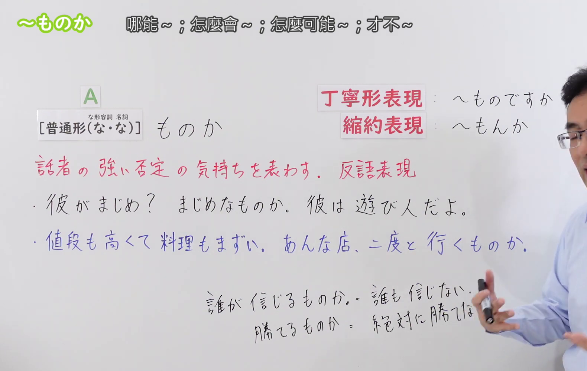
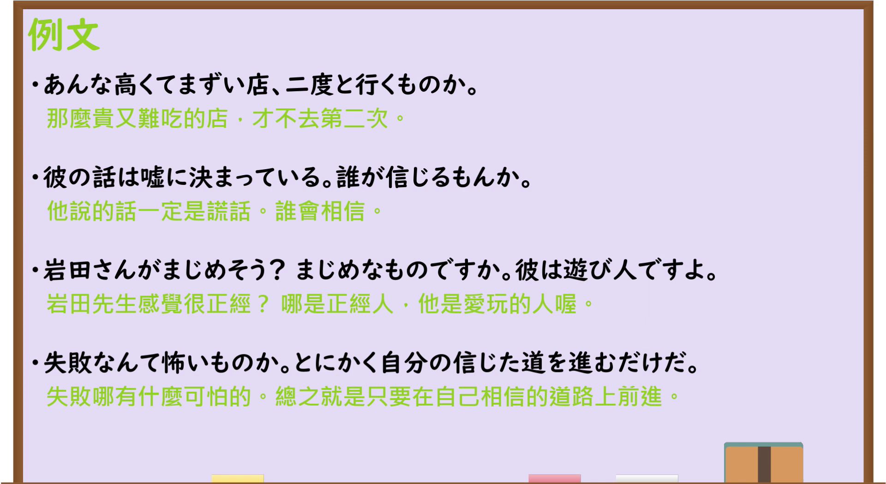

---
{
  "id": "N3-G-0082",
  "kind": "grammar",
  "level": "N3",
  "title": "～ものか／～ものですか：强烈否定、反语",
  "status": "confirmed",
  "card_revision": 1,
  "schema_version": 1,
  "source": {
    "lesson": "N3 第82个语法",
    "material": "出口日語原视频板书、日语字幕与独立日文教学正文",
    "video": "https://www.youtube.com/watch?v=OjUWkULvYzI",
    "screenshot": "assets/grammar/n3/N3-G-0082-0310.png",
    "screenshot_seconds": 190,
    "screenshot_crop": {
      "x": 0,
      "y": 0,
      "width": 1580,
      "height": 1000
    }
  },
  "tags": [
    "强烈否定",
    "反语",
    "感情表达",
    "口语",
    "N3"
  ],
  "confusions": [
    "普通疑问句",
    "～わけがない",
    "～はずがない",
    "～まい",
    "～ないものか",
    "～もんか"
  ],
  "created_at": "2026-09-14",
  "updated_at": "2026-09-19",
  "next_review": "2026-09-21"
}
---

# N3 第82课｜～ものか・～ものですか

# 视频学习资料整理

按指定范围整理；学习者未提供个人原始输出或例句，不虚构理解判断。已逐项核对播放列表第82项：标题「【Ｎ３文法】～ものか」、视频ID `OjUWkULvYzI`、时长05:20。学习者于2026-09-14确认入库，本卡从确认日开始七天复习周期。

先检查[原视频00:01](https://www.youtube.com/watch?v=OjUWkULvYzI&t=1s)，再比较01:20、02:00、02:20、02:40、03:00、03:10和03:20的同一板书。接续图取自[原视频03:10](https://www.youtube.com/watch?v=OjUWkULvYzI&t=190s)：原帧1920×1080，固定左上角裁为(0,0,1580,1000)，保留标题、普通形接续、礼貌与缩约形式、强烈否定和反语说明、两句板书例句，以及「誰も信じない／絶対に勝てない」的实际含义。裁去右侧大部分人物和底部空白；右缘保留少量人物区域，以免裁断缩约及说明。未抹除、重绘或拼接。

例句图取自[原视频03:50](https://www.youtube.com/watch?v=OjUWkULvYzI&t=230s)，位于视频后半部分的例句页，完整显示四句课程例句及中文说明。原帧1920×1080，固定左上角裁为(0,0,1920,1050)，仅裁去底部少量边框，未重绘或拼接。

# 核心与接续

## **A【普通形（な・な）】＋ものか。**

以上总接续严格依照原视频板书。括号内两个「な」依次对应な形容词和名词的现在肯定形；动词和い形容词按普通形接续。「か」保留疑问形式，但说话者并不期待回答，而是借反问强烈断言A不成立，常译为“怎么可能……”“绝不……”“才不……”。

| 类型 | 接续规则 | 示例 |
|---|---|---|
| 动词 | 普通形＋ものか | 二度と行くものか。 |
| い形容词 | 普通形＋ものか | 失敗が怖いものか。 |
| な形容词 | 现在肯定形的だ改为な＋ものか；否定、过去等按普通形 | 彼がまじめなものか。 |
| 名词 | 现在肯定形的だ改为な＋ものか；否定、过去等按普通形 | 彼が遊び人なものか。 |

礼貌形式是「～ものですか」，口语缩约是「～もんか／～もんですか」。原视频说明实际会话中普通形「ものか」更常见，礼貌形式虽然存在，但使用较少。形式变礼貌并不会消除强烈反驳的情绪。

## 用法①：对事实判断的反语否定

**说话人的意图：** 对方断言某人某事成立（"名门出身肯定厉害"），说话人认为这个前提根本不用问就知道不成立，于是用反问当场否定对方的看法，带有"这还用说吗"的纠正与不满，比直接说"不是那样"更强硬。

**场景演示（自拟场景）：**
社区烹饪教室。同事山本听说新讲师野口"出身名门烹调学校"，认定他水平一定很高；佐藤知道野口其实中途退学，上次示范课还把咖喱烧糊了。

山本：野口先生って名門出身なんでしょ？それだけで腕は本物みたいなもんだよね。この教室を選んで安心だよ。 
（野口老师是名门出身的吧？光凭这一点本事就是真的了吧。选这个教室真让人放心。）

佐藤：安心なものですか。あの先生は途中でやめて、前回の示範でカレーを焦がしたんですよ。 
（才让人放心呢。那位老师中途就退学了，上次示范课还把咖喱烧糊了。）

山本：えっ、そうなの？でも、名門って言うくらいだから、腕は本物かもしれないよ。 
（诶，是吗？不过都说是名门了，本事说不定是真的呢。）

佐藤：焦がしたカレーを出す人が本物？誰が信じるものか。あの経歴は全部でたらめだよ。 
（上烧糊咖喱的人是真本事？谁信啊。那份履历全是瞎编的。）

「安心なものですか」按名词／な形容词以「な」接续，与「まじめなものですか」同构：形式礼貌，仍是在强烈反驳对方的说法；「誰が信じるものか」与板书例句一样不期待回答，实际断言"没人会信"。

## 用法②：强烈否定意志、宣示决心

**说话人的意图：** 对方劝说话人让步、道歉或放弃，说话人不接受商量，当场宣示"绝不……"，表明去留早已决定、没有讨论空间；「絶対に」「二度と」等词常呼应出现，加强立场。

**场景演示（自拟场景）：**
学园祭实行委员的聚会上。田中单方面推迟彩排，导致铃木的场地申请失败，却等着铃木先低头道歉；同事的伊藤来劝架。

伊藤：まあ仲直りしようよ。あんたが先に謝ったほうが事もなく済むんじゃない？事も小さいし。 
（好了，和好吧。你先道个歉，事情不就过去了吗？也不是什么大事。）

铃木：謝るものか。予定を変えたこと、あの人はずっと分かってたんだよ。 
（我才不道歉。改计划那事，他一直都清楚。）

伊藤：それはそうだけど…… 
（话是这么说……）

铃木：分かってるなら、謝るのは向こうのほうだ。絶対に謝るもんか。 
（既然知道，该道歉的是对方。我绝对不会道歉。）

「絶対に謝るもんか」用口语缩约「もんか」呼应「絶対に」，是对劝说者的断然拒绝，并不是真的在问自己会不会道歉。

# 语义边界与适用条件

1. **反语，不是真正提问。** 「誰が信じるものか」表面是“谁会相信”，实际断言“谁都不会相信”；听者不需要回答人名。
2. **带强烈感情。** 常见于反驳、愤怒、决心、不服输或断然拒绝，比普通「～ない」更有情绪，也可能显得粗硬。
3. **既能否定事实判断，也能表达否定意志。** 「彼がまじめなものか」否定“他认真”；「二度と行くものか」表达“我绝不会再去”；「負けるものか」则可表达“绝不能输／我才不会输”的强烈决心。
4. **「絶対に」「決して」「二度と」「誰が」常与本结构呼应。** 这些词强化说话者的否定立场，但不是每句都必须出现。
5. **礼貌体仍需注意语境。** 「まじめなものですか」形态上礼貌，却仍是在强烈反驳。面对上级或不熟悉的人，可能不够得体。
6. **课程标为N3，外部资料多标N2。** 等级归类存在教材差异；本卡按指定出口日語N3播放列表编号，不据此改变接续与意义。

# 例句

## 原视频例句

1. あんな高くてまずい店、二度と行くものか。  
   那种又贵又难吃的店，我绝不再去第二次。

2. 彼の話は嘘に決まっている。誰が信じるものか。  
   他说的肯定是谎话。谁会相信啊。

3. 岩田さんがまじめそう？まじめなものですか。彼は遊び人ですよ。  
   岩田先生看起来认真？才不认真呢，他是个爱玩的人。

4. 失敗なんて怖いものか。とにかく自分の信じた道を進むだけだ。  
   失败有什么可怕的。总之只管沿着自己相信的道路前进。

## 补充自然例句

- こんなところであきらめるものか。最後までやり抜く。  
  我怎么会在这种地方放弃。一定坚持到底。

- A：彼に謝るの？ B：謝るもんか。悪いのは彼のほうだ。  
  A：你要向他道歉吗？B：我才不道歉。错的是他。

# 易混项与 JLPT 考点

- **普通疑问句**：「本当に行きますか」期待对方回答；「二度と行くものか」形式上有「か」，实际已经给出“绝不去”的答案。
- **～わけがない**：同样强烈否定可能性，但较侧重说话者根据情况断定“不可能”；「～ものか」更像当场反问、反驳或表达强烈意志，情绪色彩更明显。
- **～はずがない**：否定根据预期、知识或计划作出的推断；本课更常见直接的感情性反驳。
- **～まい**：主要接动词，表示否定意志或否定推量，如「二度と飲むまい」；本课可接四类词，也更有反问和反抗语气。
- **～ないものか／～ないものだろうか**：表示“能不能想办法……”的希望，如「病気が治らないものか」，不是强烈否定。前项已经是否定形时尤其要靠整体结构和语境辨别。
- **接续陷阱**：な形容词、名词现在肯定形用「な」：`まじめなものか／冗談なものか`，不能写成`まじめだものか／冗談だものか`。

# 来源与复核记录

核对日期：2026-09-14。

- [出口日語原视频](https://www.youtube.com/watch?v=OjUWkULvYzI)：支持普通形（な・な）接续、礼貌形式「ものですか」、缩约「もんか」、反语不期待回答、强烈否定和感情性语气，以及课程板书和四句例句。
- [日本語NET「～ものか／～ものですか」](https://nihongokyoshi-net.com/2019/06/03/jlptn2-grammar-monoka/)：复核动词辞书形、い形容词、な形容词＋な、名词＋な的接续，强烈否定，以及缩约「もんか」。
- [日本語教師たのすけ「～ものか」](https://tanosuke.com/n2-monoka)：复核普通形（な形容词／名词现在肯定形用な）、情绪性反驳、「絶対に／決して」等搭配、礼貌和缩约形式，并提供与「～ないものか」「～まい」的区别。
- [日本語教師のN1et「もの族」](https://jn1et.com/mono/)：补充复核普通形接续、强烈否定、抱怨或反驳语气、「二度と」搭配及口语「もんか」。

网页获取记录：Crawl4AI 0.9.3 成功读取以上三份互相独立的日文教学正文。Yahoo! JAPAN和站内搜索只用于发现候选网址，Google页面触发验证码后未继续访问，搜索摘要和AI内容均未作为教学依据。三站多把本项列为N2，原课程列为N3；本卡仅记录差异，不以等级标签替代语法核对。

字幕校对：自动字幕把「普通形」「名詞」「ものか」「反語」「誰も信じない」等误识为「普通系」「名刺」「もの花」「反応」「誰もc印字ない」；已结合清晰板书、日语讲解和例句页校正。课程例句中的「まずい」「岩田さん」「遊び人」以例句页为准。

复核结论：原视频与三份独立日文教学正文对接续、强烈否定、反语和缩约形式一致。成稿重新检查了四类词接续、事实否定与否定意志、语体风险、相邻语法辨析、例句和译文，以及两张图片的课程归属、实际时间与裁切范围。学习者已于2026-09-14确认入库，下次复习为2026-09-21。

**2026-09-19补充：** 按学习者2026-09-19确认的流程要求，在"核心与接续"补充两组"说话人的意图＋场景演示"（均为自拟场景，接续、语体与已核实规则一致）。本次补充未改动总接续、接续表、原有例句与来源记录，确认日期和七天复习周期不变。
