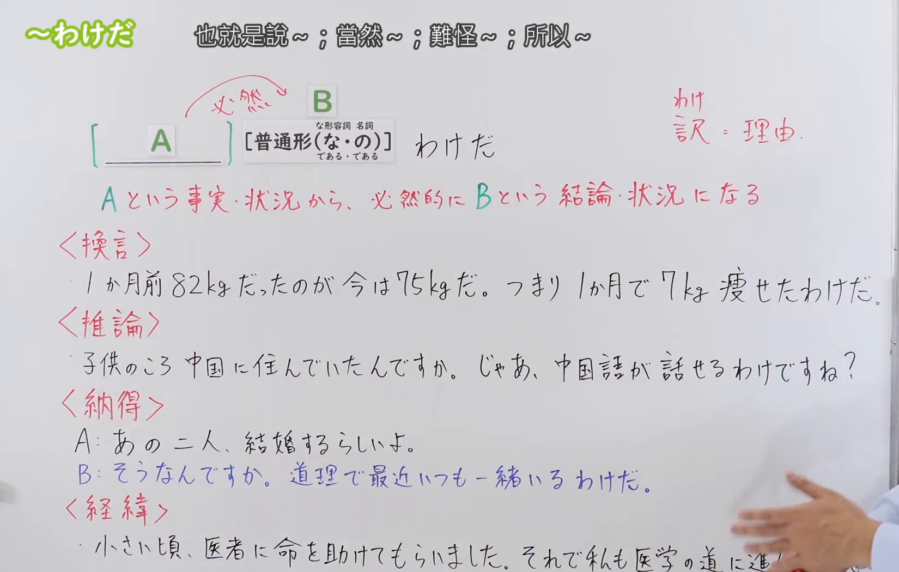

---
{
  "id": "N3-G-0084",
  "kind": "grammar",
  "level": "N3",
  "title": "～わけだ：理由、必然结论、换言与领会",
  "status": "confirmed",
  "card_revision": 1,
  "schema_version": 1,
  "created_at": "2026-09-14",
  "updated_at": "2026-09-14",
  "source": {
    "lesson": "N3 第84个语法",
    "material": "出口日語原视频板书、日语字幕与独立日文教学正文",
    "video": "https://www.youtube.com/watch?v=r-X9nF5xtgs",
    "screenshot": "assets/grammar/n3/N3-G-0084-0260.png",
    "screenshot_seconds": 260,
    "screenshot_crop": {
      "x": 0,
      "y": 0,
      "width": 1650,
      "height": 1050
    }
  },
  "tags": [
    "理由",
    "必然结论",
    "换言",
    "推论",
    "领会",
    "N3"
  ],
  "confusions": [
    "～はずだ",
    "～ということだ",
    "～わけがない",
    "～わけではない",
    "～わけにはいかない"
  ],
  "next_review": "2026-09-21"
}
---

# N3 第84课｜～わけだ

# 视频学习资料整理

按指定范围整理；学习者未提供个人原始输出或例句，不虚构理解判断。已核对播放列表第84项：标题「【Ｎ３文法】～わけだ」、视频 ID `r-X9nF5xtgs`、时长06:45。本批整理前未发现本课正式卡或复习事件；学习者于2026-09-14确认入库，本卡从确认日开始七天复习周期。

接续图取自[原视频04:20](https://www.youtube.com/watch?v=r-X9nF5xtgs&t=260s)。原帧1920×1080，固定左上角裁为(0,0,1650,1050)，保留标题、普通形接续、核心说明及换言、推论、领会、经过四类板书；裁去右侧人物与底部少量空白，未抹除、重绘或拼接。

例句图取自[原视频05:00](https://www.youtube.com/watch?v=r-X9nF5xtgs&t=300s)。原帧1920×1080，固定左上角裁为(0,0,1920,1050)，完整保留四句课程例句及中文说明，仅裁去底部少量边框，未重绘或拼接。

# 核心与接续

## **～わけだ**

## **A【普通形（な/である・の／である）】B わけだ**

以上总接续按视频板书整理；其中A是理由、事实或既有信息，B是由A自然得到的结论、换言或领会。视频用「わけ＝訳＝理由」帮助理解，但实际用法不只是在直译“理由”。

| 类型 | 接续 | 示例 |
|---|---|---|
| 动词 | 普通形＋わけだ | 毎日練習しているから、上手になるわけだ。 |
| い形容词 | 普通形＋わけだ | 北海道の冬だから、寒いわけだ。 |
| な形容词 | 词干＋な／である＋わけだ | 英語が上手なわけだ。／静かであるわけだ。 |
| 名词 | 名词＋の／である＋わけだ | 今日は定休日のわけだ。／彼が責任者であるわけだ。 |

礼貌体用「～わけです」。口语中也常见说明语气的「～わけなんだ／～わけなんですね」。外部资料还收录「～というわけだ」；它适合承接较长内容或明确作总结，本课核心仍是视频标题「～わけだ」。

# 语义边界与适用条件

1. **必然结论。** 根据数字、条件或事实得出自然结果，相当于“所以自然就……”。
2. **换言或归纳。** 把前面的事实换一种更清楚的说法，常与「つまり」「要するに」呼应。
3. **推论。** 根据已知经历、身份等推出合理结论；不是无根据猜测。
4. **领会、纳得。** 得知背景后恍然理解，常与「なるほど」「どうりで」「だから」「それで」呼应，中文常译“难怪／原来如此”。
5. **说明经过或来由。** 可以交代现在状况是怎样形成的，但必须有可追溯的理由或过程。
6. **不是单纯主张。** 若没有前提或语境，只说「彼は来るわけだ」会显得理由链不清楚。

# 例句

## 原视频例句

1. 300ページの本だから、毎日10ページ勉強すれば1か月で読み終わるわけだ。  
   因为是300页的书，每天学10页，一个月自然就能读完。

2. 昨日はずっと遊んでいた？つまり、宿題をしていないわけですね？  
   昨天一直在玩？也就是说，你没有做作业，对吧？

3. 浅野さんは子供のころアメリカに住んでいたらしい。どうりで英語が上手なわけだ。  
   听说浅野小时候住在美国。难怪他英语好。

4. ああ、電気がつかないわけだ。電池のプラスとマイナスの向きが反対だよ。  
   啊，难怪灯不亮。电池正负极的方向装反了。

## 补充自然例句（自拟）

- 彼は日本に十年住んでいたんですか。なるほど、日本語が自然なわけですね。  
  他在日本住了十年吗？原来如此，难怪日语这么自然。
- 一人千円で七人だから、全部で七千円になるわけだ。  
  每人一千日元，共七个人，所以总计自然是七千日元。

# 易混项与 JLPT 考点

- **～はずだ**：表示说话人基于依据作出的强推测或预期；「～わけだ」更侧重由事实所得的结论，或得知背景后的领会。
- **～ということだ**：可表示传闻或“也就是说”；「～わけだ」通常还带理由链、必然性或纳得感。
- **～わけがない**：强烈判断“绝不可能”，不是本课的理由／结论。
- **～わけではない**：否定某个整体判断，常含部分否定；不能把「ではない」拆成普通句尾来理解。
- **～わけにはいかない**：因社会常识、道义或人际因素“不能做”，与本课意义不同。
- **接续题重点**：な形容词用「な／である」，名词用「の／である」；不要机械接「だわけだ」。
- **呼应词辨义**：「つまり」多提示换言；「どうりで／なるほど」多提示领会；数字或条件常提示必然结论。

# 来源与复核记录

核对日期：2026-09-14。

- [出口日語原视频](https://www.youtube.com/watch?v=r-X9nF5xtgs)：支持板书总接续、由A得出B，以及换言、推论、领会、经过等讲解和四句课程例句。
- [日本語NET「～わけだ／～というわけだ」](https://nihongokyoshi-net.com/2019/01/23/jlptn3-grammar-wakeda/)：复核动词／形容词／名词接续，以及“当然的结论”和得知理由后纳得的用法。
- [たのすけ「～わけだ」](https://tanosuke.com/wakeda/)：复核な形容词「な／である」、名词「の／である」，并区分“纳得”与“结论”两类用法及「～はずだ」。
- [毎日のんびり日本語教師「～わけ」](https://mainichi-nonbiri.com/grammar/n3-wake/)：复核理由、结论／事实强调、换言／总结、纳得／理解四类语义和典型呼应词。

网页获取记录：Crawl4AI 0.9.3 成功读取以上三份独立日文教学正文；搜索页只用于发现候选网址，未作为教学依据。

字幕校对：日语自动字幕存在断句和同音误识，例如末句把「反対だよ」识成其他词；已结合清晰板书、日语讲解和例句页校正，四条课程例句以例句页文字为准。

复核结论：视频与三份独立正文对核心接续及理由链、结论和纳得用法一致。学习者已于2026-09-14确认入库，下次复习为2026-09-21。

