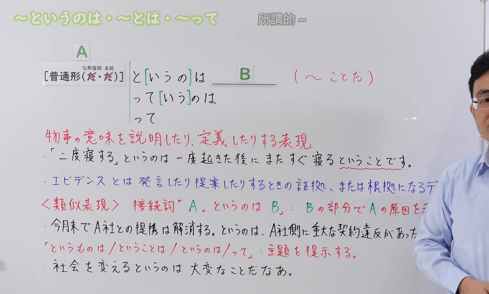
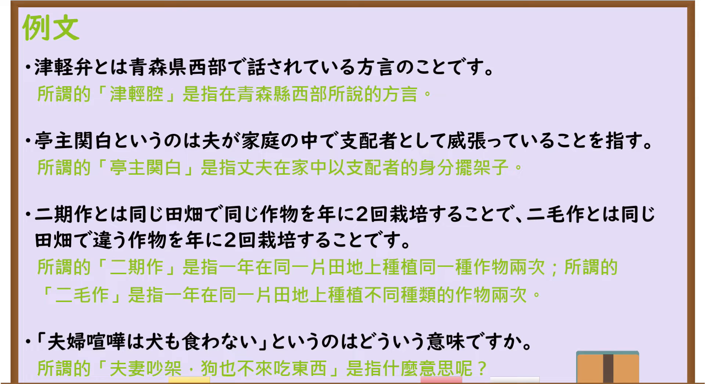

---
{
  "id": "N3-G-0087",
  "kind": "grammar",
  "level": "N3",
  "title": "～というのは／～とは／～って：说明、定义词语",
  "status": "confirmed",
  "card_revision": 1,
  "schema_version": 1,
  "created_at": "2026-09-14",
  "updated_at": "2026-09-19",
  "next_review": "2026-09-21",
  "source": {
    "lesson": "N3 第87个语法",
    "material": "出口日語原视频板书、日语字幕与独立日文教学正文",
    "video": "https://www.youtube.com/watch?v=jvHiwSk207c",
    "screenshot": "assets/grammar/n3/N3-G-0087-0440.png",
    "screenshot_seconds": 280,
    "screenshot_crop": {
      "x": 0,
      "y": 0,
      "width": 1660,
      "height": 1000
    }
  },
  "tags": [
    "定义",
    "词语说明",
    "口语",
    "语体",
    "N3"
  ],
  "confusions": [
    "接续词というのは",
    "～というものは",
    "～ということは",
    "～ということだ"
  ]
}
---

# N3 第87课｜～というのは・～とは・～って

# 视频学习资料整理

按指定范围整理；学习者未提供个人原始输出或例句，不虚构理解判断。已核对播放列表第87项：标题「【Ｎ３文法】～というのは・～とは・～って」、视频ID `jvHiwSk207c`、时长06:35。学习者于2026-09-14确认入库，本卡从确认日开始七天复习周期。

先检查[原视频00:01](https://www.youtube.com/watch?v=jvHiwSk207c&t=1s)，再逐段比较02:40、03:00、03:20、03:40、03:50、04:10、04:20和04:40的同一板书。接续图取自[原视频04:40](https://www.youtube.com/watch?v=jvHiwSk207c&t=280s)：原帧1920×1080，固定左上角裁为(0,0,1660,1000)，保留标题、A／B结构、三组省略形式、定义说明、两个板书例句，以及接续词「というのは」和主题提示用法的易混说明。右缘老师身体仍遮住蓝色例句和接续词说明的少量句末；这些部分已结合该段日语讲解和独立日文正文核对。未抹除、重绘或拼接。

例句图取自[原视频05:00](https://www.youtube.com/watch?v=jvHiwSk207c&t=300s)，位于视频后半部分的例句页，完整显示四条课程例句及中文说明。原帧1920×1080，固定左上角裁为(0,0,1920,1050)，仅裁去底部少量边框，未重绘或拼接。

# 核心与接续

## **A【普通形（だ不要・だ不要）】＋と[いうの]は／って[いう]のは／って，B（～ことだ）。**

总接续严格依照原视频板书展开。两个「だ不要」依次对应な形容词和名词的现在肯定形：在本课“把A作为词语或概念来定义”的结构中去掉「だ」，再接后面的形式；动词和い形容词按普通形接续。方括号表示板书中的成分可以省略：`と[いうの]は`包括「というのは／とは」，`って[いう]のは`包括「っていうのは／ってのは」，另有口语「って」。B负责说明或定义A，常以「～ことだ／ことです」「～のことだ」「～という意味だ」等收束。

| 类型 | 接续规则 | 示例 |
|---|---|---|
| 动词 | 动词普通形＋というのは／とは／って | 二度寝するというのは、一度起きた後にまたすぐ寝るということです。 |
| い形容词 | い形容词普通形＋というのは／とは／って | 難しいというのは、簡単にはできないという意味です。 |
| な形容词 | 现在肯定形去掉だ＋というのは／とは／って；否定、过去等按普通形 | 静かというのは、音が少ない状態のことです。 |
| 名词 | 现在肯定形去掉だ＋というのは／とは／って；否定、过去等按普通形 | エビデンスとは、発言や提案の根拠になるデータのことです。 |

课程说明A位置大多是名词，也可以放需要解释的引用语、短语或句子。若A本身是一整句引用，其中的「だ」属于引用内容，则不能机械删除；本课主表首先对应视频所讲的“词语定义”结构。

## 用法①：向对方说明陌生词、专门词或缩略语的意思

**说话人的意图：** 说话人判断听者不认识A这个说法，主动把它取出来、用B交代它的所指，替双方统一用语。意图是消除信息差而不是发表感想，所以B必须真正解释A，常以「～ことです／～という意味です／～を指す」收束；正式说明多用「とは」，一般会话多用「というのは」，「って」只用于随意场合。

**场景演示（自拟场景）：**
研究发表会的开场，主持人向到场的家长和学生说明当天题目里的关键词。

司会：本日のテーマ「共創」というのは、立場の違う人たちがお互いに意見を出し合い、新しい価値を一緒に生み出すことを指します。 
（今天主题中的“共創”，指的是立场不同的人互相提出意见、一起创造出新价值。）

参加者：学校と企業が組むだけの話かと思っていました。 
（我还以为只是学校和企业合作的事。）

司会：そこが従来の「産学連携」と違うところです。地域まで巻き込むのが「共創」だと言われています。 
（那正是与以往的“产学合作”不同之处。据说把地区也一起纳入才是“共創”。）

「共創」というのは…ことを指します，B负责释义，与板书例句「津軽弁とは…方言のことです」「エビデンスとは…データのことです」同一用法；被解释项是な形容词或名词时，现在肯定形要去掉「だ」，写「静かというのは…状態のことだ」。若在同一场合写「共創って何ですか」と问，则属于下面的提问用法。

## 用法②：请对方解释某个说法是什么意思

**说话人的意图：** 说话人自己不认识A，把A摆在话题位置，向对方索取解释。意图是明确请求信息，因此B通常带疑问表达，如「どういう意味ですか／何のことですか」。用「って」最随意，用「というのは」显得郑重，需按对象选择。

**场景演示（自拟场景）：**
入职第二年的高桥在整理部长的会议记录，遇到看不懂的谚语，趁休息时询问。

高桥：部長、すみません。「石橋を叩いて渡る」って、どういう意味ですか。 
（部长，不好意思。“石橋を叩いて渡る”是什么意思？）

部長：危ういものは確かめてから進む、という意味だよ。今回の契約書も、何度も確認してから出しなさいということだ。 
（意思是危险的东西要确认过再往前走。这次合同也是让你反复确认之后再交出去。）

高桥：承知しました。ことわざではなく、自分の言葉で書き直します。 
（明白了。我不用谚语，用自己的话重新写。）

「『石橋を叩いて渡る』って、どういう意味ですか」是口语提问形式，与板书例句4「『夫婦喧嘩は犬も食わない』というのはどういう意味ですか」结构相同，只是语体一随意一郑重。这里的「って」仍是在提出待解释的A，不是引用传闻；若写「部長が石橋を叩いて渡るって言っていましたが」，那个「って」就变成了引用传闻的助词，属另一用法。

## 用法③：把A提起为话题，再说出自己的感想或评价

**说话人的意图：** A并不是需要解释的生词，说话人只是把它作为谈论的对象先立起来，后半句要说的是自己的感受、评价或判断。意图是借此发表感想、引起对方共鸣，因此B多为「大変なことだ／不思議だ／ありがたい」一类评价，而不是释义。

**场景演示（自拟场景）：**
社团第一次独立承办讲演会，忙到深夜才结束。收完椅子后，山下和伊藤坐在空会场里说话。

山下：今日はもう動けないよ。集客から当日の進行まで、全部二人でやったんだから。 
（今天实在动不了了。从招人到当天的流程，全是两个人做的。）

伊藤：人を集めるというのは大変なことだね。来年もやるなら、三月から準備したい。 
（召集人真是件难事啊。明年还办的话，我想从三月就开始准备。）

山下：そうだね。今年は四月から始めたから、どうしても詰め込みになった。 
（是啊。今年是从四月开始的，所以怎么都是临时硬塞。）

「人を集めるというのは大変なことだね」中，B没有解释“集める”的词义，而是对这件事下评价，与视频中的「社会を変えるというのは大変なことだなあ」同一结构。判断方法：B是释义（～ことだ／という意味だ／を指す）就是用法①，B是感想或评价就是这一类。另需注意，独立出现在句首的「A。というのは、Bからだ」是接续词，B说明前句A的原因（视频对照例「提携は解消する。というのは、A社側に重大な契約違反があったからだ」），不属于本课的定义结构。

# 语义边界、适用条件及语体

- **核心功能**：把听者可能不熟悉的新词、缩略语、专门词或表达放在A，利用B说明其意思、本质或所指对象。
- **「というのは」**：中性且常用，口语和书面语都可出现。
- **「とは」**：更简洁、偏书面或正式，常见于辞典式定义、标题和说明文；日常对话中通常更常说「というのは」。
- **「っていうのは／ってのは／って」**：口语形式。「って」也常用于提问，如「エビデンスってどういう意味？」。
- **B的形式**：名词定义常接「～のことだ／ことです」；动作、状态或整句内容的释义常接「～ということだ／という意味だ」。这些是高频收束方式，不是唯一后项。
- **范围限制**：本课重点是“解释、定义A”。普通的引用、传闻或单纯把从句名词化，不一定属于本课用法。

# 课程例句与中文译文

以下四条来自原视频例句页：

1. 津軽弁とは青森県西部で話されている方言のことです。
   “津轻方言”是指在青森县西部使用的方言。
2. 亭主関白というのは夫が家庭の中で支配者として威張っていることを指す。
   “大男子主义的一家之主”是指丈夫在家庭中以支配者自居并摆威风。
3. 二期作とは同じ田畑で同じ作物を年に2回栽培することで、二毛作とは同じ田畑で違う作物を年に2回栽培することです。
   “一年两熟”是在同一块田地一年栽培两次同一种作物；“一年两作”是在同一块田地一年栽培两次不同作物。
4. 「夫婦喧嘩は犬も食わない」というのはどういう意味ですか。
   “夫妻吵架，狗都不理”是什么意思？

补充自然例句：

- サブスクというのは、料金を定期的に払って商品やサービスを利用する仕組みのことです。
  “订阅制”是指定期付费使用商品或服务的机制。
- A：二毛作って何？ B：同じ田畑で一年に違う作物を二回作ることだよ。
  A：“一年两作”是什么？B：就是在同一块田地一年种两次不同的作物。

# 易混项与JLPT考点

## 1. 定义用「AというのはB」与接续词「というのは」

- 本课：`AというのはBのことだ`，B说明A的意义。
- 接续词：`A。というのは、Bからだ`，后句B说明前句A的原因。
- 视频对照例：`今月末でA社との提携は解消する。というのは、A社側に重大な契約違反があったからだ。`

## 2. 与主题提示用法

「というものは／ということは／というのは／って」还可以把A提出为话题，再表达感想或意见，如视频中的「社会を変えるというのは大変なことだなあ」。这与给陌生词下定义相邻，但焦点是对主题进行评价，课程说明会在其他语法点展开。

## 3. 常见考试陷阱

- **语体选择**：正式定义优先「とは／というのは」；随意对话优先「っていうのは／って」。
- **后项判断**：定义句的B应真正解释A，常出现「～のことだ／ということだ／という意味だ／を指す」。
- **接续判断**：本课板书中な形容词、名词现在肯定形不加「だ」；但整句引用里的「だ」不能一概删除。
- **功能辨义**：看到「というのは」时，要判断它是在定义前面的A，还是作为接续词补充原因。

# 来源与复核记录

核对日期：2026-09-14。

- [出口日語原视频](https://www.youtube.com/watch?v=jvHiwSk207c)：支持普通形（な形容词、名词现在肯定去だ）、`と[いうの]は／って[いう]のは／って`、A／B结构、说明或定义词语、B常以「ことだ」收束、语体区别，以及两组易混用法和四条课程例句。
- [日本語教師たのすけ「～というのは（定義づけ・引用）」](https://tanosuke.com/toiunoha)：复核名词、引用文或语句接续，说明／定义功能，B常见收束形式，「って」为口语，以及「とは」更少用于日常会话的倾向。
- [毎日のんびり日本語教師「～というのは～のことだ／～とは～のことだ」](https://mainichi-nonbiri.com/grammar/n3-toiunohanokotoda/)：复核名词或名词句接续、定义说明功能，以及「のことだ／ということだ」两类典型结构。

网页获取记录：Crawl4AI 0.9.3成功读取以上两份互相独立的日文教学正文；站内搜索和Yahoo! JAPAN只用于发现候选网址，搜索摘要未作为教学依据。

字幕校对：自动字幕把「普通形」「名詞」「というのは」「とは」「って」「証拠」「根拠」等识别成「普通系」「名刺」「東亜」「日」「証拠」「根拠」等不稳定文本；已结合清晰板书、日语讲解和例句页校正。课程例句以清晰例句页文字为准。

复核结论：原视频与两份独立日文教学正文对核心定义功能、典型接续和后项形式一致。成稿重新检查了板书省略符号、四类词接续、语体差异、两个易混方向、例句和译文，以及两张图片的课程归属、实际时间与裁切范围；右缘少量遮挡不影响关键内容核实。学习者已于2026-09-14确认入库，下次复习为2026-09-21。

**2026-09-19补充：** 按学习者2026-09-19确认的流程要求，在"核心与接续"补充三组"说话人的意图＋场景演示"（均为自拟场景，接续、语义边界与语体按已核实规则编写，对话未沿用视频原句）。本次补充未改动总接续、接续表、原有例句与来源记录，确认日期和七天复习周期不变。
