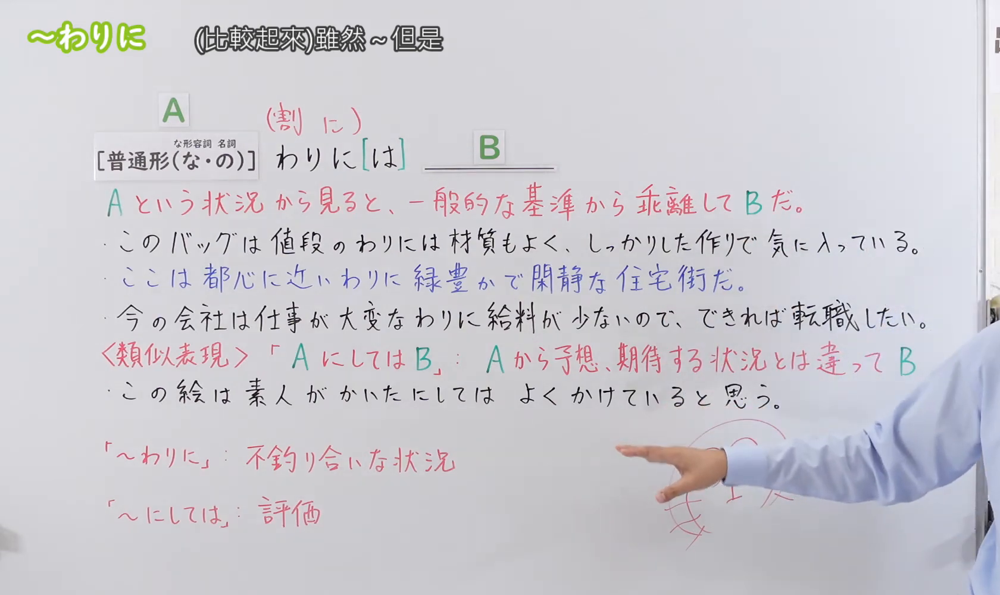

---
{
  "id": "N3-G-0088",
  "kind": "grammar",
  "level": "N3",
  "title": "～わりに／～わりには：与一般标准不相称",
  "status": "confirmed",
  "card_revision": 1,
  "schema_version": 1,
  "created_at": "2026-09-14",
  "updated_at": "2026-09-14",
  "next_review": "2026-09-21",
  "source": {
    "lesson": "N3 第88个语法",
    "material": "出口日語原视频板书、日语字幕与独立日文教学正文",
    "video": "https://www.youtube.com/watch?v=ayg65NvyNtw",
    "screenshot": "assets/grammar/n3/N3-G-0088-0420.png",
    "screenshot_seconds": 260,
    "screenshot_crop": {
      "x": 0,
      "y": 0,
      "width": 1680,
      "height": 1000
    }
  },
  "tags": [
    "不相称",
    "一般标准",
    "程度差",
    "正负评价",
    "N3"
  ],
  "confusions": [
    "～にしては",
    "～のに",
    "～にしても",
    "～かわりに"
  ]
}
---

# N3 第88课｜～わりに・～わりには

# 视频学习资料整理

按指定范围整理；学习者未提供个人原始输出或例句，不虚构理解判断。已核对播放列表第88项：标题「【Ｎ３文法】～わりに」、视频ID `ayg65NvyNtw`、时长06:19。学习者于2026-09-14确认入库，本卡从确认日开始七天复习周期。

先检查[原视频00:01](https://www.youtube.com/watch?v=ayg65NvyNtw&t=1s)，再逐段比较02:40、03:00、03:20、03:40、04:00、04:10、04:20和04:40的同一板书。接续图取自[原视频04:20](https://www.youtube.com/watch?v=ayg65NvyNtw&t=260s)：原帧1920×1080，固定左上角裁为(0,0,1680,1000)，保留标题、普通形（な・の）接续、可省略的「は」、一般标准偏离说明、三句板书例句，以及与「にしては」的区别。裁去右侧大部分人物与底部空白；右缘仅保留少量手臂，以免裁断可见板书。未抹除、重绘或拼接。

例句图取自[原视频05:00](https://www.youtube.com/watch?v=ayg65NvyNtw&t=300s)，位于视频后半部分的例句页，完整显示四句课程例句及中文说明。原帧1920×1080，固定左上角裁为(0,0,1920,1050)，仅裁去底部少量边框，未重绘或拼接。

# 核心与接续

## **A【普通形（な・の）】＋わりに[は]，B。**

总接续严格依照原视频板书书写。括号内「な・の」依次表示：な形容词现在肯定形的「だ」改为「な」，名词现在肯定形的「だ」改为「の」；动词和い形容词按普通形接续。`[は]`表示助词「は」有时会省略，因此完整形式可为「わりには」，省略后为「わりに」。整体表示：从A这一情况的一般标准来看，实际的B在程度上有所偏离、不相称，常译为“虽然……但比想象中……”“按……来说却……”。

| 类型 | 接续规则 | 示例 |
|---|---|---|
| 动词 | 动词普通形＋わりに／わりには | 厳しい食事制限をしているわりには、体重が減らない。 |
| い形容词 | い形容词普通形＋わりに／わりには | 体が細いわりには、力がある。 |
| な形容词 | 现在肯定形的だ改为な＋わりに／わりには；否定、过去等按普通形 | 有名なわりには、人が少ない。 |
| 名词 | 现在肯定形的だ改为の＋わりに／わりには；否定、过去等按普通形 | 評判のわりに、おもしろくなかった。 |

外部资料还记录较正式的「な形容词词干＋であるわりに」；原视频总接续只写「普通形（な・の）」，因此该变体不混入上面的板书总接续。

# 语义边界、适用条件及后项限制

- **有比较基准**：A提供年龄、价格、评价、努力程度、外形、身份等可形成一般预期的尺度，B说明实际程度与该预期不相称。
- **偏离方向不限**：B既可高于预期，也可低于预期；既能正面评价，也能负面评价。例如“价格不高但质量好”与“工作辛苦但工资低”都成立。
- **程度差是重点**：「わりに」常和具有程度幅度的词语搭配。若后项只是一个没有程度评价的单纯事实，「のに」通常更自然。
- **「は」的作用**：「わりには」把该比较基准进一步凸显，常带对比或限定感；「わりに」较中性。两者核心意义相同。
- **语体**：日常说明和评价中常用，特别正式、硬质的文章通常会选其他书面表达。
- **不是等比例**：这里不是数学上的“比例”，而是以A为参照所得的通常预期与实际B之间的落差。

# 课程例句与中文译文

以下四句来自原视频例句页：

1. 彼女は体が細いわりには力があります。
   她虽然身材纤细，却很有力气。
2. あの映画は評判のわりにそんなにおもしろくなかった。
   那部电影名气很大，但并没有那么好看。
3. かなり厳しい食事制限をしているわりには体重はなかなか減らない。
   明明进行了相当严格的饮食控制，体重却迟迟不下降。
4. 近頃は年のわりに精神的に未熟な人が多くなったような気がする。
   最近感觉心理上不够符合其年龄成熟度的人好像变多了。

补充课程板书例句：

- このバッグは値段のわりには材質もよく、しっかりした作りで気に入っている。
  这个包按价格来说材质很好、做工也结实，我很喜欢。
- ここは都心に近いわりに、緑豊かで閑静な住宅街だ。
  这里虽然靠近市中心，却是绿意盎然、环境清静的住宅区。

# 易混项与JLPT考点

## 1. ～わりに 与 ～にしては

- 「わりに」着眼于以A为尺度时，B的程度与一般标准不相称，常和年龄、价格、评价、努力程度等有幅度的内容搭配。
- 「にしては」更容易把某个具体事实、身份或条件作为前提，表达B不同于由此产生的预想，并常带说话者评价。
- 两者很多场合可以替换，差异是倾向而非绝对禁令。视频用「わりに＝不釣り合いな状況」「にしては＝評価」作入门区别；独立资料进一步补充“有幅度的标准”与“较具体前提”的倾向。

## 2. ～わりに 与 ～のに

- 「のに」只需表达事实间的逆接，不要求A形成尺度，也不要求B有程度评价。
- 「わりに」必须能从A建立一般标准，再评价B偏离了多少。
- 例如「電気をつけたのに、つかない」是单纯事实相反，不能自然替换为「わりに」。

## 3. 常见考试陷阱

- **接续题**：名词用「名词＋の＋わりに」，な形容词现在肯定用「な形容词词干＋な＋わりに」。
- **助词题**：板书的 `[は]` 表示「は」可有可无，不要误认为必须固定成「わりには」。
- **辨义题**：同时找出A所建立的一般预期与B的实际程度，确认二者存在落差。
- **后项限制**：若结果只有纯粹二选一、没有程度幅度，或B仅陈述事实而不含评价，通常不选「わりに」。

# 来源与复核记录

核对日期：2026-09-14。

- [出口日語原视频](https://www.youtube.com/watch?v=ayg65NvyNtw)：支持普通形（な・の）接续、可省略的「は」、从A的一般标准看B有所偏离、正负方向皆可，以及与「にしては」的课程内区别和四句例句。
- [日本語教師たのすけ「～わりに（は）」](https://tanosuke.com/wariniha/)：复核名词＋の、动词／形容词普通形、な形容词＋な／である，基准与实际不相称、正负评价皆可、程度有幅度的搭配倾向及「は」的强调作用。
- [日本語教師のN1et「わりに」](https://jn1et.com/warini/)：复核后项需带评价的限制，以及「わりに」偏向年龄、价格等有程度幅度的标准、「にしては」偏向较具体事项的辨析。
- [日本語NET「～わりに」](https://nihongokyoshi-net.com/2018/11/20/jlptn3-grammar-warini/)：复核四类接续、预期程度与实际程度的落差、差异可好可坏，以及没有程度幅度的二元结果不适合本结构。

网页获取记录：Crawl4AI 0.9.3成功读取以上三份互相独立的日文教学正文；站内搜索和Yahoo! JAPAN只用于发现候选网址，搜索摘要未作为教学依据。たのすけ将本项标作N2，原课程、日本語NET和N1et标作N3；等级标注存在教材差异，但不影响本卡对接续和用法的复核。

字幕校对：自动字幕把「普通形」「な形容詞」「名詞」「わりに」「括弧」「一般的な基準」「不釣り合い」等误识为「普通系」「南渓」「名刺」「終わりに」「格好」「一般的な基準」「不釣り合い」等；已结合清晰板书、日语讲解和例句页校正。课程四条例句以清晰例句页文字为准。

复核结论：原视频与三份独立日文教学正文对四类接续、一般标准与实际程度不相称、正负评价皆可及相邻语法的主要差异一致。成稿重新检查了总接续、`[は]`含义、语义边界、后项限制、例句和译文，以及两张图片的课程归属、实际时间与裁切范围。学习者已于2026-09-14确认入库，下次复习为2026-09-21。
