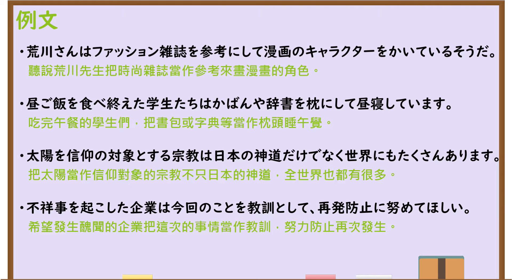

---
{
  "id": "N3-G-0089",
  "kind": "grammar",
  "level": "N3",
  "title": "～を…にして／～を…として：把A当作B来做C",
  "status": "confirmed",
  "card_revision": 1,
  "schema_version": 1,
  "created_at": "2026-09-14",
  "updated_at": "2026-09-19",
  "source": {
    "lesson": "N3 第89个语法",
    "material": "出口日語原视频板书、日语字幕与独立日文教学正文",
    "video": "https://www.youtube.com/watch?v=EagiBgKcDFI",
    "screenshot": "assets/grammar/n3/N3-G-0089-0240.png",
    "screenshot_seconds": 240,
    "screenshot_crop": {
      "x": 0,
      "y": 0,
      "width": 1650,
      "height": 1050
    }
  },
  "tags": [
    "身份",
    "立场",
    "用途",
    "认定",
    "N3"
  ],
  "confusions": [
    "～としては",
    "～にしては",
    "～向け",
    "～をきっかけに",
    "～にして"
  ],
  "next_review": "2026-09-21"
}
---
# N3 第89课｜～を…にして・～を…として

# 视频学习资料整理

按指定范围整理；学习者未提供个人原始输出或例句，不虚构理解判断。已核对播放列表第89项：标题「【Ｎ３文法】～を…にして・～を…として」、视频 ID `EagiBgKcDFI`、时长06:03。此前未发现本课正式卡或复习事件；学习者已于2026-09-14确认入库，本卡从确认日开始七天复习周期。

接续图取自[原视频04:00](https://www.youtube.com/watch?v=EagiBgKcDFI&t=240s)。原帧1920×1080，固定左上角裁为(0,0,1650,1050)，保留标题、A／B／C板书、名词接续、核心说明和应用表达；裁去右侧人物及底部少量空白，未抹除、重绘或拼接。

例句图取自[原视频04:40](https://www.youtube.com/watch?v=EagiBgKcDFI&t=280s)，位于视频后半部分的例句页，完整显示四句课程例句及中文说明。原帧1920×1080，固定左上角裁为(0,0,1920,1050)，仅裁去底部少量边框，未重绘或拼接。

# 核心

## 功能一：把A认定为B，并以此进行C

**最上位意味カテゴリー：**

- **「を〜とする」：** ものごとの関係（事物之间的关系）

**中位意味カテゴリー：**

- **「を〜とする」：** 経過・結末（经过与结果）

**意味：**

- **「を〜とする」：** 決定（决定）

**くわしい意味記述：**

- **を〜とする：** 「ある対象を〜と考える，見なす，位置づける」という意味。「〜を〜として」とほぼ同じ意味を表す。（表示“把某个对象看作、视为或定位为～”。与「〜を〜として」表达的意思基本相同。）

**派生語：** を〜として，を〜としたN

### 例句

1. 田中君をこのチームのリーダーとする。

   （决定让田中担任这个团队的负责人。）

2. 社会奉仕を目的とする団体の活動を支援する。

   （支持以服务社会为目的的团体活动。）

3. ダイエットを目的とした食品を開発した。

   （开发了以减肥为目的的食品。）

4. 結婚を前提として彼女とつきあっている。

   （以结婚为前提和她交往。）

# 来源

- [出口日語原视频](https://www.youtube.com/watch?v=EagiBgKcDFI)
- [Hagoromo「を〜とする」条目](https://hagoromo-text.work/lookup?vid=47)／[例句](https://hagoromo-text.work/get_reibun?vid=47)（查询日期：2026-09-20）
