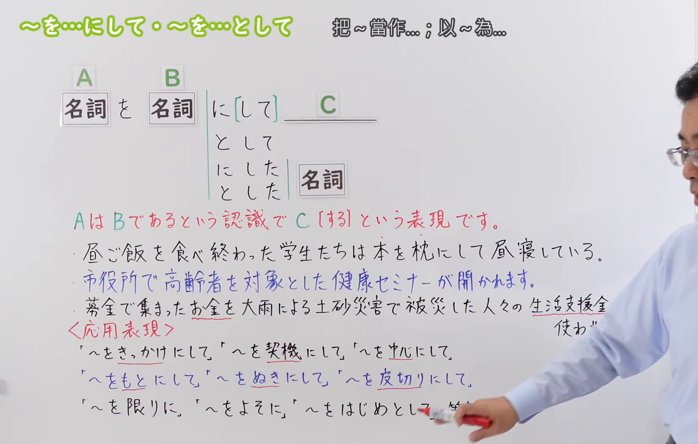
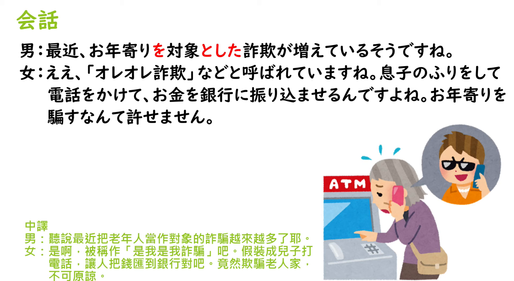

---
{
  "id": "N3-G-0089",
  "kind": "grammar",
  "level": "N3",
  "title": "～を…にして／～を…として：把A当作B来做C",
  "status": "confirmed",
  "card_revision": 1,
  "schema_version": 1,
  "created_at": "2026-09-14",
  "updated_at": "2026-09-14",
  "source": {
    "lesson": "N3 第89个语法",
    "material": "出口日語原视频板书、日语字幕与独立日文教学正文",
    "video": "https://www.youtube.com/watch?v=EagiBgKcDFI",
    "screenshot": "assets/grammar/n3/N3-G-0089-0240.png",
    "screenshot_seconds": 240,
    "screenshot_crop": {
      "x": 0,
      "y": 0,
      "width": 1650,
      "height": 1050
    }
  },
  "tags": [
    "身份",
    "立场",
    "用途",
    "认定",
    "N3"
  ],
  "confusions": [
    "～としては",
    "～にしては",
    "～向け",
    "～をきっかけに",
    "～にして"
  ],
  "next_review": "2026-09-21"
}
---
# N3 第89课｜～を…にして・～を…として

# 视频学习资料整理

按指定范围整理；学习者未提供个人原始输出或例句，不虚构理解判断。已核对播放列表第89项：标题「【Ｎ３文法】～を…にして・～を…として」、视频 ID `EagiBgKcDFI`、时长06:03。此前未发现本课正式卡或复习事件；学习者已于2026-09-14确认入库，本卡从确认日开始七天复习周期。

接续图取自[原视频04:00](https://www.youtube.com/watch?v=EagiBgKcDFI&t=240s)。原帧1920×1080，固定左上角裁为(0,0,1650,1050)，保留标题、A／B／C板书、名词接续、核心说明和应用表达；裁去右侧人物及底部少量空白，未抹除、重绘或拼接。

例句图取自[原视频05:20](https://www.youtube.com/watch?v=EagiBgKcDFI&t=320s)。原帧1920×1080，固定左上角裁为(0,0,1920,1050)，完整保留课程例句页，仅裁去底部少量边框，未重绘或拼接。

# 核心与接续

## **～を…にして・～を…として**

## **名词Aを名词B＋に[して]／として，C；名词Aを名词B＋にした／とした＋名词**

以上总接续按学习者指定方式展开，并保留视频板书的A、B、C和「に[して]／として」。四种形式是：①名词Aを名词Bに[して]，C；②名词Aを名词Bとして，C；③名词Aを名词Bにした＋名词；④名词Aを名词Bとした＋名词。A被当作B来认识、处理或使用，C是随后进行的动作、状态或评价。

| 类型 | 接续规则 | 示例 |
|---|---|---|
| 名词 | 名词＋を＋名词＋にして＋后项谓语 | 本を枕にして昼寝している。 |
| 名词 | 名词＋を＋名词＋として＋后项谓语 | 本を枕として使う。 |
| 名词 | 名词＋を＋名词＋にした＋名词 | 高齢者を対象にした健康セミナー。 |
| 名词 | 名词＋を＋名词＋とした＋名词 | 高齢者を対象とした健康セミナー。 |

「にして」「として」表示同一核心认定；视频还列出「～をきっかけにして」「～を契機にして」等相似表达，但它们表示起因，不与本课的“把A当作B”混为一谈。

# 语义边界与适用条件

1. **身份／立场／资格。** 把A视为B的身份或立场，并以该身份进行C，如「教師として働く」。
2. **用途／处理方式。** 把A当作B使用、处理或认识，如把书当枕头。
3. **目标对象。** 「高齢者を対象としたセミナー」表示以老年人为对象的研讨会；「対象にした」也可用。
4. **「にして」与「として」的倾向。** 「にして」较具体地呈现“设为B后进行C”的动作过程；「として」较突出“以B身份／用途／立场”。多数语境可互换，但固定搭配和后接名词要按句型选择。
5. **后接名词。** 不能直接用「として」修饰名词，应使用「としての＋名词」或视频所示「とした＋名词」；「にした＋名词」同理。

# 例句

## 原视频例句

1. 昼ご飯を食べ終わった学生たちは本を枕にして昼寝している。  
   吃完午饭的学生们把书当枕头睡午觉。
2. 市役所で高齢者を対象とした健康セミナーが開かれます。  
   市政府将举办以老年人为对象的健康讲座。
3. 募金で集まったお金を大雨による土砂災害で被災した人々の生活資金として使わせていただきます。  
   募集到的捐款将作为暴雨引发泥石流灾民的生活资金使用。
4. 人として、そんなことは許せない。  
   作为一个人，那种事无法原谅。

## 补充自然例句（自拟）

- 彼は通訳として会議に参加した。  
  他以口译员身份参加了会议。
- この部屋を勉強部屋にして使っています。  
  我把这个房间当作书房使用。

# 易混项与 JLPT 考点

- **～としては**：表示“作为……来说／就……而言”的评价基准，后面常接评价；本课「として」是把A认定为B来做C。
- **～にしては**：表示“以……而言却出乎预期”，含反常评价；不能按「～にして」拆开理解。
- **～向け**：表示制作者预先面向某对象；「対象として／対象にして」强调把对象认定为B。
- **～をきっかけに**：表示A成为B开始或变化的契机，不含“把A当作B”的身份／用途关系。
- **接续题重点**：名词Aを名词B＋に[して]／として，C；修饰名词时用「名词Aを名词B＋にした／とした＋名词」。
- **等级差异**：出口日語将本课编为N3；独立资料「毎日のんびり日本語教師」标为N2。本卡按课程编号保留N3，等级差异不影响接续与语义。

# 来源与复核记录

核对日期：2026-09-14。

- [出口日語原视频](https://www.youtube.com/watch?v=EagiBgKcDFI)：支持「AをBにして／AをBとしてC」、后接名词的「にした／とした」、身份／用途／对象认定及课程例句。
- [日本語NET「～として」](https://nihongokyoshi-net.com/2020/01/06/jlptn3-grammar-toshite/)：复核名词＋として、としての、としても等身份、立场、资格和用途表达。
- [毎日のんびり日本語教師「～として」](https://mainichi-nonbiri.com/grammar/n2-toshite/)：复核名词＋として／としての／としても、对象认定和后接名词的形式；该站等级标为N2。
- [日本語教師のN1et「～として」](https://jn1et.com/toshite-n3/)：复核N3教学语境下「として」表示身份、立场、作用和资格的核心意义。

网页获取记录：Crawl4AI 0.9.3 成功读取以上三份独立日文教学正文；无效或移动的候选页未作为依据，搜索摘要未作为教学证据。

字幕校对：自动字幕把「名詞」「として」「対象」「土砂災害」等多处误识为同音词；已结合板书、日语讲解和例句页校正。课程例句以清晰画面文字为准。

复核结论：原视频与独立正文对名词接续、身份／用途／对象认定核心一致。学习者已于2026-09-14确认入库，下次复习为2026-09-21。
