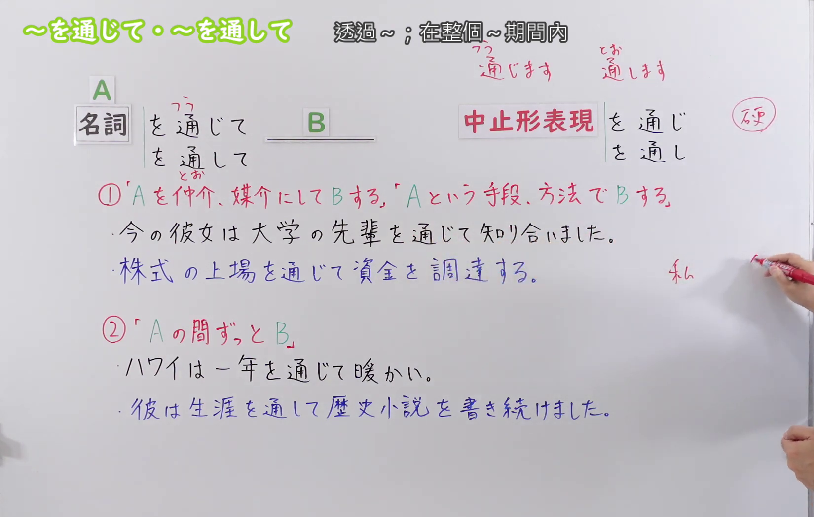
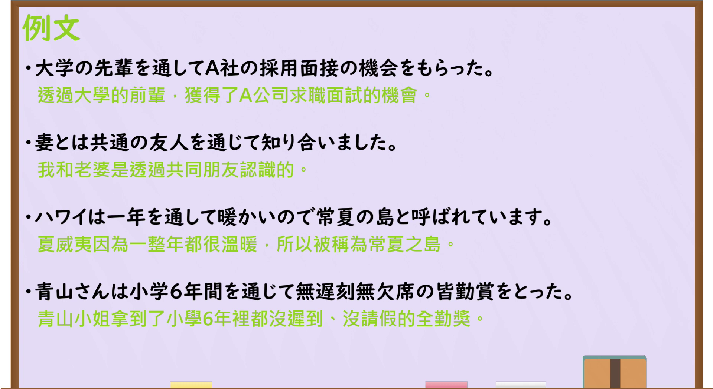

---
{
  "id": "N3-G-0093",
  "kind": "grammar",
  "level": "N3",
  "title": "～をつうじて(通じて)／～をとおして(通して)：通过……；在整个期间",
  "status": "confirmed",
  "card_revision": 1,
  "schema_version": 1,
  "created_at": "2026-09-14",
  "updated_at": "2026-09-14",
  "next_review": "2026-09-21",
  "source": {
    "lesson": "N3 第93个语法",
    "material": "出口日語原视频板书、日语字幕与独立日文教学正文",
    "video": "https://www.youtube.com/watch?v=2fxbotdyhRU",
    "screenshot": "assets/grammar/n3/N3-G-0093-0090.png",
    "screenshot_seconds": 90,
    "screenshot_crop": {
      "x": 0,
      "y": 0,
      "width": 1650,
      "height": 1050
    }
  },
  "tags": [
    "媒介",
    "手段",
    "整个期间",
    "持续",
    "N3"
  ],
  "confusions": [
    "～によって",
    "～をへて(経て)",
    "～にわたって",
    "～をつうじて与～をとおして",
    "中止形"
  ]
}
---

# N3 第93课｜～をつうじて(通じて)・～をとおして(通して)

# 视频学习资料整理

按指定范围整理；学习者未提供个人原始输出或例句，不虚构理解判断。已核对播放列表第93项：标题「【Ｎ３文法】～を通じて・～を通して」、视频 ID `2fxbotdyhRU`、时长05:27。本卡已于2026-09-14确认入库，正式卡与七天复习周期已创建。

先检查[原视频00:01](https://www.youtube.com/watch?v=2fxbotdyhRU&t=1s)，该画面中人物遮挡右侧中止形和部分语义说明。接续图因此改取[原视频01:30](https://www.youtube.com/watch?v=2fxbotdyhRU&t=90s)：原帧1920×1080，固定左上角裁为(0,0,1650,1050)，保留标题、A／B结构、两种主要形式、两种中止形、媒介／手段和整个期间两类含义，以及四句板书例句；右缘仅保留少量手部，底部裁去少量空白。未抹除、重绘或拼接。

例句图取自[原视频04:00](https://www.youtube.com/watch?v=2fxbotdyhRU&t=240s)，位于视频后半部分的例句页，完整显示四句课程例句及中文说明。原帧1920×1080，固定左上角裁为(0,0,1920,1050)，仅裁去底部少量边框，未重绘或拼接。

# 核心与接续

## **名词A＋をつうじて(通じて)，B**

## **名词A＋をとおして(通して)，B**

## **名词A＋をつうじ(通じ)，B**

## **名词A＋をとおし(通し)，B**

总接续依照原视频板书顺序，保留A、B和两种中止形。A可以是人物、组织、媒体、活动、经历或方法，表示B借助A这一媒介、手段而实现；A也可以是时间段，表示在A的整个期间内一直处于B的状态或持续做B。

| 类型 | 接续规则 | 示例 |
|---|---|---|
| 名词 | 表示媒介或手段的名词＋をつうじて(通じて)＋后项谓语 | 友人を通じて知り合う。 |
| 名词 | 表示媒介或手段的名词＋をとおして(通して)＋后项谓语 | 研修を通して学ぶ。 |
| 名词 | 表示期间的名词＋をつうじて(通じて)＋后项谓语 | 一年を通じて暖かい。 |
| 名词 | 表示期间的名词＋をとおして(通して)＋后项谓语 | 生涯を通して研究を続ける。 |
| 名词 | 名词＋をつうじ(通じ)／をとおし(通し)＋后项谓语 | インターネットを通じ、情報を発信する。 |

外部资料还列有「动词辞书形＋こと＋をつうじて(通じて)／をとおして(通して)」，如「失敗することを通して学ぶ」。这是把某一行为或经历名词化后作为媒介的常见补充形式，但原视频总接续只写名词，故不加入上面的大号总接续。

# 语义边界与适用条件

1. **媒介、仲介。** A是连接两方的人、组织或信息渠道，例如通过朋友认识某人、通过新闻得知消息。此时重点不是动作发生的地点，而是信息或关系经由什么建立。
2. **手段、方法或经历。** A是实现B的方法、活动或经历，例如通过上市筹集资金、通过项目学习管理。后项常见「知る、学ぶ、知り合う、経験する、伝える」等，但不限于这些动词。
3. **整个期间。** A是「一年、四季、生涯、六年間」等期间，表示在整个跨度内状态持续，或同一类行为一直延续；不能仅凭某一个时间点成立。
4. **两种形式通常可以互换。** 原视频把「をつうじて」与「をとおして」作为近义形式；课程另提示，在主动选择并利用某种手段时，「をとおして」更容易表现“积极使用A”的语感。这是细微倾向，不应理解为固定排他的规则。
5. **中止形偏书面。** 「をつうじ／をとおし」与主要形式表达相同关系，用于连接后项，语体较正式、简洁。
6. **不能表示单纯路线的经由地。** “经韩国去日本”一类物理路线通常用「韓国をへて(経て)日本へ行く」，不使用本课形式。

# 例句

## 原视频例句

1. 大学の先輩を通してA社の採用面接の機会をもらった。 
   我通过大学的学长获得了A公司录用面试的机会。
2. 妻とは共通の友人を通じて知り合いました。 
   我和妻子是通过共同的朋友认识的。
3. ハワイは一年を通して暖かいので常夏の島と呼ばれています。 
   夏威夷全年温暖，因此被称为常夏之岛。
4. 青山さんは小学6年間を通じて無遅刻無欠席の皆勤賞をとった。 
   青山在小学六年间从未迟到或缺席，获得了全勤奖。

## 补充自然例句（自拟）

- インターネットを通じて、海外の友人と知り合いました。 
  我通过互联网认识了海外的朋友。
- この研修を通して、チームで働く大切さを学びました。 
  我通过这次培训认识到了团队协作的重要性。
- 京都は一年を通じて多くの観光客でにぎわっています。 
  京都全年都有很多游客，十分热闹。

# 易混项与 JLPT 考点

- **～によって（手段）**：也能表示方法、手段，但「～をつうじて／～をとおして」更突出经过某个媒介、人物、活动或过程而得到结果。
- **～をへて(経て)**：表示经过地点、阶段或过程后到达下一阶段；本课形式不能替代单纯的物理经由地。
- **～にわたって**：强调范围横跨某段时间或空间；「一年をつうじて」更直接地表示整个期间内持续成立。
- **媒介用法与期间用法**：要先判断A是渠道／方法还是时间跨度，再解释为“通过……”或“在整个……期间”。
- **主要形式与中止形**：口语和一般叙述多见「をつうじて／をとおして」；正式书面连接可考「をつうじ／をとおし」。
- **汉字读音**：同一个「通」在「通じて」中读作「つう」，在「通して」中读作「とお」。

# 来源与复核记录

核对日期：2026-09-14。

- [出口日語原视频](https://www.youtube.com/watch?v=2fxbotdyhRU)：支持名词A＋「を通じて／を通して」、中止形「を通じ／を通し」、媒介／手段与整个期间两类用法，以及两者语感提示和四句课程例句。
- [日本語NET「～を通して／通じて（手段・媒介）」](https://nihongokyoshi-net.com/2019/08/28/jlptn3-grammar-tooshite-2/)：复核名词（人或物）接续、手段／媒介的意义，以及后项常搭配「知る、学ぶ」等。
- [日本語NET「～を通して／通じて（期間）」](https://nihongokyoshi-net.com/2019/01/17/jlptn3-grammar-tooshite/)：复核期间名词接续和“在该期间始终”的意义。
- [毎日のんびり日本語教師「～を通じて／を通して」](https://mainichi-nonbiri.com/grammar/n2-wotuujite/)：复核名词及「动词辞书形＋こと」接续、期间与媒介／手段两类用法，并支持不能表示物理经由地。该站将此项归为N2，但其接续和用法可独立支持本课程内容；本卡等级仍依出口日語N3课程。

网页获取记录：Crawl4AI 0.9.3 成功读取以上三个教学页面正文；同站搜索页和搜索引擎页只用于发现网址，搜索摘要未作为教学证据。日本語NET的两页属于同一网站，独立来源按日本語NET与毎日のんびり日本語教師两方计算。

字幕校对：自动字幕曾把「名詞」误识为「明治」，并多次误断「を通じて／を通して」及中止形；接续、例句和读音已以清晰板书、例句页、日语讲解及独立正文交叉校正。

复核结论：原视频与两份互相独立的日文教学来源对名词接续、媒介／手段及整个期间两类核心用法一致；视频外的「动词辞书形＋こと」仅列为补充，未混入原视频总接续。本卡已于2026-09-14确认入库，下次复习日期为2026-09-21。
