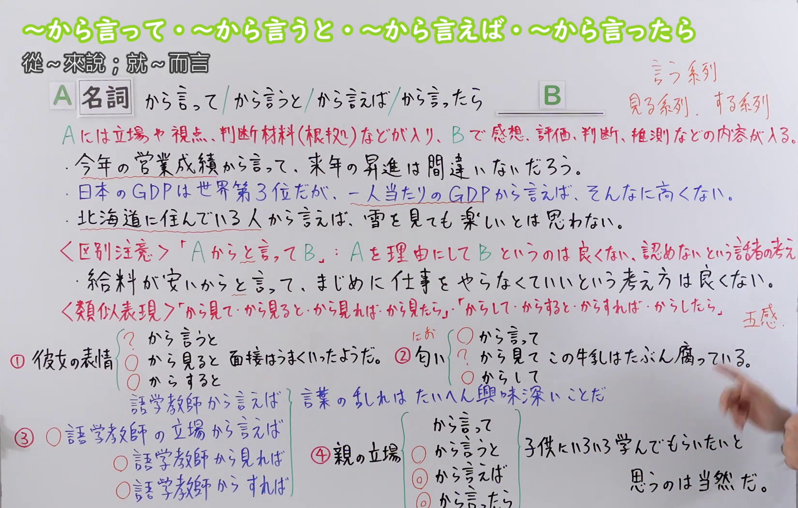
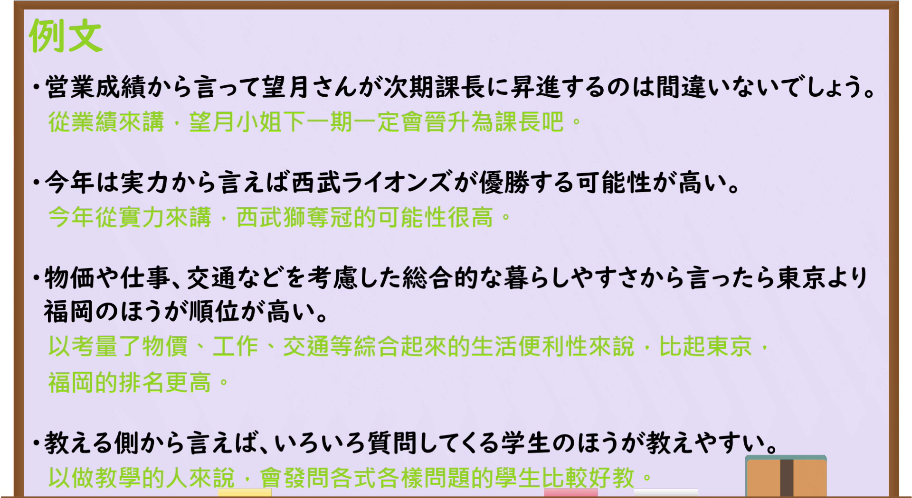

---
{
  "id": "N3-G-0094",
  "kind": "grammar",
  "level": "N3",
  "title": "～からいって(言って)／～からいうと(言うと)／～からいえば(言えば)／～からいったら(言ったら)：从……来说",
  "status": "confirmed",
  "card_revision": 1,
  "schema_version": 1,
  "created_at": "2026-09-14",
  "updated_at": "2026-09-19",
  "next_review": "2026-09-21",
  "source": {
    "lesson": "N3 第94个语法",
    "material": "出口日語原视频板书、日语字幕与独立日文教学正文",
    "video": "https://www.youtube.com/watch?v=XbSGNlvmuno",
    "screenshot": "assets/grammar/n3/N3-G-0094-0520.png",
    "screenshot_seconds": 520,
    "screenshot_crop": {
      "x": 0,
      "y": 0,
      "width": 1650,
      "height": 1050
    }
  },
  "tags": [
    "立场",
    "视点",
    "判断依据",
    "评价推测",
    "N3"
  ],
  "confusions": [
    "～からといって",
    "～からみて(見て)",
    "～からして",
    "人物名词接续",
    "四种形式的语感"
  ]
}
---

# N3 第94课｜～からいって(言って)・～からいうと(言うと)・～からいえば(言えば)・～からいったら(言ったら)

# 视频学习资料整理

按指定范围整理；学习者未提供个人原始输出或例句，不虚构理解判断。已核对播放列表第94项：标题「【Ｎ３文法】～から言って・～から言うと・～から言えば・～から言ったら」、视频 ID `XbSGNlvmuno`、时长16:40。本卡已于2026-09-14确认入库，正式卡与七天复习周期已创建。

先检查[原视频00:01](https://www.youtube.com/watch?v=XbSGNlvmuno&t=1s)，该画面中人物遮挡右下方的易混项和部分对比例句。接续图因此改取[原视频08:40](https://www.youtube.com/watch?v=XbSGNlvmuno&t=520s)：原帧1920×1080，固定左上角裁为(0,0,1650,1050)，保留标题、A／B结构、四种名词接续、立场／视点／判断材料与后项内容说明、三句核心例句、「～からといって」区分和「見る／する」系列提示；右缘仅保留少量手部，底部裁去少量空白。最右侧少量补写被画面边缘或人物遮挡，相关内容已结合日语讲解与独立正文核对；未抹除、重绘或拼接。

例句图取自[原视频15:20](https://www.youtube.com/watch?v=XbSGNlvmuno&t=920s)，位于视频后半部分的例句页，完整显示四句课程例句及中文说明。原帧1920×1080，固定左上角裁为(0,0,1920,1050)，仅裁去底部少量边框，未重绘或拼接。

# 核心与接续

## **名词A＋からいって(言って)，B**

## **名词A＋からいうと(言うと)，B**

## **名词A＋からいえば(言えば)，B**

## **名词A＋からいったら(言ったら)，B**

总接续依照原视频板书顺序，保留A、B和四种形式。A表示评价时采用的立场、视点或判断材料（根据）；B给出从该角度得到的感想、评价、判断或推测，可译为“从A来说／从A来看／根据A判断”。

| 类型 | 接续规则 | 示例 |
|---|---|---|
| 名词 | 表示立场、视点或判断材料的名词＋からいって(言って)＋后项判断 | 成績から言って、合格は間違いない。 |
| 名词 | 表示立场、视点或判断材料的名词＋からいうと(言うと)＋后项判断 | 安全性から言うと、この製品がいい。 |
| 名词 | 表示立场、视点或判断材料的名词＋からいえば(言えば)＋后项判断 | 私の経験から言えば、準備が大切だ。 |
| 名词 | 表示立场、视点或判断材料的名词＋からいったら(言ったら)＋后项判断 | 費用から言ったら、こちらの案が現実的だ。 |

### 场景：把A作为立场、视点或判断材料，B给出从该角度得到的评价、判断或推测——A不是原因，单纯人物通常要改成「経験／立場」等明确依据

**场景演示（自拟场景）：**
公司会议上，市场部的小林和主管田中讨论新款保温瓶采用A案还是B案；两人分别从价格、安全、消费者立场和以往经验等角度评价两个方案。

小林：今回の新製品、A案とB案のどちらがいいでしょうか。 
（这次的新产品，A方案和B方案哪个更好呢？）

田中：価格から言うと、A案のほうが現実的だね。 
（从价格来说，A方案更现实呢。）

小林：はい。でも安全性から言って、B案のほうが安心だと思います。 
（是的。但从安全性来说，我觉得B方案更让人放心。）

田中：そうだね。消費者の立場から言えば、多少高くても安全なほうを選ぶ人も多いよ。 
（是啊。从消费者的立场来说，即使贵一点也会选安全的人很多。）

小林：では、私の経験から言えば、B案のように少し値段が高くても、長く売れる商品のほうが結果的に得です。 
（那么，从我的经验来说，像B方案这样价格稍高但能长期卖的商品，结果上更划算。）

田中：なるほど。これまでの売り上げから言ったら、B案のほうが可能性が高いね。B案で進めよう。 
（原来如此。从迄今的销售来看，B方案可能性更高呢。就推进B方案吧。）

# 语义边界与适用条件

1. **A提供评价框架。** A不是B发生的原因，而是说话人观察、评价或推测B时采用的立场、方面、数据或根据。
2. **B通常是主观认识或判断。** 常见为感想、评价、意见、判断和推测，如「高い、便利だ、向いている、可能性が高い、間違いないだろう」。
3. **人物通常要改成可识别的立场或依据。** 两份外部资料都提醒，不宜把单纯人物直接放在A处，如「私から言うと」；通常说「私の経験から言うと」「消費者の立場から言えば」。原视频也建议对职业人物加「の立場」，避免误解为“某人实际说了什么”。
4. **带有明确处境的人群可作为视点。** 原视频使用「北海道に住んでいる人から言えば」，把“居住在北海道的人”整体理解为一种生活处境和立场。为使结构更明确，也可以说「北海道に住んでいる人の立場から言えば」。这不等于任意人名都能直接接续。
5. **四种形式核心意义相同。** 独立资料把四种形式视为可互换的近义表达；原视频进一步提示，「からいって」常用于不强调对比的判断、推测，而明确比较多个立场时更常选「からいえば／からいったら」。这是使用倾向，不是绝对的语法禁令。
6. **感官根据要注意搭配。** 以表情等视觉信息判断时，「表情からみると(見ると)」较自然；气味、味道等非视觉根据不宜机械使用「みる(見る)」系列，可用「匂いからいって／からして」。数据、状态等一般根据则多种近义形式都可能成立。

# 例句

## 原视频例句

1. 営業成績から言って望月さんが次期課長に昇進するのは間違いないでしょう。 
   从销售业绩来看，望月升任下一任课长应该是肯定的吧。
2. 今年は実力から言えば西武ライオンズが優勝する可能性が高い。 
   今年从实力来看，西武狮队夺冠的可能性很高。
3. 物価や仕事、交通などを考慮した総合的な暮らしやすさから言ったら東京より福岡のほうが順位が高い。 
   从综合考虑物价、工作和交通等因素的宜居程度来说，福冈的排名高于东京。
4. 教える側から言えば、いろいろ質問してくる学生のほうが教えやすい。 
   从教学一方来说，经常提出各种问题的学生更容易教。

## 补充自然例句（自拟）

- これまでの売り上げから言って、今年の目標達成は難しいでしょう。 
  根据迄今的销售额判断，今年恐怕难以实现目标。
- 私の経験から言えば、旅行前に宿を予約したほうが安心です。 
  从我的经验来说，旅行前先订好住宿更安心。
- 医師の立場から言えば、この症状を放置すべきではありません。 
  从医生的立场来说，不应该放任这种症状不管。

# 易混项与 JLPT 考点

- **～からといって**：形式只多一个「と」，意义却不同；它表示“不能只因为A就断定／允许B”，后项常是否定或否定性评价，如「給料が安いからといって、まじめに働かなくていいわけではない」。
- **～からみて(見て)／～からみると(見ると)**：同样能表示判断视点；视觉线索尤其适合「みる(見る)」系列。外部资料还指出，该系列可以直接接人物名词来表达从该人物看来。
- **～からして／～からすると／～からすれば／～からしたら**：也能根据某种状况、特征或立场作判断；考试中需结合固定搭配、语境和后项判断选择。
- **人物与“人物的立场”**：○私の経験から言うと／○消費者の立場から言えば；一般避免只写「私から言うと」。
- **原因与判断依据**：本课的A是观察或评价B的角度，不等于普通原因从句；不要一见「から」就译成“因为”。
- **四种形式**：核心可互换，但应留意原视频讲到的语用倾向：材料推测常见「からいって」，立场对比常见「からいえば／からいったら」。

# 来源与复核记录

核对日期：2026-09-14。

- [出口日語原视频](https://www.youtube.com/watch?v=XbSGNlvmuno)：支持名词A＋四种形式、A为立场／视点／判断材料、B为感想／评价／判断／推测，以及「～からといって」区分、人物立场表达和「言う／見る／する」系列的语感提示。
- [毎日のんびり日本語教師「～から言うと／から言えば／から言ったら／から言って」](https://mainichi-nonbiri.com/grammar/n3-karaiuto/)：复核四种名词接续、从某立场作判断或评价、四种形式核心可互换，以及一般不直接接单纯人物名词。
- [絵でわかる日本語「～からいうと・～からいえば・～からいったら」](https://www.edewakaru.com/archives/24733340.html)：复核名词接续、从某方面／判断依据／立场表达判断评价意见，以及人物应改写为「私の経験」等明确依据。

网页获取记录：Crawl4AI 0.9.3 成功读取以上两份互相独立的日文教学正文；站内搜索页和搜索引擎页只用于发现网址，搜索摘要未作为教学证据。

字幕校对：自动字幕反复把「から言って」误识为「から入って」，并误识「名詞」「判断材料」「昇進」「語学教師」等词语；接续、课程例句和限制已以清晰板书、例句页、日语讲解及独立正文交叉校正。

分歧处理：外部两站用简化规则说明“不能直接接人物”，原视频则接受「北海道に住んでいる人から言えば」，同时认为「語学教師から言えば」容易误解并建议加「の立場」。本卡将二者统一为：单纯人物通常不直接接；当人物短语本身明确代表一种处境或立场时可以出现，但加「の立場」更清楚。该处理不把课程例句误判为错误，也不把人物接续无限泛化。

复核结论：原视频与两份独立日文教学正文对四种名词接续、立场／视点／判断材料及后项评价判断的核心一致；来源差异已明确限定。本卡已于2026-09-14确认入库，下次复习日期为2026-09-21。

**2026-09-19补充中文释义分组与场景演示：** 接续图（`assets/grammar/n3/N3-G-0094-0520.png`，原视频08:40）上方中文释义原文「從～來說；就～而言」，按「；」拆出初始候选2项；例句图（`assets/grammar/n3/N3-G-0094-0920.png`，原视频15:20）为「例文」页，仅标题与逐句中译（例1・2用「從…來講」、例3・4用「以…來說」），不产生新候选。「從～來說」与「就～而言」属同一核心义的不同中文译法：板书仅一条意义块「Aには立場や視点、判断材料(根拠)などが入り、Bで感想、評価、判断、推測などの内容が入る」；[毎日のんびり日本語教師](https://mainichi-nonbiri.com/grammar/n3-karaiuto/)意味栏并作「从…来说／从…来讲」，解説仅一条「ある立場から見た判断・評価・見方を表します」且「４つ全て意味も同じで、お互いに入れ替えることができます」；[絵でわかる日本語](https://www.edewakaru.com/archives/24733340.html)意味「〜の点から言うと／〜のほうから判断すると／〜の立場から考えると」亦为一条，解説「Aから見た判断や評価、意見などを表します」；二者仅译法不同，故合并为唯一组。板书「区别注意」的「Aからと言ってB」属「～からといって」易混项、「类似表现」的見る／する系列属易混项，人物接续限制属语义边界，均不另立场景。最终组数1，场景1个（自拟场景，不编号），不编写“说话人的意图”，对话后不重复接续分析。

覆盖记录：

| 候选释义或重要要点 | 来源及支持内容 | 最终分组或正文落点 |
|---|---|---|
| 「從～來說」 | 接续图08:40顶部释义；视频例1・2中译「從…來講」；毎日のんびり意味「从…来说」；絵でわかる意味「〜の点から言うと」 | 与「就～而言」合并为唯一组；场景全部对话落地 |
| 「就～而言」 | 接续图08:40顶部释义；视频例3・4中译「以…來說」；毎日のんびり意味「从…来讲」；絵でわかる意味「〜の立場から考えると」 | 唯一组；场景落地 |
| 单一意义（立场／视点／判断材料→评价判断） | 板书意义块；毎日のんびり解説「ある立場から見た判断・評価・見方を表します」；絵でわかる解説「Aから見た判断や評価、意見」 | 唯一组；场景标题与对话落地 |
| 四种形式可互换及语感倾向 | 毎日のんびり解説「４つ全て意味も同じ」；卡语义边界第5条 | 接续表与语义边界第5条；场景自然出现四种形式，不重复讲解 |
| 人物通常改「経験／立場」 | 毎日のんびり解説「人物を表す名詞には接続できません」＋◯自分の経験；絵でわかる「Aには人やグループを入れることはできません」＋⭕私の経験；卡语义边界第3条 | 语义边界第3条；场景「消費者の立場から言えば」「私の経験から言えば」落地 |
| 「～からといって」区分 | 板书区别注意；卡易混项 | 易混项；不另立场景 |
| 見る／する系列 | 板书类似表现；卡语义边界第6条与易混项 | 语义边界第6条与易混项；不另立场景 |
| 视频四句课程例句 | 接续图08:40板书、15:20例文页 | 例句节保持不动 |

网页获取记录（2026-09-19）：Crawl4AI 0.9.3 以 `crwl crawl -o markdown` 读取毎日のんびり日本語教師（`work/fetch-20260919/mainichi-karaiuto.md`）与絵でわかる日本語（`work/fetch-20260919/edewakaru-karaiu.md`）两份日文正文，缓存不入库；场景标题的通用总结取自其日文解説栏。搜索页仅用于发现网址，摘要未作为教学证据。

本次补充新增“场景”一节与本记录，未改动总接续、接续表、语义边界、例句、易混项及原有来源记录，确认日期与七天复习周期不变。
