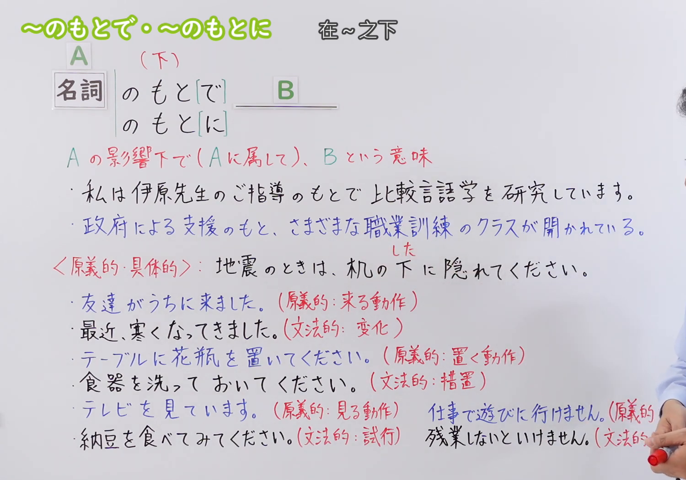
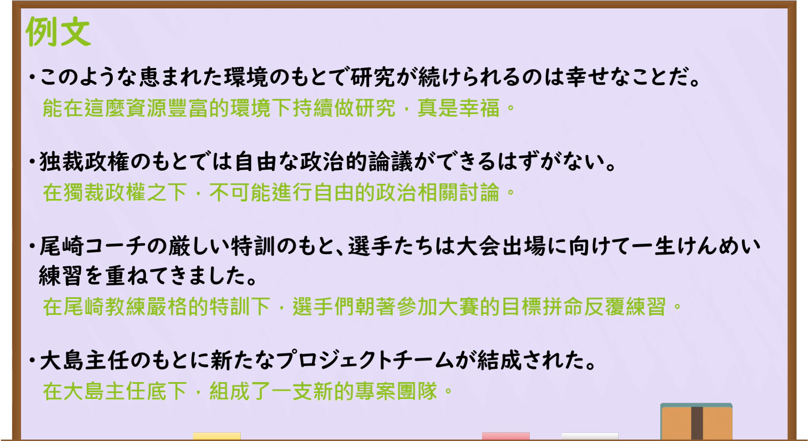

---
{
  "id": "N3-G-0095",
  "kind": "grammar",
  "level": "N3",
  "title": "～のもとで／～のもとに：在……之下；在……影响或条件下",
  "status": "confirmed",
  "card_revision": 1,
  "schema_version": 1,
  "created_at": "2026-09-14",
  "updated_at": "2026-09-14",
  "next_review": "2026-09-21",
  "source": {
    "lesson": "N3 第95个语法",
    "material": "出口日語原视频板书、日语字幕与独立日文教学正文",
    "video": "https://www.youtube.com/watch?v=svVRQ-8sRek",
    "screenshot": "assets/grammar/n3/N3-G-0095-0120.png",
    "screenshot_seconds": 120,
    "screenshot_crop": {
      "x": 0,
      "y": 0,
      "width": 1500,
      "height": 1050
    }
  },
  "tags": [
    "影响之下",
    "指导",
    "条件",
    "体制",
    "N3"
  ],
  "confusions": [
    "～をもとに",
    "～のした(下)で",
    "～のもとで与～のもとに",
    "助词省略",
    "汉字与平假名"
  ]
}
---

# N3 第95课｜～のもとで・～のもとに

# 视频学习资料整理

按指定范围整理；学习者未提供个人原始输出或例句，不虚构理解判断。已核对播放列表第95项：标题「【Ｎ３文法】～のもとで・～のもとに」、视频 ID `svVRQ-8sRek`、时长08:34。本卡已于2026-09-14确认入库，正式卡与七天复习周期已创建。

先检查[原视频00:01](https://www.youtube.com/watch?v=svVRQ-8sRek&t=1s)，接续、含义和例句均已写在板书上，但人物遮挡右下方部分对照说明。接续图因此改取[原视频02:00](https://www.youtube.com/watch?v=svVRQ-8sRek&t=120s)：原帧1920×1080，固定左上角裁为(0,0,1500,1050)，保留标题、A／B结构、两种接续、影响范围说明、两句核心例句，以及「下」的原义用法和语法化／原义用法的书写对比；右缘仅保留少量人物和手部，未遮挡主要文字。未抹除、重绘或拼接。

例句图取自[原视频07:10](https://www.youtube.com/watch?v=svVRQ-8sRek&t=430s)，位于视频后半部分的例句页，完整显示四句课程例句及中文说明。原帧1920×1080，固定左上角裁为(0,0,1920,1050)，仅裁去底部少量边框，未重绘或拼接。

# 核心与接续

## **名词A＋のもと[で]，B**

## **名词A＋のもと[に]，B**

总接续依照原视频板书顺序，保留A、B和方括号。方括号表示「で／に」可以省略，成为「名词A＋のもと，B」。A是对B产生影响的人、组织、制度、方针、支援或环境条件；整体表示B在A的影响范围内、接受A的指导，或处于A所形成的条件与体制之下。

| 类型 | 接续规则 | 示例 |
|---|---|---|
| 名词 | 表示人物、组织、制度或条件的名词＋のもとで＋后项谓语 | 先生の指導のもとで研究する。 |
| 名词 | 表示人物、组织、制度或条件的名词＋のもとに＋后项谓语 | 主任のもとにチームが結成された。 |
| 名词 | 表示人物、组织、制度或条件的名词＋のもと＋后项谓语 | 厳しい特訓のもと、練習を続ける。 |

# 语义边界与适用条件

1. **人的指导、领导或影响。** A可以是老师、教练、领导者等，表示B接受其指导、指示或影响，或属于其领导的团体。例如「先生のもとで学ぶ」「監督のもとで練習する」。
2. **制度、方针、支援或环境条件。** A也可以是法律、政权、政策、支援、和平、严格管理、良好环境等，表示B在这种框架或条件下成立。它不要求A一定是人。
3. **「で／に」跟随后项关系选择。** 原视频说明，应根据B原本需要的格助词决定：把A所形成的范围看作动作或事件进行的场面时常用「で」；把它看作人员、事物存在、聚集、成立或归属的落点时常用「に」。例如「先生のもとで研究する」与「主任のもとにチームが結成される」。这是一种搭配倾向，不应简化为所有动词只能接「で」、所有存在句只能接「に」。
4. **「で／に」可以省略。** 课程例句「厳しい特訓のもと、選手たちは……」省略了助词，语义仍是“在严格特训之下”。省略形式常见于较正式、书面的叙述。
5. **文法用法通常写平假名。** 本课抽象地表示影响范围时，原视频建议写「もと」。表示具体空间“下面”时通常写汉字「下」，并读作「した」，如「机の下に隠れる」。这不是绝对的正字法禁令，但学习时应先区分两种用法。
6. **语体偏正式。** 与日常口语的「先生に教えてもらう」「政府の支援で」相比，「～のもとで／～のもとに」更适合正式说明、新闻和书面叙述。

# 例句

## 原视频例句

1. このような恵まれた環境のもとで研究が続けられるのは幸せなことだ。 
   能在这样优越的环境下继续研究，是一件幸福的事。
2. 独裁政権のもとでは自由な政治的論議ができるはずがない。 
   在独裁政权之下，不可能进行自由的政治讨论。
3. 尾崎コーチの厳しい特訓のもと、選手たちは大会出場に向けて一生けんめい練習を重ねてきました。 
   在尾崎教练严格的特训下，选手们为了参加大赛一直拼命反复练习。
4. 大島主任のもとに新たなプロジェクトチームが結成された。 
   在大岛主任的领导下，成立了一个新的项目团队。

## 补充自然例句（自拟）

- 専門家の指導のもとで、安全点検が行われました。 
  在专家的指导下进行了安全检查。
- 新しい制度のもとでは、申請の手続きが簡単になります。 
  在新制度下，申请手续会变得更简单。
- リーダーのもとに、各分野の専門家が集まりました。 
  各领域的专家聚集到了这位领导者麾下。

# 易混项与 JLPT 考点

- **～をもとに／～をもとにして**：表示以资料、事实或作品为基础进行制作、判断或改编，如「実話をもとに映画を作る」。本课是「名词＋のもとで／に」，表示处于某种影响或条件下，助词和意义都不同。
- **～のした(下)で**：表示具体的空间位置时，「下」读「した」，如「木の下で休む」；本课的抽象文法用法读「もと」，通常写平假名。
- **「で」与「に」**：考试会结合后项动词考搭配。动作在某种范围内进行常见「のもとで」，成员聚集、组织成立等落点关系常见「のもとに」。
- **助词省略**：看到「指導のもと、研究を行う」时，不要误判为另一个句型；它是「で／に」省略后的形式。
- **名词接续**：A后必须有「の」；不能说「先生もとで」「法律もとに」。

# 来源与复核记录

核对日期：2026-09-14。

- [出口日語原视频](https://www.youtube.com/watch?v=svVRQ-8sRek)：支持名词A＋「のもと[で]／のもと[に]」、助词省略、A的影响下／归属于A的含义、根据B选择「で／に」，以及文法用法「もと」与具体空间「下（した）」的书写和读音对比。
- [日本語NET「～のもとで／～のもとに」](https://nihongokyoshi-net.com/2019/05/09/jlptn2-grammar-motode/)：复核「名词＋の＋もとで」接续、“在……之下／依靠……”的含义，以及人物指导、组织管理、政权和法律等实例。
- [日本語教師のN1et「のもとで／のもとに」](https://jn1et.com/nomotode/)：复核仅接名词、人物或指导者影响下的用法，并补充自由、和平等抽象名义或框架下的用法。

网页获取记录：Crawl4AI 0.9.3 成功读取以上两份互相独立的日文教学正文；Yahoo! JAPAN、站内搜索页只用于发现网址，搜索摘要未作为教学证据。日本語NET与日本語教師のN1et均把本项列为N2，而出口日語播放列表列为N3；本卡等级依课程范围记为N3，并明确保留教材分级差异。

字幕校对：自动字幕把「名詞」「格助詞」「存在地」「帰着点」「原義」等多处误识或错误断句，并将部分「もと」误转为「下／元」。接续、助词说明和四句课程例句已以清晰板书、例句页、日语讲解及独立正文交叉校正。

成稿复核：总接续逐行保留原视频的A、B与方括号；接续表按三种实际形式逐行展开。重新核对了「で／に」与后项的关系、助词省略、抽象「もと」和具体「下（した）」的边界、课程例句及译文。每张图片均来自本课原视频独立帧，图片引用有效；本卡已于2026-09-14确认入库，下次复习日期为2026-09-21。
