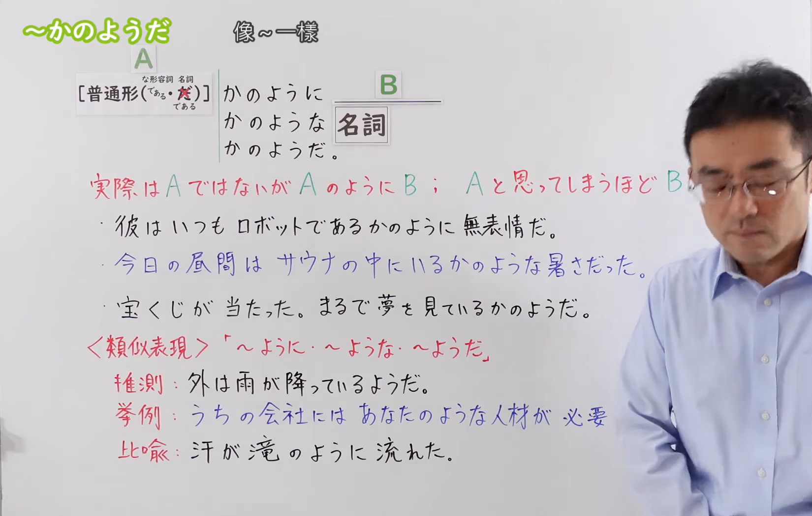
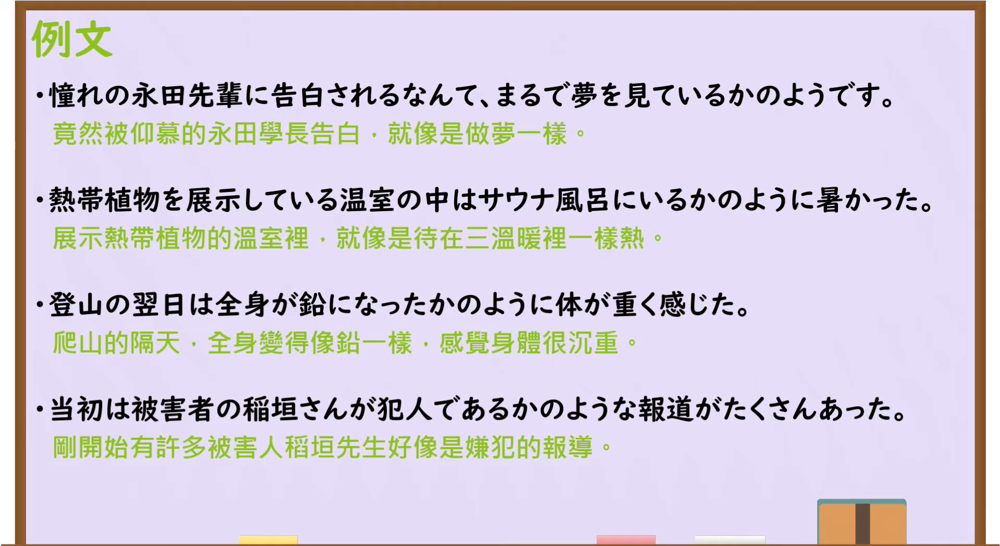

---
{
  "id": "N3-G-0096",
  "kind": "grammar",
  "level": "N3",
  "title": "～かのように／～かのような／～かのようだ：仿佛……；好像……一样",
  "status": "confirmed",
  "card_revision": 1,
  "schema_version": 1,
  "created_at": "2026-09-14",
  "updated_at": "2026-09-19",
  "next_review": "2026-09-21",
  "source": {
    "lesson": "N3 第96个语法",
    "material": "出口日語原视频板书、日语字幕与独立日文教学正文",
    "video": "https://www.youtube.com/watch?v=MF9Eh3i87PU",
    "screenshot": "assets/grammar/n3/N3-G-0096-0001.png",
    "screenshot_seconds": 1,
    "screenshot_crop": {
      "x": 0,
      "y": 0,
      "width": 1650,
      "height": 1050
    }
  },
  "tags": [
    "比喻",
    "非事实",
    "样态",
    "まるで",
    "N3"
  ],
  "confusions": [
    "～ようだ（推测）",
    "～ようだ（举例）",
    "～ようだ（比喻）",
    "～みたいだ",
    "な形容词与名词接续"
  ]
}
---

# N3 第96课｜～かのように・～かのような・～かのようだ

# 视频学习资料整理

按指定范围整理；学习者未提供个人原始输出或例句，不虚构理解判断。已核对播放列表第96项：标题「【Ｎ３文法】～かのようだ」、视频 ID `MF9Eh3i87PU`、时长06:39。本卡已于2026-09-14确认入库，正式卡与七天复习周期已创建。

接续图取自首选时点[原视频00:01](https://www.youtube.com/watch?v=MF9Eh3i87PU&t=1s)：原帧1920×1080，固定左上角裁为(0,0,1650,1050)，保留标题、A／B结构、普通形及な形容词／名词的特殊接续、三种后接形式、非事实比喻的含义、三句板书例句，以及与普通「ようだ」的推测／举例／比喻用法对照。人物仍遮挡右侧少量含义补写和个别例句末尾；经比较00:30、01:00、01:30、02:00、04:00与04:50等画面，其他时点遮挡相同或更多，因此保留00:01，并以日语讲解和独立正文核对被遮挡内容。未抹除、重绘或拼接。

例句图取自[原视频05:20](https://www.youtube.com/watch?v=MF9Eh3i87PU&t=320s)，位于视频后半部分的例句页，完整显示四句课程例句及中文说明。原帧1920×1080，固定左上角裁为(0,0,1920,1050)，仅裁去底部少量边框，未重绘或拼接。

# 核心

## 功能一：实际上不是A，却像A一样B；B到了让人误以为是A的程度

**最上位意味カテゴリー：**

- **「かのようだ」：** 考え・感情（想法与情感）

**中位意味カテゴリー：**

- **「かのようだ」：** 比喩・比況（比喻与比拟）

**意味：**

- **「かのようだ」：** 比喩（比喻）

**くわしい意味記述：**

- **かのようだ：** たとえを挙げて何かを説明したい時に使う。「かのように」の前の部分がたとえであり，それは本当に起こったことではない。「かのように」には「かのごとく」という言い方がある。（用于借助比喻说明某事。「かのように」前面的部分是比喻，并非实际发生过的事情。「かのように」还有「かのごとく」这种说法。）

**派生語：** 未列出

### 例句

1. お父さんが退院して、たけしが留学から帰ってきて、一度に春が来たかのようね。

   （爸爸出院了，武也留学归来，仿佛春天一下子到来了呢。）

2. ある政治評論家が述べたように、イタリアは秩序ある政府よりも、「楽しい無政府を優先している」かのようであった。

   （正如一位政治评论家所说，意大利仿佛“宁可选择快乐的无政府状态，也不选择有秩序的政府”。）

3. それどころか、憲法改正を口にすること自体がタブーであるかのような政治的・社会的雰囲気が続いた。

   （更有甚者，一种仿佛连谈论修改宪法本身都是禁忌的政治和社会氛围一直延续着。）

4. 企業間の情報伝達効率化により、別法人であるがゆえに生じる業務の重複を排除し、業務プロセスのリードタイムを抜本的に短縮化し、複数の企業があたかも一つの企業であるかのように活動することが可能となっている。

   （通过提高企业之间的信息传递效率，可以消除因企业是不同法人而产生的业务重复，从根本上缩短业务流程的交付周期，并使多家企业能够仿佛一家企业一样开展活动。）

# 来源

- [出口日語原视频](https://www.youtube.com/watch?v=MF9Eh3i87PU)
- [Hagoromo「かのようだ」条目](https://hagoromo-text.work/lookup?vid=411)／[例句](https://hagoromo-text.work/get_reibun?vid=411)（查询日期：2026-09-21）
