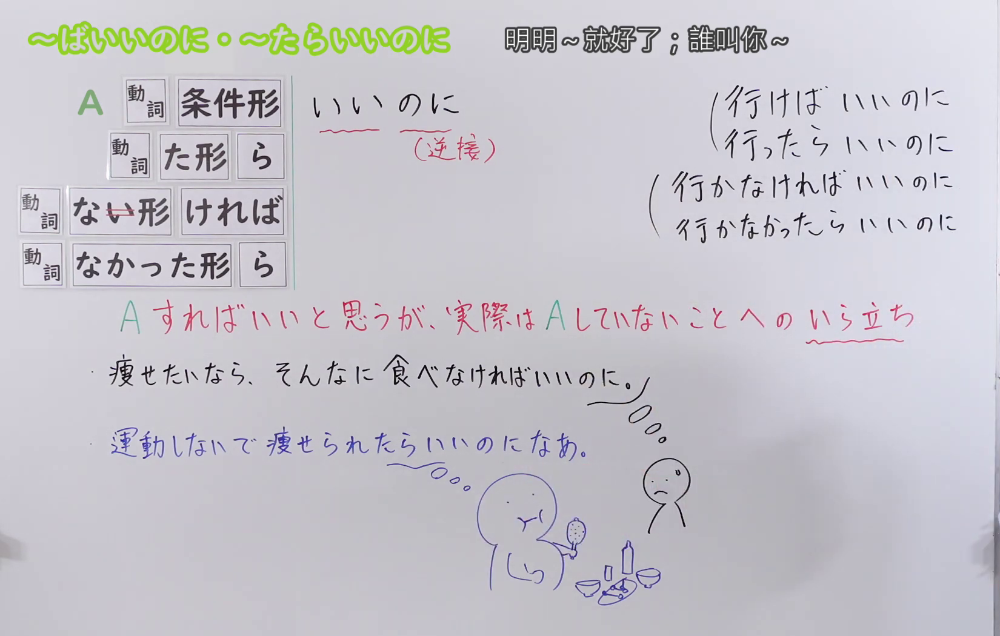

---
{
  "id": "N3-G-0097",
  "kind": "grammar",
  "level": "N3",
  "title": "～ばいいのに／～なければいいのに：明明……就好了；要是……就好了",
  "status": "confirmed",
  "card_revision": 1,
  "schema_version": 1,
  "created_at": "2026-09-14",
  "updated_at": "2026-09-20",
  "next_review": "2026-09-21",
  "source": {
    "lesson": "N3 第97个语法",
    "material": "出口日語原视频板书、日语字幕与独立日文教学正文",
    "video": "https://www.youtube.com/watch?v=_AUQp36qeUg",
    "screenshot": "assets/grammar/n3/N3-G-0097-0180.png",
    "screenshot_seconds": 180,
    "screenshot_crop": {"x": 0, "y": 0, "width": 1650, "height": 1050}
  },
  "tags": ["愿望", "不满", "遗憾", "建议", "条件形", "N3"],
  "confusions": ["～ばいい", "～たらいい", "～ばよかった", "～なきゃいいのに", "肯定与否定条件"]
}
---

# N3 第97课｜～ばいいのに・～なければいいのに

# 视频学习资料整理

按指定范围整理；学习者未提供个人原始输出或例句，不虚构理解判断。已核对播放列表第97项：标题「【Ｎ３文法】～ばいいのに・～なければいいのに」、视频 ID `_AUQp36qeUg`、时长05:44。本卡已于2026-09-14确认入库，正式卡与七天复习周期已创建。

接续图取自[原视频03:00](https://www.youtube.com/watch?v=_AUQp36qeUg&t=180s)：原帧1920×1080，固定左上角裁为(0,0,1650,1050)，保留四种接续、逆接说明、现实没有做A所引起的焦躁／不满，以及两句板书例句；裁去最右侧人物区域，未抹除、重绘或拼接。

例句图取自[原视频04:40](https://www.youtube.com/watch?v=_AUQp36qeUg&t=280s)，完整显示四句课程例句及中文说明。原帧1920×1080，固定左上角裁为(0,0,1920,1050)，仅裁去底部少量边框，未重绘或拼接。

# 核心与接续

## **A【动词条件形】＋いいのに**

## **A【动词た形】＋ら＋いいのに**

## **A【动词ない形去い】＋ければ＋いいのに**

## **A【动词なかった形】＋ら＋いいのに**

总接续依照原视频板书顺序，只保留课程明确列出的动词形式。说话人认为A更好，但现实没有实现A，因此表达愿望、遗憾，或对未采取A的行为感到焦躁、不满并提出带情绪的建议。肯定条件表示现实中没有做／没有发生A；否定条件表示现实中做了／发生了A。

| 类型 | 接续规则 | 示例 |
|---|---|---|
| 肯定条件（ば） | 动词条件形＋いいのに | もっと早く相談すればいいのに。 |
| 肯定条件（たら） | 动词た形＋ら＋いいのに | 少し休んだらいいのに。 |
| 否定条件（ば） | 动词ない形去「い」＋ければ＋いいのに | 無理をしなければいいのに。 |
| 否定条件（たら） | 动词なかった形＋ら＋いいのに | そんなことを言わなかったらいいのに。 |

### 场景一：现实与愿望不同而产生的遗憾、不满或希望

**场景演示（自拟场景）：**
公司会议室里，同事藤本和佐佐木聊起近期加班和天气问题。

藤本：最近、残業が多すぎる。もっと早く帰れたらいいのになあ。 
（最近加班太多。要是能早点回家就好了啊。）

佐々木：うん。それに、明日も雨が降らなかったらいいのにな。行楽シーズンだし。 
（是啊。而且，明天要是别下雨就好了。毕竟是旅游季。）

藤本：そうだね。でも、天気なんてどうにもならないしなあ。 
（是啊。但天气这种事没办法啊。）

佐々木：もし晴れられたらいいのになあ。ピクニックに行きたいんだ。 
（要是能放晴就好了啊。我想去野餐。）

藤本：はは、それは無理かな。でも、せめて週末くらいは晴れてほしい。 
（哈哈，恐怕不行吧。但至少希望周末能放晴。）

佐々木：うん。空気が良ければ、気分も変わるかもしれないね。 
（嗯。空气好的话，心情说不定也会变好。）

### 场景二：对他人未采取行动或采取不理想行动的批评、责备或建议

**场景演示（自拟场景）：**
办公室茶水间，前辈田中劝告后辈山田不要接下条件差的工作；两人聊到沟通方式的问题。

田中：そんな条件の悪い仕事、引き受けなきゃいいのに。 
（条件那么差的工作，明明不接就好了。）

山田：でも、断ったら後で怒られるかもって思ってさ。 
（但我想着要是拒绝的话之后可能会被骂。）

田中：だったら、ちゃんと説明すればいいのに。 
（那就好好说明一下不就好了。）

山田：でも、彼もあんなひどい言い方をしなければいいのに。 
（但他明明不要用那么过分的说法就好了。）

田中：はは、そうだな。でも、分からないなら先生に聞けばいいのに。 
（哈哈，也是。不过不懂的话问老师不就好了。）

山田：うん。次回から気をつけるよ。 
（嗯。下次我会注意的。）

# 语义边界与适用条件

1. **愿望与现实相反。** 对无法直接控制的事情，可表示“要是……就好了”的愿望或遗憾，如「戦争なんてなくなればいいのに」。重点是现实尚未如愿，并不一定是在批评某个人。
2. **对他人的建议常带焦躁或不满。** 对方明明可以做A却没做时，说话人用本句型表示“明明做A就好了”。比单纯的「～ばいい」多了现实相反和情绪性的余韵，语气可能显得责备或多管闲事。
3. **肯定与否定要按现实反向理解。** 「行けばいいのに」暗示实际没去；「行かなければいいのに」暗示实际要去、去了，或仍在做“去”这件不理想的选择。
4. **「～たらいいのに」与「～ばいいのに」近义。** 两者都可表达愿望或带不满的建议；本课同时把肯定和否定的「たら」形式列为替换形式，不应漏认。
5. **「～なきゃいいのに」是口语缩约。** 它来自「～なければいいのに」，如课程例句「引き受けなきゃいいのに」。正式写作或接续题仍应能还原为「～なければ」。
6. **不是对过去选择的直接后悔。** 本课着眼于当前未实现的愿望或对现状的不满；回顾自己过去“当时应该做／不该做”通常用下一课的「～ばよかった／～なければよかった」。

# 例句

## 原视频例句

1. 電卓じゃなくてエクセルを使って計算すればいいのに。 
   明明不用计算器、改用Excel计算就好了。
2. 戦争なんてこの世界からなくなればいいのに。 
   战争这种东西要是能从这个世界上消失就好了。
3. そんな条件の悪い仕事、引き受けなきゃいいのに。 
   条件那么差的工作，明明不接就好了。
4. 運動しないで痩せられたらいいのになあ。 
   要是不用运动也能瘦下来就好了啊。

## 补充自然例句（自拟）

- 分からないなら、先生に聞けばいいのに。 
  不懂的话，明明问老师就好了。
- 明日は雨がやめばいいのになあ。 
  明天雨要是能停就好了啊。
- 彼もあんなひどい言い方をしなければいいのに。 
  他明明不要用那么过分的说法就好了。

# 易混项与 JLPT 考点

- **～ばいい／～たらいい**：单纯提出“做……就可以”的办法或建议；加「のに」后，会突出实际没有这样做以及说话人的遗憾、不满或愿望。
- **～ばよかった／～なければよかった**：回顾已经确定的过去事实并后悔；本课则多针对当前状态、未来愿望或他人尚未采取的行动。
- **～ばよかったのに**：可以对过去事实表示“明明当时……就好了”，常含对对方的遗憾或责备；不要因结尾同为「のに」而与本课的非过去形式混淆。
- **口语缩约**：「行かなきゃいいのに」＝「行かなければいいのに」。题目可能用缩约形式测试还原能力。
- **条件形式配对**：肯定用「条件形＋いいのに」或「た形＋ら＋いいのに」；否定用「ない形去い＋ければ＋いいのに」或「なかった形＋ら＋いいのに」。

# 来源与复核记录

核对日期：2026-09-14。

- [出口日語原视频](https://www.youtube.com/watch?v=_AUQp36qeUg)：支持四种动词接续、逆接语感、现实未做A所引起的焦躁／不满，以及四句课程例句。
- [日本語のブログ「～ばいいのに」](https://nihongonoblog.com/【n3】「～ばいいのに」の意味と例文◆meaning-and-example-of「～/)：复核现实与愿望不同所产生的遗憾，以及对他人未采取行动的批评、非难或建议。
- [Japanese Exercises「～ばいいのに」](https://japaneseexercises.com/2024/11/27/【jlpt-n3-～ばいいのに　文法解説・問題】/)：复核条件形接续、现实相反的愿望／批评语义、「～たらいいのに」近义形式及过去式「～ばよかったのに」。

网页获取记录：Crawl4AI 0.9.3 成功读取以上两份互相独立的日文教学正文；搜索页只用于发现网址，摘要未作为教学证据。两份外部资料与出口日語课程均把本项列为N3。

字幕校对：自动字幕存在同音字和断句误识；四种接续、语义说明和四句课程例句均以清晰板书、例句页、日语讲解及独立正文交叉校正。

成稿复核：大号总接续逐行保留原视频的A与四种动词形式，没有加入视频未列的形容词或名词接续；肯定／否定形式的现实预设、愿望与批评两类用法、口语缩约以及与第98课的区别均已单列。每张图片来自本课原视频的独立帧，图片引用有效；本卡已于2026-09-14确认入库，下次复习日期为2026-09-21。

**2026-09-20 补充中文释义分组与场景演示：** 接续图（`assets/grammar/n3/N3-G-0097-0180.png`，原视频 03:00）上方中文释义原文「明明～就好了；誰叫你～」，有「；」分隔 → 初始候选 2 项；例句图（`assets/grammar/n3/N3-G-0097-0280.png`，原视频 04:40）为「例文」页，逐句中译均为「……就好了」类型，不产生新候选。板书意义为「A すればいいと思うが、実際は A していないことへのいら立ち」（单一语义块）。[日本語のブログ](https://nihongonoblog.com/【n3】「～ばいいのに」の意味と例文◆meaning-and-example-of「～/")) 意味两条：①「話し手が望んでいることと現実が違うことを残念に思っているとき」（愿望/遗憾）；②「相手の行動に対しての批判や非難したり、アドバイスをあげるとき」（批评/责备）。顶部分义的「；」前后对应上述两类用法，且两者在实际语境中可能重叠，但卡片语义边界已明确区分第 1 条（愿望与现实相反）和第 2 条（对他人的建议常带焦躁或不满），故按「；」拆分为 2 组，最终组数 2，场景 2 个（编号 场景一/场景二），不编写“说话人的意图”，对话后不重复接续分析。

覆盖记录：

| 候选释义或重要要点 | 来源及支持内容 | 最终分组或正文落点 |
|---|---|---|
| 「明明～就好了」 | 接续图 03:00 顶部释义前半；板书「A すればいいと思うが、実際は A していないことへのいら立ち」中的愿望面；日本語のブログ意味①「望んでいることと現実が違うことを残念に思っているとき」 | 场景一；全部对话落地 |
| 「誰叫你～」 | 接续图 03:00 顶部释义后半；板书中的「いら立ち」在他人行动上的体现；日本語のブログ意味②「相手の行動に対しての批判や非難したり、アドバイスをあげるとき」 | 场景二；全部对话落地 |
| 四种接续形式 | 板书四行接续；卡接续表四行 | 接续表与语义边界第 3—5 条；场景自然出现「帰れたら」「降らなかったら」「晴れられたら」「空気が良ければ」「引き受けなきゃ」「説明すれば」「言わなければ」「聞けば」 |
| 口语缩约「～なきゃ」 | 课程例句「引き受けなきゃいいのに」；卡语义边界第 5 条 | 语义边界第 5 条；场景田中第一句自然使用「引き受けなきゃ」 |
| 肯定/否定与现实反向 | 卡语义边界第 3 条 | 语义边界第 3 条；场景一「降らなかったら」「晴れられたら」暗示实际在下雨/未放晴，场景二「引き受けなきゃ」暗示实际已接、「言わなければ」暗示实际说了过分的话 |
| 视频四句课程例句 | 接续图 03:00 板书、04:40 例文页 | 例句节保持不动 |

网页获取记录（2026-09-20）：Crawl4AI 0.9.3 以 `crwl crawl -o markdown` 读取日本語のブログ（`work/fetch-20260919/nihongonoblog-baiinoni.md`）一份日文正文，缓存不入库；japaneseexercises 页面返回 404 无法获取，仅以单份独立正文维持分组结论；场景标题的通用总结取其日文意味栏。该站与出口日語课程均把本项列为 N3。搜索页仅用于发现网址，摘要未作为教学证据。

本次补充新增两个“场景”与本记录，未改动总接续、接续表、语义边界、例句、易混项及原有来源记录，确认日期与七天复习周期不变。