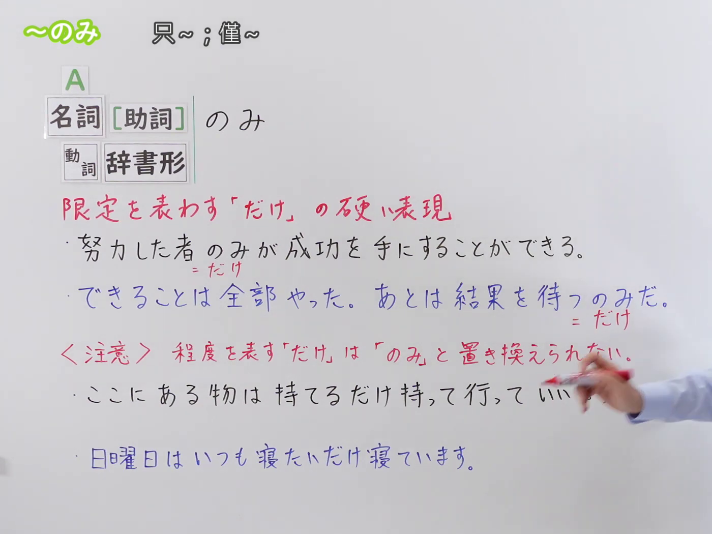
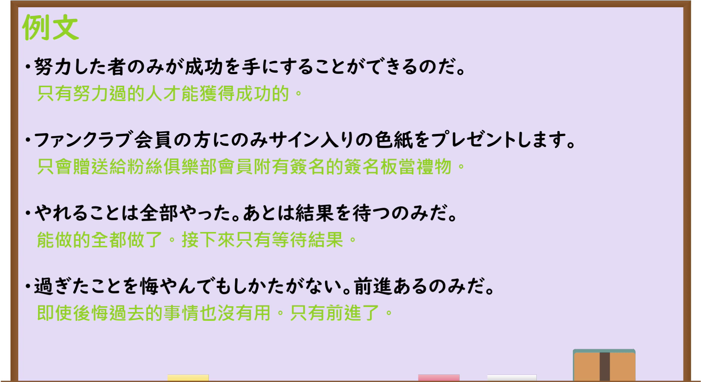

---
{
  "id": "N3-G-0099",
  "kind": "grammar",
  "level": "N3",
  "title": "～のみ：只；仅；唯有",
  "status": "confirmed",
  "card_revision": 1,
  "schema_version": 1,
  "created_at": "2026-09-15",
  "updated_at": "2026-09-15",
  "next_review": "2026-09-22",
  "source": {
    "lesson": "N3 第99个语法",
    "material": "出口日語原视频板书、日语字幕与独立日文教学正文",
    "video": "https://www.youtube.com/watch?v=boX-itMr5gc",
    "screenshot": "assets/grammar/n3/N3-G-0099-0090.png",
    "screenshot_seconds": 90,
    "screenshot_crop": {"x": 0, "y": 0, "width": 1400, "height": 1050}
  },
  "tags": ["限定", "书面语", "正式表达", "だけ", "助词位置", "N3"],
  "confusions": ["～だけ", "程度用法的だけ", "のみが／のみを", "名词＋助词＋のみ", "～のみだ"]
}
---

# N3 第99课｜～のみ

# 视频学习资料整理

按指定范围整理；学习者未提供个人原始输出或例句，不虚构理解判断。已核对播放列表第99项：标题「【Ｎ３文法】～のみ」、视频 ID `boX-itMr5gc`、时长04:10。本卡已于2026-09-15确认入库，正式卡与七天复习周期已创建。

接续图取自[原视频01:30](https://www.youtube.com/watch?v=boX-itMr5gc&t=90s)：原帧1920×1080，固定左上角裁为(0,0,1400,1050)，保留名词、名词后助词和动词辞书形接续、限定意义、两句板书例句，以及程度用法不能换成「のみ」的提醒；裁去右侧人物区域，未抹除、重绘或拼接。

例句图取自[原视频03:00](https://www.youtube.com/watch?v=boX-itMr5gc&t=180s)，完整显示四句课程例句及中文说明。原帧1920×1080，固定左上角裁为(0,0,1920,1050)，仅裁去底部少量边框，未重绘或拼接。

# 核心与接续

## **A【名词[助词]】＋のみ**

## **A【动词辞书形】＋のみ**

总接续依照原视频板书顺序，只列课程明确展示的名词（可带助词）和动词辞书形。表示把对象或范围限定为A，相当于较正式、较书面的「だけ」。动词辞书形后常见「～のみだ」，表示该做的事只剩A，或除了A以外没有别的办法。

| 类型 | 接续规则 | 示例 |
|---|---|---|
| 名词 | 名词＋のみ | 関係者のみ入場できます。 |
| 名词＋助词 | 名词＋助词＋のみ | 会員の方にのみお知らせします。 |
| 动词 | 动词辞书形＋のみ | あとは発表を待つのみだ。 |

# 语义边界与适用条件

1. **是限定表达。** 「のみ」把人、物、范围或剩余行动限定为A，基本可译为“只、仅、唯有”，语气比「だけ」硬，常用于通知、规定、书面语和正式发言。
2. **名词后可以先出现助词。** 原视频明确写作「名詞[助詞]のみ」，如「会員の方にのみ」。这表示“只对会员”，不是把「に」遗漏掉。
3. **「が／を」通常放在「のみ」后。** 常说「努力した者のみが」「この商品についてのみを扱う」；其中「が／を」有时也可省略。与「に／で／へ／と／から」等助词搭配时，可见「名词＋助词＋のみ」；具体位置要按惯用表达判断。
4. **动词辞书形＋のみ常表示“只需／只剩……”。** 「あとは結果を待つのみだ」说明能做的已经做完，接下来只剩等待；「前進あるのみだ」则强调唯一选择就是前进。
5. **表示程度的「だけ」不能机械替换为「のみ」。** 「持てるだけ持って行く」是“能拿多少就拿多少”，「寝たいだけ寝る」是“想睡多久就睡多久”。这里的「だけ」表示达到能力或愿望所及的程度，而非把对象限定为唯一项，因此不能换成「のみ」。
6. **课程等级与资料标级存在差异。** 本系列将本项作为N3；两份复核资料分别标为N2和N1。这是教材分级差异，不改变本项目按课程编号记录为N3。

# 例句

## 原视频例句

1. 努力した者のみが成功を手にすることができるのだ。 
   只有努力过的人才能获得成功。
2. ファンクラブ会員の方にのみサイン入りの色紙をプレゼントします。 
   只向粉丝俱乐部会员赠送带签名的签名板。
3. やれることは全部やった。あとは結果を待つのみだ。 
   能做的全都做了。接下来只需等待结果。
4. 過ぎたことを悔やんでもしかたがない。前進あるのみだ。 
   后悔过去的事也没有用，唯有前进。

## 补充自然例句（自拟）

- この部屋は関係者のみ利用できます。 
  这个房间仅限相关人员使用。
- 詳しい日程は参加者にのみメールでお知らせします。 
  详细日程只通过邮件通知参加者。
- 必要な準備は終わったので、あとは出発を待つのみです。 
  必要的准备已经结束，接下来只等出发。

# 易混项与 JLPT 考点

- **～だけ**：日常口语中更常见，用法范围也更广；「のみ」更正式、书面，但只能在两者都表示单纯限定时近义替换。
- **程度用法的「だけ」**：「食べたいだけ食べる」「できるだけ早く」中的「だけ」表示程度，不是本课的限定「のみ」。
- **助词位置**：「のみが／のみを」是常见顺序；看到「名词＋に／で／へ／と／から＋のみ」时，要识别为助词后接「のみ」的限定。
- **～のみだ**：动词辞书形后常用于“只剩下……”“唯有……”；题目可能通过「待つのみだ」「進むのみだ」测试其书面语感。
- **～のみの＋名词**：「会員のみの特典」表示“仅限会员的优惠”。这是「のみ」修饰后续名词时加入「の」，不要误读为另一个语法。

# 来源与复核记录

核对日期：2026-09-14。

- [出口日語原视频](https://www.youtube.com/watch?v=boX-itMr5gc)：支持名词（可带助词）和动词辞书形接续、较硬的限定意义、四句课程例句，以及程度用法的「だけ」不能换成「のみ」。
- [日本語教師のN1et「のみ」](https://jn1et.com/nomi/)：复核「Xだけ」的限定意义、名词和动词接续、文语及公告标识中的使用；该站将本项列为N1。
- [Hedgehog Japanese「のみ」](https://hedgehog-japanese.com/grammar/jlpt-n2/nomi/)：复核名词、名词＋助词、动词辞书形接续，正式／书面语感，助词位置和修饰名词时的「のみの」；该站将本项列为N2。

网页获取记录：Firecrawl账户已认证，但当前可用额度显示为负值；依项目工作流改用本机 Crawl4AI 0.9.3，成功读取以上两份互相独立的日文教学正文。搜索页只用于发现网址，摘要未作为教学证据。

字幕校对：自动字幕存在断句误识；接续、程度用法限制和四句课程例句均以清晰板书、例句页、日语讲解及独立正文交叉校正。

成稿复核：大号总接续逐行保留原视频的名词（可带助词）与动词辞书形，没有加入视频未列的形容词接续；限定与程度两类「だけ」的边界、助词位置和教材分级差异均已单列。每张图片来自本课原视频的独立帧，图片引用有效；本卡已于2026-09-15确认入库，下次复习日期为2026-09-22。
