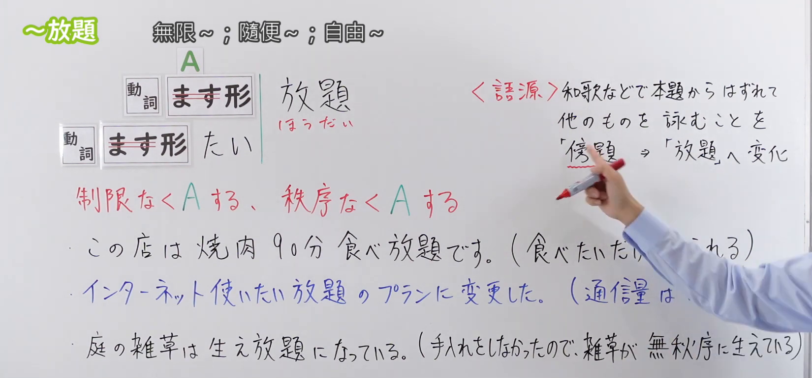
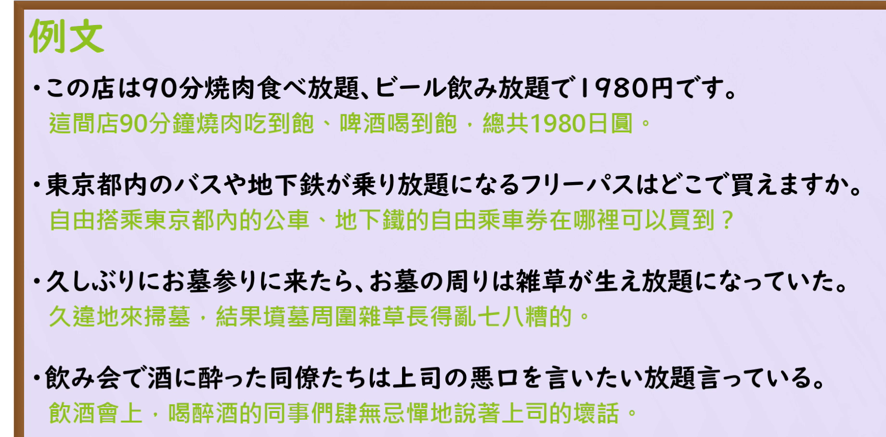

---
{
  "id": "N3-G-0101",
  "kind": "grammar",
  "level": "N3",
  "title": "～ほうだい(放題)：不限量；任其发展；肆意……",
  "status": "confirmed",
  "card_revision": 2,
  "schema_version": 1,
  "created_at": "2026-09-19",
  "updated_at": "2026-09-20",
  "source": {
    "lesson": "N3 第 101 个语法",
    "material": "出口日語原视频板书、日语自动字幕与两份独立日文教学正文",
    "video": "https://www.youtube.com/watch?v=LDccAzriyFo",
    "screenshot": "assets/grammar/n3/N3-G-0101-0115.png",
    "screenshot_seconds": 115,
    "screenshot_crop": {
      "x": 0,
      "y": 0,
      "width": 1650,
      "height": 770
    }
  },
  "tags": [
    "不限量",
    "放任",
    "无约束",
    "服务套餐",
    "N3"
  ],
  "confusions": [
    "～たいだけ",
    "～たい放題",
    "～っぱなし",
    "不限量与免费",
    "语境中的褒贬"
  ],
  "next_review": "2026-09-26"
}
---

# N3 第 101 课｜～ほうだい (放題)｜已确认

# 视频学习资料整理

本次只整理第 101 课。学习者未提供个人原始输出，不虚构理解判断。2026-09-19 通过原播放列表核对第 101 项：标题「【Ｎ３文法】～放題」、视频 ID `LDccAzriyFo`、时长 04:12。本卡已于 2026-09-19 确认入库，下次复习日期为 2026-09-26，之后固定每七天复习。

接续图取自 [原视频 01:55](https://www.youtube.com/watch?v=LDccAzriyFo&t=115s)：原帧 1920×1080，固定左上角裁为 (0,0,1650,770)。保留两种接续、A 符号、「制限なく A する／秩序なく A する」两类含义及三句板书例句；裁去右侧人像主体和底部空白，未抹除、重绘或拼接。首选 00:01 的右侧说明遮挡较多，比较前段和中段画面后改用此帧。图中仍有手臂遮住右侧部分补充说明，未把遮挡内容当作可见文字；接续、核心含义和三句例句主体清楚，相关含义另以字幕及独立正文交叉复核。

例句图取自视频后半部分的 [02:40](https://www.youtube.com/watch?v=LDccAzriyFo&t=160s)：原帧 1920×1080，固定左上角裁为 (0,0,1840,910)。完整保留四句日语例句和课程中文译文，仅裁去右侧及底部多余边框、装饰区域，未重绘或拼接。

# 核心

## 功能一：不受限制地做A，或无秩序地做A

**くわしい意味記述：**

- **～ほうだい(放題)／～たいほうだい(たい放題)：** 動ます形に接続して、思う存分したいだけするという意味を表します。「好き放題」という言い方もあります。（接在动词ます形后，表示尽情地、想做多少就做多少。也有「好き放題」这一说法。）

### 例句

1. 焼肉食べ放題大人一人３０００円。

   （烤肉不限量吃，每位成人3000日元。）

2. 赤ちゃんは泣くのが仕事だから、泣きたい放題泣かせておけばいい。

   （婴儿哭就是他的事情，所以让他想哭多少就哭多少好了。）

3. いつも些細な事からつい言いたい放題言ってしまって喧嘩になる。

   （总是因为一点小事就忍不住想说什么说什么，最后吵起来。）

4. ネットでは匿名性にかこつけて、無責任な発言をしたい放題している。

   （在网络上，有人以匿名为借口，肆意发表不负责任的言论。）

# 来源

- [出口日語原视频](https://www.youtube.com/watch?v=LDccAzriyFo)
- [毎日のんびり日本語教師「～放題（ほうだい）」](https://mainichi-nonbiri.com/grammar/n1-houdai/)（查询日期：2026-09-21）
