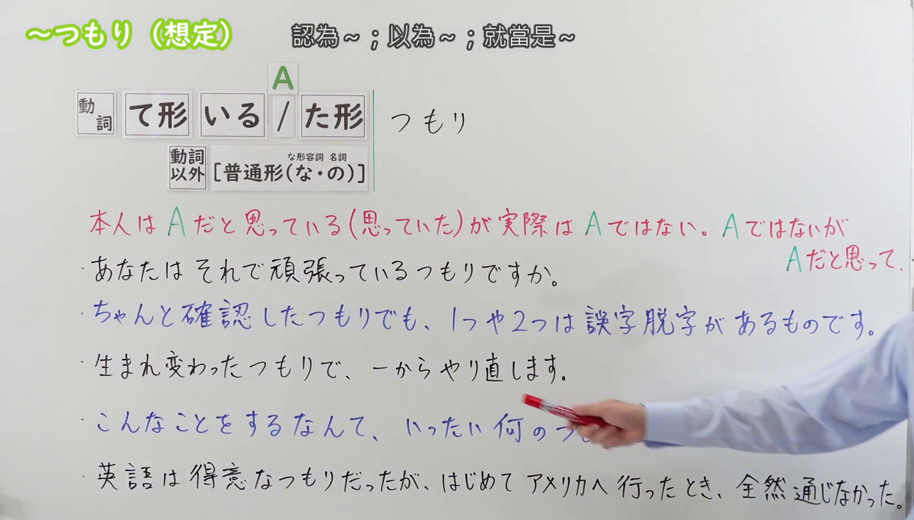
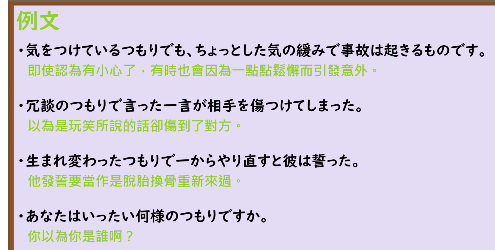

---
{
  "id": "N3-G-0104",
  "kind": "grammar",
  "level": "N3",
  "title": "～つもり（想定）：自认为；就当是",
  "status": "confirmed",
  "card_revision": 1,
  "schema_version": 1,
  "created_at": "2026-09-20",
  "updated_at": "2026-09-20",
  "source": {
    "lesson": "N3 第104个语法",
    "video": "https://www.youtube.com/watch?v=YUMxOWwK-8I",
    "screenshot": "assets/grammar/n3/N3-G-0104-0120.png",
    "screenshot_seconds": 120,
    "screenshot_crop": {
      "x": 0,
      "y": 0,
      "width": 1650,
      "height": 940
    }
  },
  "tags": [
    "认知落差",
    "假定",
    "N3"
  ],
  "confusions": [
    "意志的つもり",
    "ふりをする"
  ],
  "next_review": "2026-09-27"
}
---

# N3 第104课｜～つもり（想定）｜已确认

# 视频学习资料整理

本次只整理第104课，没有学习者个人原始输出。复用2026-09-20获取的播放列表记录：requested_entries为100—104，第104项视频ID为`YUMxOWwK-8I`，时长05:29；本轮重新获取原视频及日语自动字幕，以画面核对日语标题「～つもり（想定）」。未发现本课正式卡、草稿或确认事件。本卡已于2026-09-20确认入库，下次复习日期为2026-09-27，之后固定每七天复习。

接续图取自[原视频02:00](https://www.youtube.com/watch?v=YUMxOWwK-8I&t=120s)，原帧1920×1080，固定左上角裁为(0,0,1650,940)。00:01人物挡住含义说明和多句右端；另检查01:30、02:00、02:05、02:10、02:40、03:00、03:20、03:40后选用02:00。保留标题、中文释义、全部接续、两种含义说明和五句板书；已裁掉脸部及右侧大部分人像，手臂仍遮挡第4句「何のつもりだ」的一部分，该句由02:05清晰画面核对。没有重绘、拼接或补字；不为去除手臂裁掉教学板书。

例句图取自后半部分[原视频04:00](https://www.youtube.com/watch?v=YUMxOWwK-8I&t=240s)，原帧1920×1080，固定左上角裁为(0,0,1800,910)，完整保留四句日语例句及中文译文，裁去右侧和底部空白，无人物遮挡。

# 核心

## 功能一：本人认为（曾认为）是A，但实际并不是A

**くわしい意味記述：**

- **～つもりだ（事実とは異なる状態）：** 二人称か三人称の主語をとり、その人が思っていることと、周囲が思っていることが異なることを表します。（以第二人称或第三人称为主语，表示本人所想与周围人的看法不同。）
- **～つもりだ（自分の認識）：** 物事に対する自分自身の客観的な認識を述べます。他の人がどう思っているかや、事実とは異なる内容だとしても関係なく使うことができます。この用法の時は必ず一人称の主語しかとりません。（陈述自己对事物的客观认识；无论他人如何看待，也无论内容是否与事实不同，都可以使用。此用法只以第一人称为主语。）

### 例句

1. 隠しているつもりだろうがバレバレだ。

   （你自以为藏得很好吧，可其实太明显了。）

2. 調子悪くないつもりだったが、ここ数日ずっと寝ている。

   （我本以为身体状况不差，但这几天一直在睡觉。）

3. ちゃんと伝えたつもりだったが、相手は理解できていなかった。

   （我以为已经好好传达了，但对方没能理解。）

4. 私は彼と友達のつもりだったが、彼はそう思っていなかったようだ。

   （我以为自己和他是朋友，但他似乎不这么认为。）

## 功能二：虽然不是A，却把它当作A来行动

**くわしい意味記述：**

- **～たつもりで：** 事実は異なるが、そのように見なして何かをすることを表す文法です。「～したと見なして」「～したと考えて」「～したと仮定して」「～した気になって」などに言い換えることができます。（表示虽然事实并非如此，却视作如此而采取某种行动。可以换成「视作已经……」「认为已经……」「假定已经……」「感觉像已经……」等说法。）

### 例句

1. 子供になったつもりで考えてみると、意外と良い案が思い浮かぶこともある。

   （试着把自己当成孩子来思考，有时会意外地想到好主意。）

2. 哲学者になったつもりで人生について語る。

   （把自己当作哲学家来谈论人生。）

3. 先生になったつもりで説明してみよう。

   （试着把自己当作老师来讲解吧。）

4. 相手の立場になったつもりで、よく考えてから発言することが重要だ。

   （重要的是设想自己处在对方的立场上，仔细思考后再发言。）

# 来源

- [出口日語原视频](https://www.youtube.com/watch?v=YUMxOWwK-8I)
- [毎日のんびり日本語教師「～つもりだ」](https://mainichi-nonbiri.com/grammar/n2-tsumorida/)（查询日期：2026-09-21）
- [毎日のんびり日本語教師「～たつもりで」](https://mainichi-nonbiri.com/grammar/n3-tatsumoride/)（查询日期：2026-09-21）
