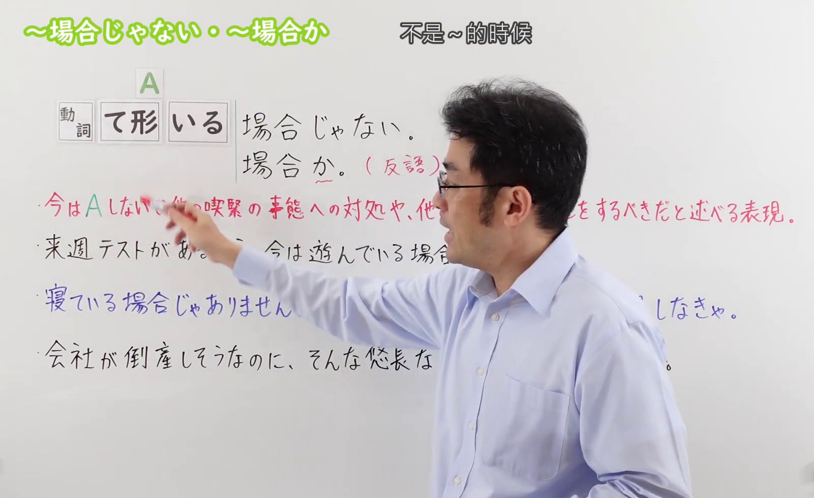
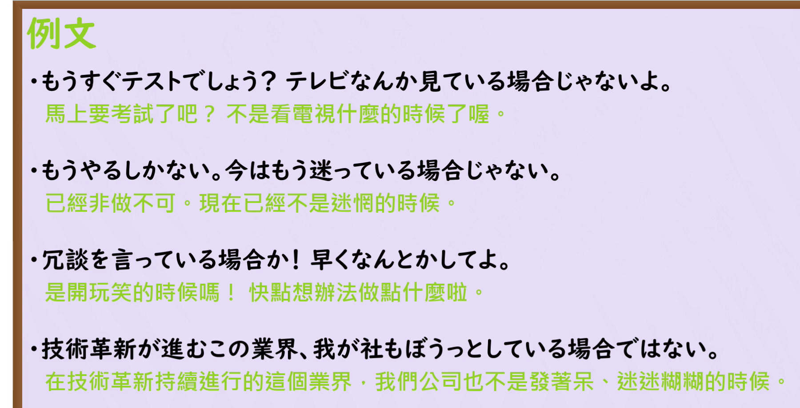

---
{
  "id": "N3-G-0105",
  "kind": "grammar",
  "level": "N3",
  "title": "～場合じゃない・～場合か：不是……的时候；难道要……吗",
  "status": "confirmed",
  "card_revision": 1,
  "schema_version": 1,
  "created_at": "2026-09-20",
  "updated_at": "2026-09-20",
  "source": {
    "lesson": "N3 第105个语法",
    "material": "出口日語原视频板书、日语自动字幕与两份独立日文教学正文",
    "video": "https://www.youtube.com/watch?v=Kv5qFb7RMEA",
    "screenshot": "assets/grammar/n3/N3-G-0105-0060.png",
    "screenshot_seconds": 60,
    "screenshot_crop": {
      "x": 0,
      "y": 0,
      "width": 1600,
      "height": 980
    }
  },
  "tags": [
    "場合じゃない",
    "場合か",
    "反语",
    "紧急性",
    "N3"
  ],
  "confusions": [
    "場合（条件）",
    "わけじゃない",
    "どころじゃない"
  ],
  "next_review": "2026-09-27"
}
---

# N3 第105课｜～場合じゃない・～場合か｜已确认

# 视频学习资料整理

本次只整理第105课，无学习者个人原始输出。2026-09-20核对出口日語播放列表第105项：标题「【Ｎ３文法】～場合じゃない・～場合か」、视频ID `Kv5qFb7RMEA`、时长约04:50。未发现本课正式卡、草稿或确认事件；本卡已于2026-09-20确认入库，下次复习日期为2026-09-27，之后固定每七天复习。

接续图取自[原视频01:00](https://www.youtube.com/watch?v=Kv5qFb7RMEA&t=60s)，原帧1920×1080，固定左上角裁为(0,0,1600,980)。保留标题、中文释义、A符号、动词て形＋いる接续、两种句型及含义说明和三句板书例句；人物遮挡右端少量空白，没有遮住接续或例句关键文字。

例句图取自[原视频03:40](https://www.youtube.com/watch?v=Kv5qFb7RMEA&t=220s)，原帧1920×1080，固定左上角裁为(0,0,1800,920)，保留课程例句页，裁去右侧和底部空白。

# 核心

## 功能一：现在不该做A，而应处理其他紧急事态或做别的事情（「～場合か」为反问）

**くわしい意味記述：**

- **「～ている場合じゃない」：** 今していることをすぐにでもやめて、他のことをしたほうがいいと言う時に使う。（用于表示应该立即停止正在做的事情，改做其他事情。）

### 例句

1. 東京大学へ行きたいなら、こんなところで遊んでいる場合じゃないでしょう。今すぐ家に帰って勉強しなさい。

   （如果想上东京大学，现在可不是在这种地方玩的时候吧。马上回家学习。）

2. 本気でプロになりたいなら、本なんか読んで勉強している場合じゃないよ。スクールに通うとか経験者に教えてもらうとかしたら？

   （如果真想成为专业人士，现在不是只靠看书学习的时候。去专业学校，或者请有经验的人指导你怎么样？）

3. 行くかどうか迷っている場合じゃないよ。そんなことしてたら、すぐにチケットは売り切れちゃうよ。

   （现在不是犹豫要不要去的时候。再这样下去，票马上就会卖光。）

# 来源

- [出口日語原视频](https://www.youtube.com/watch?v=Kv5qFb7RMEA)
- [日本語NET「～ている場合じゃない」](https://nihongokyoshi-net.com/2019/08/04/jlptn3-grammar-teirubaaijanai/)（查询日期：2026-09-21）
