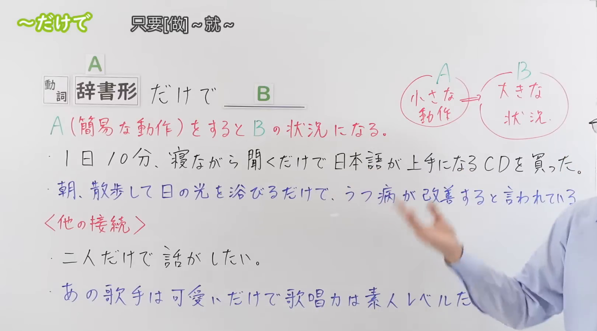
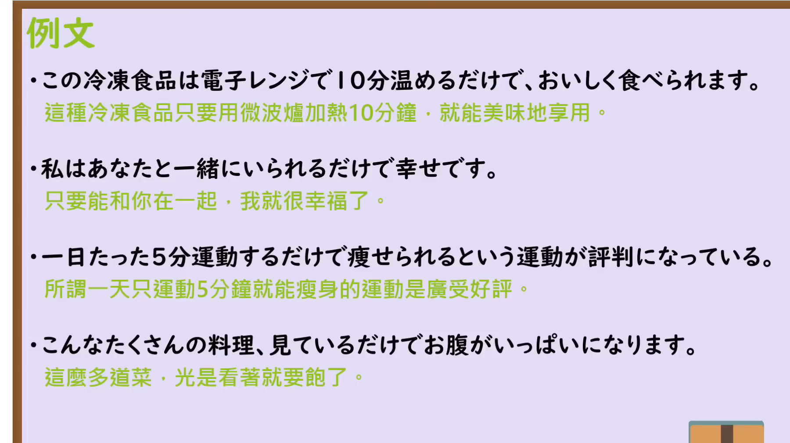

---
{
  "id": "N3-G-0106",
  "kind": "grammar",
  "level": "N3",
  "title": "～だけで：只要……就……；仅仅……就……",
  "status": "confirmed",
  "card_revision": 1,
  "schema_version": 1,
  "created_at": "2026-09-20",
  "updated_at": "2026-09-20",
  "next_review": "2026-09-27",
  "source": {
    "lesson": "N3 第106个语法",
    "material": "出口日語原视频板书、日语自动字幕与两份独立日文教学正文",
    "video": "https://www.youtube.com/watch?v=H2kzYuLFNQc",
    "screenshot": "assets/grammar/n3/N3-G-0106-0075.png",
    "screenshot_seconds": 75,
    "screenshot_crop": {
      "x": 0,
      "y": 0,
      "width": 1620,
      "height": 900
    }
  },
  "tags": [
    "だけで",
    "简单条件",
    "触发结果",
    "N3"
  ],
  "confusions": [
    "だけ（限定）",
    "だけでも",
    "だけでは",
    "～たら／～と"
  ]
}
---

# N3 第106课｜～だけで｜已确认

# 视频学习资料整理

本次只整理第106课，无学习者个人原始输出。2026-09-20核对出口日語播放列表第106项：标题「【N３文法】～だけで」、视频ID H2kzYuLFNQc，时长约04:35。本卡已于2026-09-20确认入库，下次复习日期为2026-09-27，之后固定每七天复习。

接续图取自[原视频01:15](https://www.youtube.com/watch?v=H2kzYuLFNQc&t=75s)，原帧1920×1080，固定左上角裁为(0,0,1620,900)。画面保留标题、中文释义「只要[做]～就～」、A/B总接续、红字含义说明「A（簡易な動作）をするとBの状況になる」、两条例句及其他接续提示；右侧保留必要板书，人物已不在画面内。

例句图取自[原视频03:00](https://www.youtube.com/watch?v=H2kzYuLFNQc&t=180s)，原帧1920×1080，固定左上角裁为(0,0,1800,1010)。画面完整保留课程例句页的四句日语和中文译文，未与接续图重复。

# 核心

## 功能一：做A（简单动作）就会进入B的状态

**くわしい意味記述：**

- **「～だけで」：** 「〜だけで」は「AだけでB」の形で使われ、「実際に体験しなくても、AすればB」という意味を表す文型です。「A」には【知覚】【思考】を表す動詞が使われ、「実際に体験しなくても、AすればBと感じられる」と言いたい時に使用します。（「～だけで」以「AだけでB」的形式使用，表示“即使没有实际体验，只要做A就会出现B”。A使用表示知觉或思考的动词，用于表达“即使没有实际体验，只要做A就能感受到B”。）

### 例句

1. 旅行に行くことを考えるだけで楽しくなってくる。

   （光是想到去旅行这件事，就会开心起来。）

2. おばけを見たなんて、想像するだけでこわい。

   （光是想象看到了鬼，就觉得害怕。）

3. スマホをなくしてしまうなど、考えるだけで嫌だ。

   （光是想到把手机弄丢这种事，就觉得难受。）

4. 昨日はドーナツを20個も食べたの！――聞くだけでお腹がいっぱいになるよ……。

   （“我昨天吃了整整20个甜甜圈！”——光是听着，我就觉得肚子饱了……。）

5. レモンを見ただけでつばが出る。

   （光是看到柠檬，唾液就会分泌出来。）

# 来源

- [出口日語原视频](https://www.youtube.com/watch?v=H2kzYuLFNQc)
- [絵でわかる日本語「～だけで」](https://www.edewakaru.com/archives/20202486.html)（查询日期：2026-09-21）
