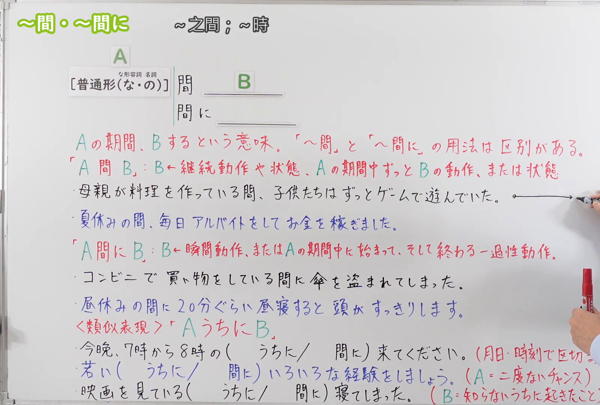

---
{
  "id": "N3-G-0107",
  "kind": "grammar",
  "level": "N3",
  "title": "～あいだ(間)・～あいだ(間)に：期间内持续；期间内发生或完成",
  "status": "confirmed",
  "card_revision": 1,
  "schema_version": 1,
  "created_at": "2026-09-21",
  "updated_at": "2026-09-21",
  "next_review": "2026-09-28",
  "source": {
    "lesson": "N3 第107个语法",
    "material": "出口日語原视频板书、日语自动字幕、Hagoromo文型检索与日本語NET正文",
    "video": "https://www.youtube.com/watch?v=_s_9oYPgtoQ",
    "screenshot": "assets/grammar/n3/N3-G-0107-0090.png",
    "screenshot_seconds": 90,
    "screenshot_crop": {
      "x": 0,
      "y": 0,
      "width": 1600,
      "height": 1080
    }
  },
  "tags": [
    "あいだ",
    "あいだに",
    "时间范围",
    "持续",
    "期间内发生",
    "N3"
  ],
  "confusions": [
    "～うちに",
    "～とき",
    "～あいだ与～あいだに"
  ]
}
---

# N3 第107课｜～あいだ(間)・～あいだ(間)に｜已确认

# 视频学习资料整理

本次只整理第107课，无学习者个人原始输出。2026-09-21核对出口日語播放列表第107项：标题「【Ｎ３文法】～間・～間に」，视频ID `_s_9oYPgtoQ`，时长09:26。本卡已于2026-09-21确认入库，下次复习日期为2026-09-28，之后固定每七天复习。

接续图取自[原视频01:30](https://www.youtube.com/watch?v=_s_9oYPgtoQ&t=90s)，原帧1920×1080，固定左上角裁为(0,0,1600,1080)。画面保留课程标题、A/B总接续、两种形式的红字含义说明、板书例句及与「～うちに」的选择提示；老师位于最右侧，裁后仅余少量手部，没有遮住接续或红字说明。

例句图取自[原视频08:00](https://www.youtube.com/watch?v=_s_9oYPgtoQ&t=480s)，原帧1920×1080，固定左上角裁为(0,0,1880,1040)。画面保留四句课程例句及其中文译文，裁去右侧与底部少量边框和空白，未与接续图重复。

# 核心

## 功能一：在A期间，B一直是持续性动作或状态

**最上位意味カテゴリー：**

- **～あいだ(間)：** 場所・時間（场所与时间）

**中位意味カテゴリー：**

- **～あいだ(間)：** 時間的前後（时间上的先后关系）

**意味：**

- **～あいだ(間)：** 範囲（范围）

**くわしい意味記述：**

- **～あいだ(間)：** 「その時間ずっと」という意味を表す。時間幅のある状態を表す言葉に続く。（表示“在那段时间里一直如此”，接在表示具有时间跨度的状态的词语之后。）

**派生語：** 未列出（网站原值：記載なし）

### 例句

1. 雨が降っている間、店の中で待ちましょう。

   （下雨期间，我们在店里等吧。）

2. Ｇ先生がご病気の間はＡちゃんもちょっとお暇ね。

   （G老师生病的那段时间，A小姐也稍微清闲一些呢。）

3. 冬休みの間はどうするの？

   （寒假期间你打算做什么？）

## 功能二：B是瞬间动作，或是在A期间开始并结束的一次性动作

**くわしい意味記述：**

- **～あいだ(間)に：** 〜の期間に・・・する。※ずっと〜するのではない。「間に」の後ろに継続性のある動詞や表現は使えない。（表示在某段期间内做某事，但不是从头到尾一直做；「間に」之后不能使用表示持续性的动词或表达。）

### 例句

1. 昨日、寝ている間に地震がありました。

   （昨天睡觉期间发生了地震。）

2. 娘が出かけている間に晩御飯を作りました。

   （女儿外出期间，我做好了晚饭。）

3. 日本に住んでいる間に一度でいいから歌舞伎を見てみたいです。

   （住在日本期间，哪怕只有一次，我也想看看歌舞伎。）

4. 夏休みの間に富士山に登りたいです。

   （我想在暑假期间登一次富士山。）

5. 本を読んでいる間に、寝てしまった。

   （看书的时候，不知不觉睡着了。）

# 来源

- [出口日語原视频](https://www.youtube.com/watch?v=_s_9oYPgtoQ)
- [Hagoromo 文型检索「あいだ（範囲）」](https://www.hagoromo-text.work/)（查询日期：2026-09-21）
- [日本語NET「〜間に」](https://nihongokyoshi-net.com/2019/04/18/jlptn4-grammar-aidani/)（查询日期：2026-09-21）
