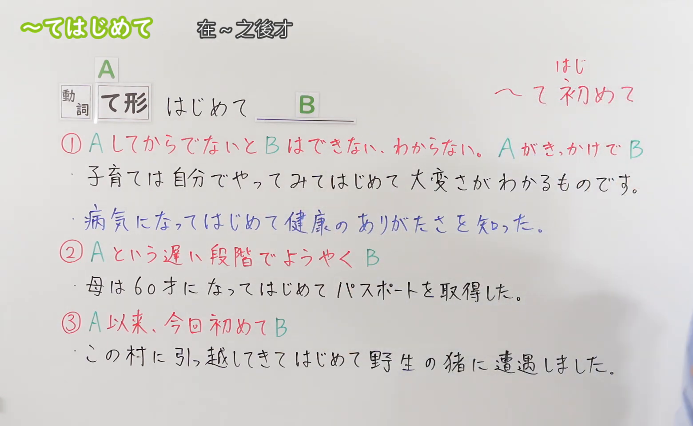
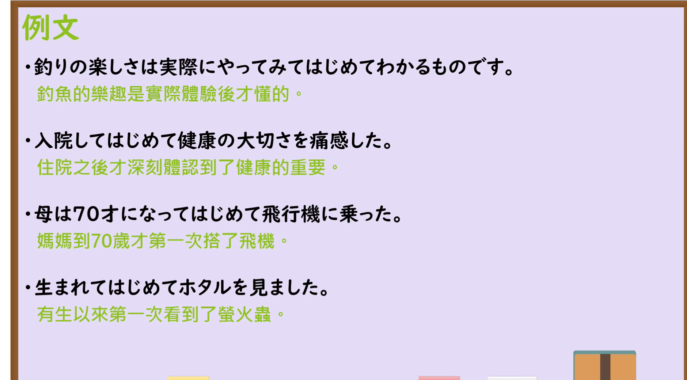

---
{
  "id": "N3-G-0108",
  "kind": "grammar",
  "level": "N3",
  "title": "～てはじめて・～てみてはじめて：经历……之后才……",
  "status": "confirmed",
  "card_revision": 1,
  "schema_version": 1,
  "created_at": "2026-09-21",
  "updated_at": "2026-09-22",
  "next_review": "2026-09-29",
  "source": {
    "lesson": "N3 第108个语法",
    "material": "出口日語原视频板书、日语自动字幕与毎日のんびり日本語教師正文",
    "video": "https://www.youtube.com/watch?v=zKc6yr7blno",
    "screenshot": "assets/grammar/n3/N3-G-0108-0090.png",
    "screenshot_seconds": 90,
    "screenshot_crop": {
      "x": 0,
      "y": 0,
      "width": 1560,
      "height": 960
    }
  },
  "tags": [
    "てはじめて",
    "てみてはじめて",
    "经历",
    "领悟",
    "契机",
    "N3"
  ],
  "confusions": [
    "～てから",
    "～てからでないと",
    "～てこそ",
    "はじめて（首次）"
  ]
}
---

# N3 第108课｜～てはじめて｜已确认

# 视频学习资料整理

本次只整理第108课，无学习者个人原始输出。2026-09-21核对出口日語播放列表第108项：日语标题「【Ｎ３文法】～てはじめて」，视频ID `zKc6yr7blno`，时长05:34。原视频板书列出三种读法；本卡“核心”依据直接对应的日文语法条目，整理其中“经历A后才理解、注意到或进入B”的N3句型功能。板书中的“到了A这一较晚阶段才第一次B”及“自A以来这次第一次B”属于「はじめて」表示首次经历的普通读法，保留在视频图片中，不与该句型功能混合。本卡已于2026-09-22确认入库，下次复习日期为2026-09-29，之后固定每七天复习。

接续图取自[原视频01:30](https://www.youtube.com/watch?v=zKc6yr7blno&t=90s)，原帧1920×1080，固定左上角裁为(0,0,1560,960)。00:01画面中人物遮住右侧含义说明；检查前段时间轴后改用01:30。画面完整保留课程标题、接续、三种红字含义说明及四句板书例句，右缘仅余少量人物衣袖，没有遮住教学文字。

例句图取自[原视频04:15](https://www.youtube.com/watch?v=zKc6yr7blno&t=255s)，原帧1920×1080，固定左上角裁为(0,0,1880,1040)。画面完整保留四句课程例句及其中文译文，裁去右侧与底部少量边框和空白；本图与接续图内容不重复。

# 核心

## 功能一：若不先经历A，就无法做到或理解B；A成为契机后才出现B

**くわしい意味記述：**

- **～てはじめて／～てみてはじめて：** 前項には何らかの経験を述べ、後項ではその経験を通してようやく気付いたことや、今まで注意していなかったことに気付いたことを述べます。多くの場合、後項では「分かる」「知る」「できる」などの動詞が用いられます。（前项叙述某种经历，后项表示通过这一经历才终于察觉到某事，或注意到此前未曾留意的事情。后项多使用「分かる」「知る」「できる」等动词。）

### 例句

1. 今まで好きっていう感情がよく分からなかったけど、彼に出会えてはじめて分かったような気がする。

   （以前我一直不太明白喜欢一个人是什么感觉，但遇见他之后，我才觉得自己好像明白了。）

2. 指摘されてはじめて間違いに気づいた。

   （被指出以后，我才注意到错误。）

3. 実家を離れてはじめて親のありがたみを知った。

   （离开父母家以后，我才懂得父母的可贵。）

4. 子育ての大変さって、やってみてはじめてわかる。

   （养育孩子有多辛苦，只有亲自做过之后才会明白。）

5. 飼ってみてはじめて自分が猫アレルギーだと気づいた。

   （实际养了以后，我才发现自己对猫过敏。）

# 来源

- [出口日語原视频](https://www.youtube.com/watch?v=zKc6yr7blno)
- [毎日のんびり日本語教師「～てはじめて／てみてはじめて」](https://mainichi-nonbiri.com/grammar/n3-tehajimete/)（查询日期：2026-09-21）
