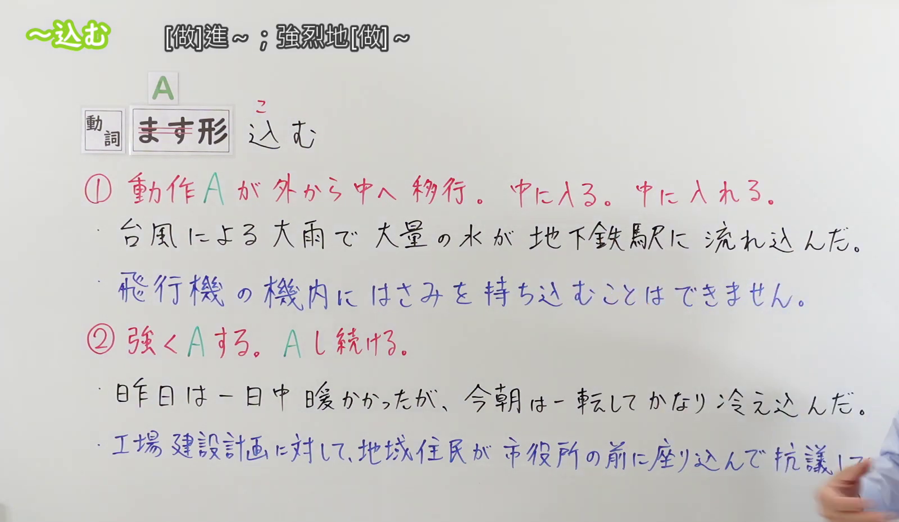
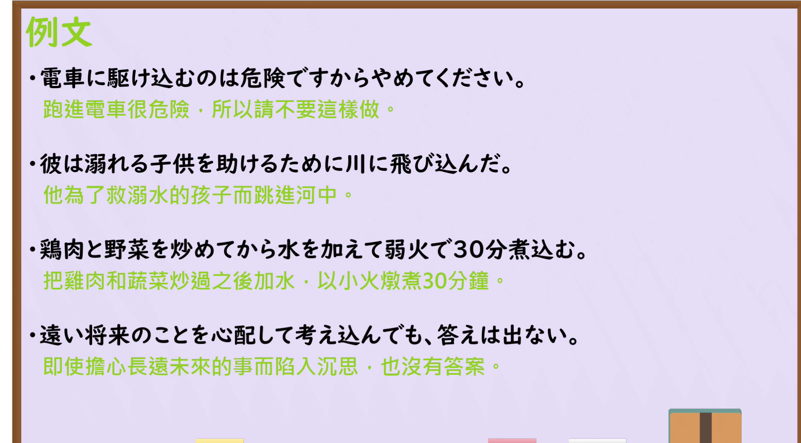

---
{
  "id": "N3-G-0109",
  "kind": "grammar",
  "level": "N3",
  "title": "～こむ(込む)：进入内部；深入或持续进行",
  "status": "confirmed",
  "card_revision": 1,
  "schema_version": 1,
  "created_at": "2026-09-22",
  "updated_at": "2026-09-22",
  "source": {
    "lesson": "N3 第109个语法",
    "material": "出口日語原视频板书、日语自动字幕、毎日のんびり日本語教師与日本語NET正文",
    "video": "https://www.youtube.com/watch?v=6NvfMD1c6q0",
    "screenshot": "assets/grammar/n3/N3-G-0109-0100.png",
    "screenshot_seconds": 100,
    "screenshot_crop": {
      "x": 0,
      "y": 0,
      "width": 1600,
      "height": 930
    }
  },
  "tags": [
    "こむ",
    "込む",
    "内部移动",
    "深入",
    "持续",
    "复合动词",
    "N3"
  ],
  "confusions": [
    "～つづける(続ける)",
    "～きる(切る)",
    "～ぬく(抜く)"
  ]
}
---

# N3 第109课｜～こむ(込む)｜待确认

> **未提交待确认版本：** 本卡尚未确认入库，未创建确认事件，也未启动七天复习周期。

# 视频学习资料整理

本次只整理第109课，无学习者个人原始输出。2026-09-22核对出口日語播放列表第109项：日语标题「【Ｎ３文法】～込む」，视频ID `6NvfMD1c6q0`，时长05:10。原视频板书把本课分为两个功能：一是动作A从外部向内部移动，进入里面或把东西放进里面；二是强烈地做A，或持续做A。本卡“核心”按照这两个功能分组。

接续图取自[原视频01:40](https://www.youtube.com/watch?v=6NvfMD1c6q0&t=100s)，原帧1920×1080，固定左上角裁为(0,0,1600,930)。00:01画面中人物遮挡板书，因此检查前段时间轴后改用01:40。画面完整保留课程标题、接续和两项红字含义说明，并保留多句辅助理解的板书例句；右下角仅有少量人物入镜，未遮挡接续和两项功能说明。

例句图取自[原视频04:00](https://www.youtube.com/watch?v=6NvfMD1c6q0&t=240s)，原帧1920×1080，固定左上角裁为(0,0,1880,1040)。画面完整保留四句课程例句及其中文译文，裁去右侧和底部少量边框；本图与接续图内容不重复。

# 核心

## 功能一：动作A从外部向内部移动；进入里面或把东西放进里面

**くわしい意味記述：**

- **～こむ(込む)：** 内部への移動、中へ入れる。（表示向内部移动，或把某物放入里面。）

### 例句

1. 店のオープンと同時に、セール品めがけて、たくさんの人が駆け込んだ。

   （商店一开门，很多人便朝着打折商品冲了进去。）

2. ここに、カードを差し込んでください。

   （请把卡插进这里。）

3. 薬は噛まずに飲み込んでください。

   （药请不要咀嚼，直接吞下去。）

4. 知らない男がいきなり家に上がり込んできた。

   （一个陌生男子突然闯进了家里。）

5. これはテストに必ず出るから、しっかり頭に叩き込んでおけよ。

   （这个考试一定会考，所以给我牢牢记在脑子里。）

## 功能二：强烈地做A；持续做A

**くわしい意味記述：**

- **～こむ(込む)：** 状態が極まること。深く～する、その状態をずっと続ける。「深く」というのがポイントです。例えば「眠り込む」なら深い眠りに落ちたことを意味しますし、「考え込む」ならより深いところまで考え巡らすという意味になります。（表示状态达到极点，深入地做某事，或让该状态持续下去。重点在于“深入”：例如「眠り込む」表示陷入沉睡，「考え込む」表示深入地反复思考。）

### 例句

1. じっくり煮込んだスープは味がしっかりしていて美味しい。

   （慢慢炖透的汤味道浓郁，很好喝。）

2. トムさん、さっきからずっと考え込んでるよ。

   （汤姆从刚才起就一直在沉思。）

3. 今日は１時間走り込んだ。

   （今天扎扎实实地跑了一个小时。）

4. うっかり話し込んでしまった。

   （一不留神就聊了很久。）

5. 息子は東京大学に合格するために勉強に打ち込んでいる。

   （儿子为了考上东京大学，正全心投入学习。）

# 来源

- [出口日語原视频](https://www.youtube.com/watch?v=6NvfMD1c6q0)
- [毎日のんびり日本語教師「～込む」](https://mainichi-nonbiri.com/grammar/n3-komu/)（意义说明；查询日期：2026-09-22）
- [日本語NET「〜込む」](https://nihongokyoshi-net.com/2019/11/12/jlptn3-grammar-komu/)（分组例句；查询日期：2026-09-22）
