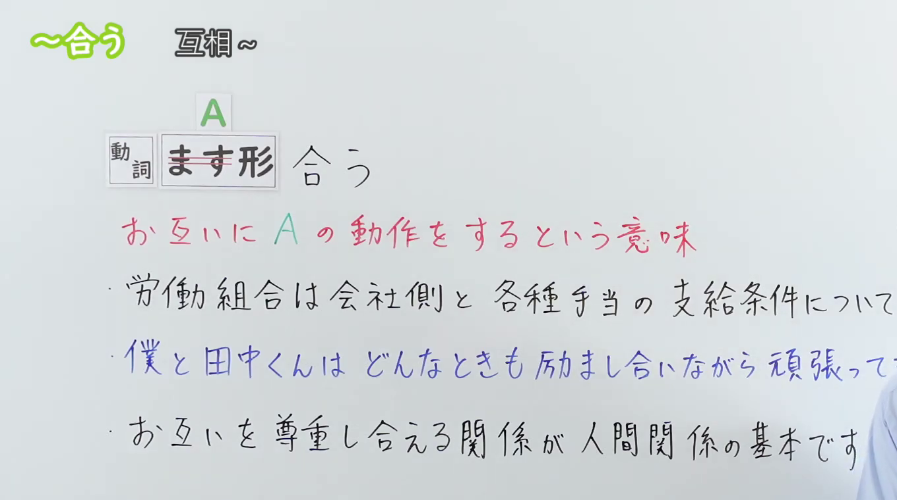
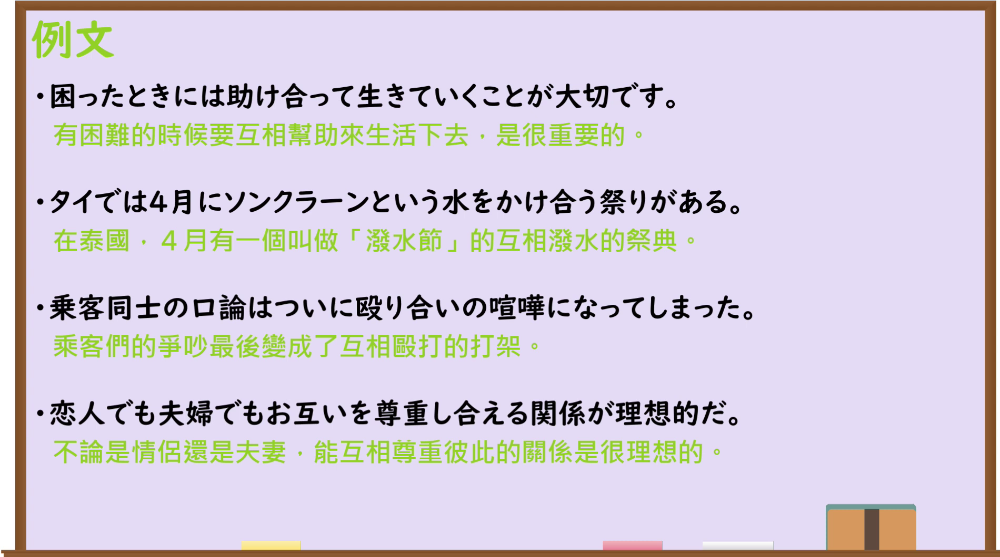

---
{
  "id": "N3-G-0110",
  "kind": "grammar",
  "level": "N3",
  "title": "～あう(合う)：彼此进行同一动作",
  "status": "confirmed",
  "card_revision": 1,
  "schema_version": 1,
  "created_at": "2026-09-22",
  "updated_at": "2026-09-22",
  "next_review": "2026-09-29",
  "source": {
    "lesson": "N3 第110个语法",
    "material": "出口日語原视频板书、日语自动字幕与日本語NET正文",
    "video": "https://www.youtube.com/watch?v=WdL-4lWFwmg",
    "screenshot": "assets/grammar/n3/N3-G-0110-0001.png",
    "screenshot_seconds": 1,
    "screenshot_crop": {
      "x": 0,
      "y": 0,
      "width": 1360,
      "height": 760
    }
  },
  "tags": [
    "あう",
    "合う",
    "相互动作",
    "复合动词",
    "N3"
  ],
  "confusions": [
    "おたがいに(お互いに)",
    "いっしょに(一緒に)",
    "一方的な動作"
  ]
}
---

# N3 第110课｜～あう(合う)

# 视频学习资料整理

本次只整理第110课，无学习者个人原始输出。2026-09-22核对出口日語播放列表第110项：日语标题「【Ｎ３文法】～合う」，视频ID `WdL-4lWFwmg`，时长03:47。原视频说明本课形式是复合动词，表示彼此进行同一动作；本卡“核心”据此按一个功能整理。

接续图取自[原视频00:01](https://www.youtube.com/watch?v=WdL-4lWFwmg&t=1s)，原帧1920×1080，固定左上角裁为(0,0,1360,760)。画面完整保留课程标题、接续、红字含义说明和第三句板书例句，并保留前两句板书例句在原画面中未被遮挡的部分；右侧仅有少量人物入镜，未遮挡接续与含义说明。

例句图取自[原视频02:15](https://www.youtube.com/watch?v=WdL-4lWFwmg&t=135s)，原帧1920×1080，固定左上角裁为(0,0,1900,1060)。画面完整保留四句课程例句及其中文译文，只裁去右侧和底部少量边缘；本图与接续图内容不重复。

# 核心

## 功能一：表示彼此进行 A 这一动作

**くわしい意味記述：**

- **～あう(合う)：** お互いに〜する（彼此做……。）

### 例句

1. 困った時は助け合いましょう。

   （遇到困难时，互相帮助吧。）

2. 隣の人と相談し合って答えを考えてください。

   （请和旁边的人互相商量后思考答案。）

3. 問題が起きたときは、どうすべきかみんなで話し合いましょう。

   （出现问题时，大家一起讨论该怎么办吧。）

4. 僕たちは愛し合っています。

   （我们彼此相爱。）

5. テストの結果が返ってきて、点数を見せ合った。

   （考试结果发下来后，我们互相给对方看了分数。）

# 来源

- [出口日語原视频](https://www.youtube.com/watch?v=WdL-4lWFwmg)
- [日本語NET「〜合う」](https://nihongokyoshi-net.com/2019/11/11/jlptn3-grammar-au/)（意义说明与例句；查询日期：2026-09-22）
