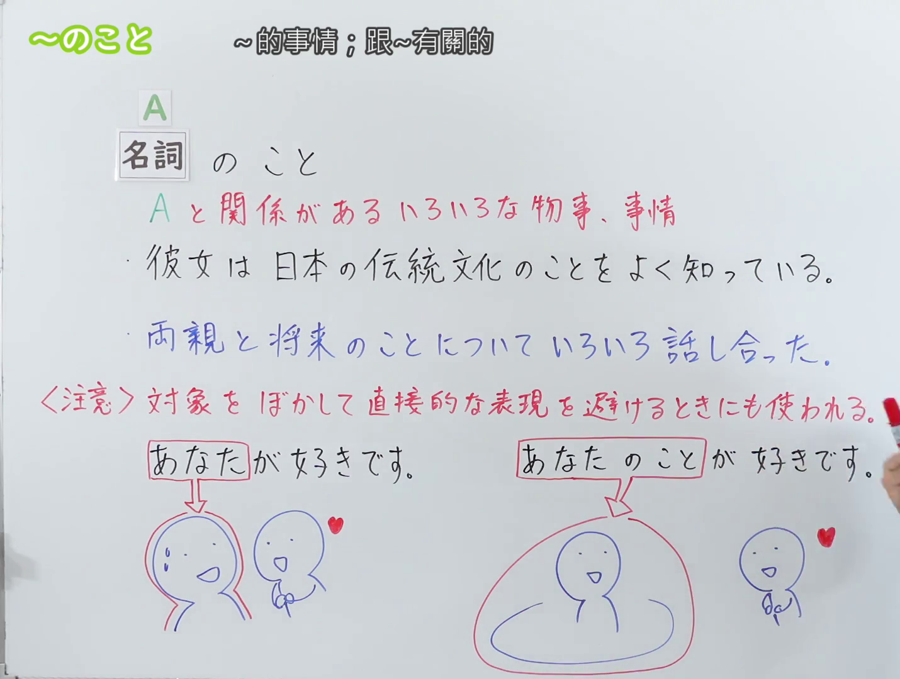
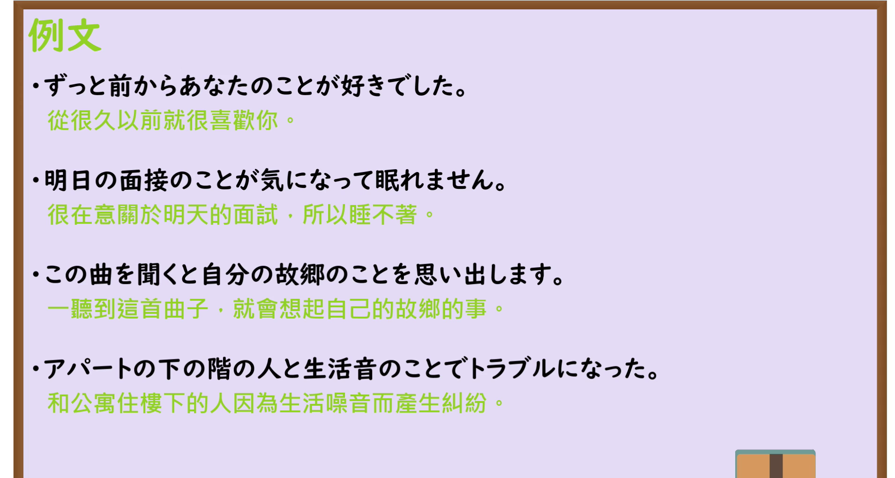

---
{
  "id": "N3-G-0111",
  "kind": "grammar",
  "level": "N3",
  "title": "～のこと：与A相关的各种事物、情况；也用于模糊对象、避免直接表达",
  "status": "confirmed",
  "card_revision": 1,
  "schema_version": 1,
  "created_at": "2026-09-22",
  "updated_at": "2026-09-22",
  "next_review": "2026-09-29",
  "source": {
    "lesson": "N3 第111个语法",
    "material": "出口日語原视频板书、日语自动字幕与日本語教師たのすけのお助けブログ正文",
    "video": "https://www.youtube.com/watch?v=X_VpZIV7-9c",
    "screenshot": "assets/grammar/n3/N3-G-0111-0130.png",
    "screenshot_seconds": 130,
    "screenshot_crop": {
      "x": 0,
      "y": 0,
      "width": 1430,
      "height": 1080
    }
  },
  "tags": [
    "のこと",
    "こと",
    "対象",
    "ぼかし",
    "N3"
  ],
  "confusions": [
    "～について",
    "～のことだ",
    "～とのことだ"
  ]
}
---

# N3 第111课｜～のこと

# 视频学习资料整理

本次只整理第111课，无学习者个人原始输出。2026-09-22核对出口日語播放列表第111项：日语标题「【Ｎ３文法】～のこと」，视频ID `X_VpZIV7-9c`，时长04:13。原视频板书把本课分为两个功能：一是表示与A有关的各种事物、情况；二是也用于模糊对象、避免直接表达。本卡“核心”按照这两个功能分组。

接续图取自[原视频02:10](https://www.youtube.com/watch?v=X_VpZIV7-9c&t=130s)，原帧1920×1080，固定左上角裁为(0,0,1430,1080)。00:01画面中人物站在板书中央，遮住两句例句的结尾和〈注意〉说明，因此检查前段与中段时轴后改用02:10。画面完整保留课程标题、接续「名詞＋のこと」、红字含义说明、两句板书例句、〈注意〉用法说明，以及「あなたが好きです／あなたのことが好きです」的对比与图示；右侧仅有老师手部入镜，未遮挡任何板书内容。

例句图取自[原视频02:55](https://www.youtube.com/watch?v=X_VpZIV7-9c&t=175s)，原帧1920×1080，固定左上角裁为(0,0,1910,1020)。画面完整保留四句课程例句及其中文译文，裁去右侧和底部少量边框；本图与接续图内容不重复。

# 核心

## 功能一：与A有关的各种事物、情况

**くわしい意味記述：**

- **～のこと：** ～について、それに関連すること全部。（表示“关于……”，即与……相关的全部事情。）

### 例句

1. 先輩、仕事のことで相談したいんですが、ちょっとお時間いいですか？

   （前辈，我有工作上的事想和您商量，能占用您一点时间吗？）

2. 来週の試験のことを教えてください。

   （请告诉我下周考试的相关情况。）

3. 将来のことを考えて、毎月３万円貯金しています。

   （考虑到将来的事，我每个月存三万日元。）

4. 彼が好きなので、彼のことを何でも知りたいです。

   （因为喜欢他，所以想了解关于他的一切。）

## 功能二：也用于模糊对象、避免直接表达的时候

**くわしい意味記述：**

- **～のこと：** 気持ちや動作が向けられている人や物事を表す。（対象）（表示感情或动作所指向的人或事物。属于“对象”用法。）

### 例句

1. 私は田中さんのことが好きだ。

   （我喜欢田中。）

2. 卒業しても、みんなのことを忘れません。

   （即使毕业了，我也不会忘记大家。）

3. 彼が今日の服装のことを褒めてくれた。

   （他夸了我今天的穿着。）

4. 明日のN3の試験のことが心配です。

   （我很担心明天N3考试的事。）

# 来源

- [出口日語原视频](https://www.youtube.com/watch?v=X_VpZIV7-9c)
- [日本語教師たのすけのお助けブログ「【N3文法解説】～のこと｜例文・用法」](https://tanosuke.com/nokoto)（Hagoromo 与规定的三个备选网站均未收录本课「名詞＋のこと」条目，改用互联网检索所得的该条目；意义说明与例句。查询日期：2026-09-22）
